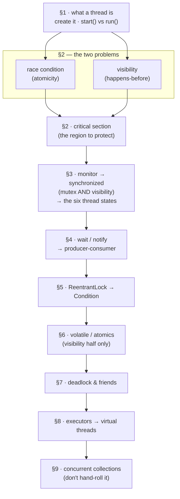

# Threads + JVM — the concurrency kit 🐧🧵

Threads · locks · the memory model · executors · JVM internals.
Rapid-fire, answers sized for speaking. Extracted from
[core-java.md](core-java.md) §5 and ordered so that no answer depends
on one below it.

- [The map — read in this order](#the-map--read-in-this-order)
- [§1 Ground floor — what a thread is, how you get one](#1-ground-floor--what-a-thread-is-how-you-get-one)
- [§2 The two problems](#2-the-two-problems)
- [§3 The monitor, `synchronized`, and thread state](#3-the-monitor-synchronized-and-thread-state)
- [§4 Waiting *inside* a lock](#4-waiting-inside-a-lock)
- [§5 Upgrading the lock — ReentrantLock](#5-upgrading-the-lock--reentrantlock)
- [§6 Without a lock — volatile and atomics](#6-without-a-lock--volatile-and-atomics)
- [§7 Liveness failures](#7-liveness-failures)
- [§8 Running the work — executors and virtual threads](#8-running-the-work--executors-and-virtual-threads)
- [§9 Don't hand-roll it](#9-dont-hand-roll-it)
- [§10 JVM — memory, GC, loading](#10-jvm--memory-gc-loading)
- [Rep scorecard](#rep-scorecard)

**How to drill:** aloud, blind. Answers are sized for SPEAKING — say
the 1–3 lines, then stop talking. Never bluff; anchor to IMPS (⚓)
when pressed. Runnable companion: [threads lab](lab/07-threads/README.md)
— eight predict→run→explain stations, linked inline as [→ S2].

---

## The map — read in this order

Every tool is defined against the one above it: `ReentrantLock`
against `synchronized`, `Condition` against the single wait-set,
`volatile` against the lock's visibility half. Read top to bottom
once; after that, jump anywhere.



---

## §1 Ground floor — what a thread is, how you get one

- **What is a thread?** *(the opener)* — a single sequential flow
  of execution within a process; a process is an independent
  running program with its own memory, a thread is a lighter unit
  inside it — threads in one process share heap + static memory,
  each gets its own stack + program counter.

- **Ways to create a thread?**

  - extend `Thread` — burns the one superclass slot

  - implement `Runnable` — preferred, frees inheritance

  - `Callable` + `Future` — returns a value, can throw checked

  - submit any of them to an `ExecutorService` pool (production) —
    a fixed crew of *reused* threads pulling tasks off a shared
    queue, so you stop paying for a new OS thread per task (full
    answer in [§8](#8-running-the-work--executors-and-virtual-threads))

  ```java
  // 1. Extend Thread (least flexible)
  class Worker extends Thread {
      @Override
      public void run() {
          System.out.println("running");
      }
  }
  new Worker().start();


  // 2. Implement Runnable (preferred over extending Thread)
  class Task implements Runnable {
      @Override
      public void run() {
          System.out.println("running");
      }
  }
  new Thread(new Task()).start();

  // Lambda (Runnable is a functional interface)
  new Thread(() -> System.out.println("running")).start();


  // 3. Callable + Future (returns a value and can throw checked exceptions)
  Callable<Integer> job = () -> 42;

  FutureTask<Integer> future = new FutureTask<>(job);
  new Thread(future).start();

  int result = future.get();      // waits for completion


  // 4. ExecutorService (recommended for real applications)
  ExecutorService pool = Executors.newFixedThreadPool(4);

  pool.execute(new Task());           // fire-and-forget Runnable

  Future<Integer> future = pool.submit(job); // Callable -> Future
  int result = future.get();

  pool.shutdown();
  ```

  | Approach                  | Creates Thread?        | Returns Value?      | Recommended?            |
  | ------------------------- | ---------------------- | ------------------- | ----------------------- |
  | Extend `Thread`           | Yes                    | No                  | Rarely                  |
  | Implement `Runnable`      | Yes (via `new Thread`) | No                  | Yes                     |
  | `Callable` + `FutureTask` | Yes (via `new Thread`) | Yes                 | Occasionally            |
  | `ExecutorService`         | No (uses thread pool)  | Optional (`Future`) | ✅ Yes (production code) |

- **run() vs start()?** *(trap)* — `start()` spawns a new thread
  that calls `run()`; calling `run()` directly is just a method
  call on the current thread.
  - the lab station that prints the thread name both ways:
    [→ S1](lab/07-threads/README.md)

---

## §2 The two problems

Name the problem before you name the fix — every tool in this kit
exists for one of these two.

- **Race condition?** *(problem one of two)* — two threads touch
  the same shared state and the result depends on who wins the
  interleaving.

  ```java
  int count = 0;        // shared

  count++;              // looks like one step. it is three:
                        //   1. read count       (both read 5)
                        //   2. add 1            (both compute 6)
                        //   3. write it back    (both write 6)
  ```

  Two threads each running `count++` a thousand times almost never
  ends at 2000 — one update lands on top of the other. That is a
  **lost update**, and the cause is a lack of **atomicity**: the
  operation isn't indivisible, so a second thread slips between
  the steps.

  - the classic shapes: **read-modify-write** (`count++`) and
    **check-then-act** (`if (!seen.contains(id)) seen.add(id);`)
  - keep the two failures straight: *atomicity* = "saw it, then
    clobbered it" (this one); *visibility* = "never saw it at all"
    (the next answer)
  - ⚓ **I shipped one:** IMPS's Redis debit-limit check
    (`hget` → compare → `hset`) isn't atomic — two concurrent
    outward payments can both pass. Fix: Redis MULTI/WATCH or a Lua
    script. (Honest "what I'd fix" gold.)
  - the lab station that loses updates on cue:
    [→ S2](lab/07-threads/README.md)

- **The visibility problem?** *(problem two of two — a race is
  about *order*, this is about whether the write is seen at all)*

  ```java
  int x = 0;                     // plain shared field

  // Thread A          // Thread B
  x = 42;              System.out.println(x);   // may print 0
  ```

  Nothing guarantees B ever sees 42 — not late, *ever*. Threads
  may work from their own cached copy of a variable, and the
  compiler/CPU may reorder around a plain field, so A's write can
  stay unpublished indefinitely.

  - the rule: a read is only guaranteed to see a write when the
    two are joined by a **happens-before** edge — and a plain
    field creates none
  - anything that creates one fixes it: `synchronized`, `Lock`,
    `volatile`, `Atomic*`, `Thread.start()`/`join()` — the rest of
    this kit is those tools
  - visibility ≠ atomicity — this is "never saw it"; a lost update
    (above) is "saw it, then clobbered it". `synchronized` fixes
    both; `volatile` fixes only this one.
  - the lab station that hangs on exactly this:
    [→ S3](lab/07-threads/README.md)

- **Critical section?** — the specific lines that touch shared
  mutable state and so must not run in two threads at once.
  Naming it *is* the design step: you don't protect a class or a
  method, you protect a **region**.

  ```java
  var row = cache.get(k);        // read-only — leave it outside
  synchronized (lock) {
      if (!seen.contains(id)) {  // ─┐ the critical section:
          seen.add(id);          //  │ check-then-act on shared
      }                          // ─┘ state — must be indivisible
  }
  audit.log(id);                 // slow I/O — keep it OUTSIDE
  ```

  - **mutex** ("mutual exclusion") = the mechanism that admits one
    thread at a time. In Java that's the monitor behind
    `synchronized` (next), or a `Lock` ([§5](#5-upgrading-the-lock--reentrantlock)).
  - too wide and threads queue for nothing (throughput dies); too
    narrow and the race survives. Get it correct first, then narrow.
  - never do slow work — I/O, network calls, `sleep` — inside one:
    you are holding the door shut the whole time

---

## §3 The monitor, `synchronized`, and thread state

- **monitor?** — Every Java object implicitly owns a monitor consisting of two parts: a lock and a wait-set. The lock is the mutex you already know: synchronized acquires and releases it. The wait-set is a separate queue for threads that already acquired the monitor but then called wait(), releasing ownership while waiting for some condition to become true. Threads that have not yet acquired the monitor wait separately to enter it (BLOCKED); threads that did acquire it and then called wait() are in the wait-set (WAITING). notify()/notifyAll() move waiting threads back to compete for the monitor—they do not immediately make them the owner.

  **The picture to hold:** a room with a capacity of one, a line at
  its door, and a bench in a side alcove. The room is the guarded
  code. The line is threads that want in. The bench is reachable
  only from *inside* the room, and stepping onto it costs the key —
  so the way back into the room is the door, via the line, like
  everyone else.

  **Anatomy — three regions, one of them capacity 1**

  ```mermaid
  flowchart
      subgraph MON ["THE MONITOR — every Java object has exactly one, implicitly"]
          direction LR

          subgraph LOCKHALF ["the lock half — the mutex synchronized acquires"]
              EQ["ENTRY QUEUE<br/>the line at the door<br/><br/>0 .. N threads<br/>none of them holds the lock"]
              OW(["OWNER<br/>the room, capacity 1<br/><br/>0 or 1 thread — never 2<br/>holds the lock<br/>runs the guarded code"])
          end

          subgraph WSHALF ["the wait-set half — reached only from the room"]
              WS["WAIT-SET<br/>the side bench<br/><br/>0 .. N threads<br/>each one held the lock<br/>and gave it back on purpose"]
          end
      end

      classDef q fill:#e7eefb,stroke:#4a6fa5,stroke-width:1px,color:#12243d
      classDef owner fill:#dcf2e0,stroke:#3f8f4f,stroke-width:3px,color:#0f2e17
      classDef bench fill:#fbeed3,stroke:#a8760c,stroke-width:1px,color:#3a2c00
      class EQ q
      class OW owner
      class WS bench
  ```

  Membership in the entry queue is 0..N and membership in the
  wait-set is 0..N, but the owner slot holds one thread or none.
  That single-slot fact *is* mutual exclusion — everything else in
  the section exists to serve it.

  **Ownership transfer — the four operations that move threads**

  ```mermaid
  flowchart
      IN["a thread reaches<br/>synchronized (obj)"]
      EQ["ENTRY QUEUE"]
      OW(["OWNER<br/>capacity 1"])
      DONE["past the guarded code,<br/>done with this object"]
      WS["WAIT-SET"]

      IN --> EQ
      EQ -- "ACQUIRE<br/>only while the slot is empty;<br/>exactly one winner, the rest<br/>keep queueing" --> OW
      OW -- "UNLOCK — leaves the guarded<br/>code, slot empties, one queued<br/>thread wins it" --> DONE
      OW -- "wait() — hands the lock back<br/>and vacates the slot" --> WS
      WS -- "notify() / notifyAll()<br/>re-queues the thread;<br/>does not resume it" --> EQ
      WS -. "never — no path from<br/>bench to room" .-> OW

      classDef q fill:#e7eefb,stroke:#4a6fa5,stroke-width:1px,color:#12243d
      classDef owner fill:#dcf2e0,stroke:#3f8f4f,stroke-width:3px,color:#0f2e17
      classDef bench fill:#fbeed3,stroke:#a8760c,stroke-width:1px,color:#3a2c00
      classDef edge fill:#f2f2f3,stroke:#8d8d92,stroke-width:1px,color:#1a1a1a
      class EQ q
      class OW owner
      class WS bench
      class IN,DONE edge
  ```

  Only the entry queue can produce the next owner. Acquiring the monitor is the only way into the owner slot. notify() doesn't grant ownership—it merely moves a waiting thread from the wait-set back to the entry queue. From there it competes for the monitor like every other thread, can lose to a thread that never waited at all, and resumes from wait() only after re-acquiring the monitor ([§4](#4-waiting-inside-a-lock)). That's why the guard is always a while, not an if.

  

  **Where a thread sits vs what state it is in** — the three regions
  are parts of the *object's monitor*; BLOCKED, WAITING and
  TIMED_WAITING are values of `Thread.getState()`, properties of the
  *thread*. One is furniture, the other is a label on the person.

  | Region      | Thread state            | Next destination                                   |
  | ----------- | ----------------------- | -------------------------------------------------- |
  | Outside     | RUNNABLE                | Entry queue                                        |
  | Entry queue | BLOCKED                 | Owner                                              |
  | Owner       | RUNNABLE                | Outside *(unlock)* or Wait-set *(`wait()`)*        |
  | Wait-set    | WAITING / TIMED_WAITING | **Entry queue** *(`notify()`, timeout, interrupt)* |
  
  All three mean "not executing". The split says *why*, and the
  third value adds *for how long*:

  - **BLOCKED** — stuck in the entry queue, wanting a lock another
    thread holds. It never chose to stop.
  - **WAITING** — called `wait()` (or `join()`, or `park()`), gave
    the lock up on purpose, parked *indefinitely* until something
    wakes it.
  - **TIMED_WAITING** — the same parking with a deadline:
    `wait(t)`, `join(t)`, `sleep(t)`. `sleep(t)` is the odd one in
    the list — it parks a thread that never touched the monitor at
    all, which is why it keeps whatever locks it holds
    ([§4](#4-waiting-inside-a-lock)).

  Whichever way a thread left, the wait-set returns it to the entry
  queue, never straight to the owner slot — so a woken thread is
  BLOCKED again before it is RUNNABLE again.

- **synchronized?** — mutual exclusion: only one thread at a time
  can hold a given monitor, so the guarded code can't interleave.
  - **instance method** `synchronized void m()` — locks `this`.
    Two threads calling `m()` on the *same* instance serialize; on
    different instances they don't (different monitors).
  - **block** `synchronized(obj) { ... }` — locks whatever `obj` you
    pick, not necessarily `this`. Narrows the critical section and
    lets you choose the lock object explicitly.
  - **static method** `synchronized static void m()` — locks the
    `Class` object (`Foo.class`), not any instance. So a static
    synchronized method and an instance synchronized method on the
    *same* object do **not** exclude each other — two different
    monitors *(MCQ trap)*.

  **The three forms, side by side** — the comment is the monitor:

  ```java
  class Counter {
      int n;                                  // the guarded state
      private final Object lock = new Object();

      synchronized void inc() {               // monitor = this
          n++;
      }

      void incBlock() {
          setup();                            // not guarded
          synchronized (lock) { n++; }        // monitor = lock
      }                                       // ↑ narrower section

      static int total;
      static synchronized void addTotal() {   // monitor = Counter.class
          total++;                            // ← NOT excluded by inc()
      }
  }
  ```

  Why a `private final Object lock` rather than `synchronized (this)`:
  `this` is visible to callers, so any outside code can lock your
  object and stall you. A private lock nobody else can reach can't
  be interfered with.

  - **which lock, which pairing?** — only two monitors exist per
    class: `Foo.class` (shared by every static synchronized method)
    and each individual instance (shared by its own instance
    synchronized methods). Exclusion only happens when two threads
    are fighting over the *same* one of those two.

    | Pairing | Same lock? | Mutually exclusive? |
    |---|---|---|
    | static sync + static sync (same class) | yes — `Foo.class` | ✅ yes |
    | instance sync + instance sync (same instance) | yes — `this` | ✅ yes |
    | instance sync + instance sync (different instances) | no | ❌ no |
    | static sync + instance sync (any instance) | no | ❌ no |
  - reentrant: a thread already holding the monitor can re-enter
    another synchronized method/block guarded by it without
    deadlocking itself.

  **A lock is two guarantees, not one.** This is the step most
  people miss: `synchronized` answers *who gets in* **and** *what
  they see*. It fixes both problems in [§2](#2-the-two-problems)
  at once.

  ```java
  // Thread A                     // Thread B, later
  synchronized (lock) {           synchronized (lock) {
      x = 42;                         print(x);   // sees 42
  }                               }               // guaranteed
  ```

  Not "probably 42" — **guaranteed**, provided both use the *same*
  lock. The lock is a hand-off point:

  ```text
  Thread A            Thread B
  --------            --------
  x = 42
  unlock  ────────▶   lock          releasing publishes A's writes;
                      print(x)      acquiring re-reads them
          happens-before            → B must see 42
  ```

  - **on unlock**, every write made inside the block is published
    to main memory before the unlock completes
  - **on lock**, the entering thread must refresh its view of
    shared memory before it reads anything
  - that ordering is the **happens-before** edge (the rule named
    in the visibility problem above)
  - why it must work this way: a lock with mutual exclusion but no
    visibility would still let B print `0` — one thread inside at a
    time, reading stale data. That lock would be nearly useless.
  - contrast to keep: `volatile` gives *only* the visibility half,
    no mutual exclusion — which is exactly why `count++` stays
    broken on a volatile field
    ([§6](#6-without-a-lock--volatile-and-atomics))

- **the six thread states?** *(MCQ staple)* — the monitor supplies
  three of them; the other three are the thread's own lifecycle,
  from `new Thread(...)` to a dead thread. `Thread.getState()`
  returns exactly one at any moment.

  ```mermaid
    stateDiagram-v2
        direction LR
        [*] --> NEW
        NEW --> RUNNABLE : start()
        RUNNABLE --> TERMINATED : run() ends
        TERMINATED --> [*]

        RUNNABLE --> BLOCKED : lock busy
        BLOCKED --> RUNNABLE : acquired
        RUNNABLE --> WAITING : wait()/join()
        WAITING --> RUNNABLE : notify()
        RUNNABLE --> TIMED_WAITING : sleep(t)/wait(t)
        TIMED_WAITING --> RUNNABLE : timeout
  ```

  | State | Entered by | Leaves via |
  | --- | --- | --- |
  | NEW | constructed | `start()` |
  | RUNNABLE | `start()`, re-scheduled | runs / blocks / waits |
  | BLOCKED | contended `synchronized` | monitor acquired |
  | WAITING | `wait()`, `join()`, `park()` *(the low-level primitive `Lock`/`Condition` are built on)* | `notify()`, target ends, unpark |
  | TIMED_WAITING | `sleep(t)`, `wait(t)`, `join(t)` | timeout **or** `notify()` |
  | TERMINATED | `run()` returns | — *(one-way door)* |

  - `join()` = caller waits until that thread terminates
  - one-way doors: NEW and TERMINATED are visited once — a
    terminated thread can't `start()` again *(MCQ trap)*

---

## §4 Waiting *inside* a lock

A mutex answers only one question: **who may enter?** Sometimes the
thread *does* get in, but the state it needs isn't there yet — buffer
empty, queue full. Holding the monitor while waiting would deadlock
progress: the thread that could change that state is locked outside.
So the thread temporarily **gives up ownership** of the monitor, lets
someone else enter, and resumes only after the state may have changed.
That is what `wait()` is for.

Memory hook: **`wait()` says "I'll step aside until the state
changes." `sleep()` says "I'm taking a nap, but I'm keeping the
key."**

- **wait vs sleep?** *(the famous one)*

  | `wait()` | `sleep()` |
  |---|---|
  | `Object` method | static `Thread` method |
  | releases the monitor | keeps any monitor it already holds |
  | must be inside `synchronized` (else `IllegalMonitorStateException`) | may be called anywhere |
  | resumes after `notify()`, `notifyAll()`, interrupt, or timeout | resumes after timeout (or interrupt) |

  One-liner: **`wait()` coordinates threads; `sleep()` merely delays
  one thread.**
  - the lab station that shows the difference under contention:
    [→ S4](lab/07-threads/README.md)

- **notify vs notifyAll?** — `notify()` wakes **one arbitrary
  waiter**. It does **not** hand over the monitor — it simply moves
  that thread from the wait-set back to the entry queue, where it must
  compete for the lock again.

  `notifyAll()` wakes **every waiter** to compete again. It is the
  safe default because a monitor has **one wait-set shared by every
  waiting role**: the one thread `notify()` wakes may still be unable
  to proceed while the one that could remains asleep. (Object-method
  table: [core-java.md §1](core-java.md#1-bedrock--java-identity--oop).)

- **Producer–consumer, the classic shape?** — one or more producer
  threads add work, one or more consumer threads take it, with a
  shared buffer between them. This is exactly what
  `wait()`/`notify()` coordinate.

  ```java
  private final Queue<String> q = new ArrayDeque<>();

  synchronized void put(String item) throws InterruptedException {
      while (q.size() == CAP) wait();   // releases the monitor
      q.add(item);
      notifyAll();      // wakes consumers AND the other producers
  }

  synchronized String take() throws InterruptedException {
      while (q.isEmpty()) wait();       // same single wait-set
      String item = q.poll();
      notifyAll();      // ...again, everybody
      return item;
  }
  ```

  **`while`, never `if`.** A notified thread resumes only after
  re-acquiring the monitor, and by then another thread may already
  have changed the shared state again. Every wake must re-check the
  guard.

  One monitor means **one wait-set**. Every `notifyAll()` is
  effectively a broadcast, waking producers and consumers alike even
  though usually only one role can make progress. That limitation is
  exactly what `Condition` removes in
  [§5](#5-upgrading-the-lock--reentrantlock) by giving each role its
  own waiting queue.

  Real code: `BlockingQueue` (`put()`/`take()`) already implements
  this coordination correctly — production code rarely hand-rolls
  `wait()`/`notify()`.

  ⚓ IMPS analogy: producers (NPCI/CBS callers) append to a Kafka
  topic, consumer processors `poll()` at their own pace — the
  broker's partition log is the shared buffer.

  [→ S7](lab/07-threads/README.md) runs the `BlockingQueue` version.

---

## §5 Upgrading the lock — ReentrantLock

- **synchronized vs Lock (ReentrantLock)?** *(X-vs-Y staple)*

  **Lead with what's the *same*:** both provide mutual exclusion,
  both are reentrant, and both establish the same happens-before
  relationship on release/acquire (the `Lock` contract requires it).
  The difference is not memory visibility — it is **how you acquire
  the lock and how you wait on it**.

  `synchronized` has exactly one way to acquire a monitor: wait
  until it becomes available. You cannot time out, cannot interrupt
  the acquisition, cannot choose not to wait. `ReentrantLock` is
  not "stronger synchronization" — it is the *same* synchronization
  with control over acquisition policy and condition management.

  **The mental picture:** one door, two doorknobs. `synchronized`
  has no handle on your side — you push, and the JVM opens and
  closes it for you. `ReentrantLock` is the same door with a
  keypad: more ways in, and you close it yourself.

  ```text
  synchronized (obj) {        lock.lock();
      critical();             try {
  }                               critical();
  // released here —          } finally {
  // normal exit OR               lock.unlock();  // you, always
  // exception                }
  ```

  That `finally` is the *entire* cost of the upgrade — miss it and
  an exception walks off still holding the lock, hanging every
  thread behind it.

  `lock` there is a **field**, not a local: one lock object per
  piece of guarded state, shared by every thread that touches it.

  ```java
  import java.util.concurrent.locks.*;   // ReentrantLock, Condition

  private final ReentrantLock lock = new ReentrantLock();
  ```

  **What you buy for it — four verbs:** *give up · be interrupted ·
  take turns · wake precisely.* If none of those four is what you
  need, `synchronized` is the simpler choice.

  *One term first — **interrupt is a cooperative cancel request,
  not a kill**:* `t.interrupt()` sets a flag on the target. Many
  blocking methods are *interruptible* — `sleep`, `wait`, `join`,
  `await`, `lockInterruptibly`, `BlockingQueue.take` — and those
  throw `InterruptedException` and **clear** that flag. (Not every
  blocking API is: entering a `synchronized` block isn't, and
  neither is classic socket I/O.) Re-calling `interrupt()` inside
  the catch restores the flag, so code above you still sees the
  cancel.

  | | `synchronized` | `ReentrantLock` |
  |---|---|---|
  | **give up** waiting | ❌ push and pray | `tryLock()`, `tryLock(t, unit)` |
  | be **interrupted** waiting | ❌ | `lockInterruptibly()` |
  | **take turns** (FIFO) | ❌ non-fair (barging allowed) | `new ReentrantLock(true)` |
  | **wake precisely** | ❌ one wait-set | *n* × `lock.newCondition()` |
  | *(minor fifth)* ask who owns it | ❌ opaque | `isLocked()`, `isHeldByCurrentThread()`, `getHoldCount()`, `hasQueuedThreads()` |
  | *(the price)* | JVM always unlocks | **you** unlock, in `finally` |

  That fifth row is worth a sentence in an interview: a monitor is
  invisible from Java code, while a `ReentrantLock` can be
  *interrogated* — useful for assertions (`assert
  lock.isHeldByCurrentThread()`) and for monitoring, though never
  as a substitute for actually locking.

  **Verbs 1–2 — the ways to knock.** Both are escape routes out of
  a wait that `synchronized` simply doesn't have — which is why the
  next two snippets have no `synchronized` counterpart to compare
  against. That absence *is* the answer:

  ```text
                     ┌─ lock()               → wait forever
                     ├─ tryLock()            → false, walk away
  thread wants in ───┼─ tryLock(2, SECONDS)  → false after 2s
                     └─ lockInterruptibly()  → InterruptedException

  synchronized has only the top row — and no way back out of it.
  ```

  ```java
  if (lock.tryLock()) {              // ask once, don't queue up
      try {
          transfer(from, to);
      } finally {
          lock.unlock();             // only unlock if you GOT it
      }
  } else {
      skipped++;                     // ← the branch synchronized
  }                                  //   can't have: it must wait

  // same, but willing to wait 2s first — note the checked throw:
  if (lock.tryLock(2, TimeUnit.SECONDS)) { ... }  // InterruptedEx
  ```

  *(Beginner trap: calling `tryLock()` bare, outside an `if`, then
  unlocking in `finally` anyway — you'd release a lock you never
  acquired → `IllegalMonitorStateException`. The `if` **is** the
  API.)*

  ```java
  import java.util.concurrent.locks.ReentrantLock;

  public class LockInterruptiblyExample {

      private static ReentrantLock lock = new ReentrantLock();

      public static void main(String[] args) throws InterruptedException {

          Thread t1 = new Thread(() -> {
              lock.lock();
              try {
                  System.out.println("T1 acquired lock.");

                  // Hold the lock for 5 seconds
                  Thread.sleep(5000);

              } catch (InterruptedException e) {
                  e.printStackTrace();
              } finally {
                  lock.unlock();
                  System.out.println("T1 released lock.");
              }
          });

          Thread t2 = new Thread(() -> {
              try {
                  System.out.println("T2 trying to acquire lock...");
                  lock.lockInterruptibly();

                  try {
                      System.out.println("T2 acquired lock.");
                  } finally {
                      lock.unlock();
                  }

              } catch (InterruptedException e) {
                  System.out.println("T2 was interrupted while waiting!");
              }
          });

          t1.start();

          Thread.sleep(500); // Ensure T1 acquires lock first

          t2.start();

          Thread.sleep(2000); // Let T2 wait

          System.out.println("Main thread interrupts T2");
          t2.interrupt();
      }
  }
  ```
  ```
  T1 acquired lock.
  T2 trying to acquire lock...
  Main thread interrupts T2
  T2 was interrupted while waiting!
  T1 released lock.
  ```

  **One shape under all three acquires:** the acquire is the last
  statement *before* the `try`, never the first statement inside
  it. The `try` block means "I hold the lock" and nothing else:

  ```text
  lock.lock();                  │  if (lock.tryLock()) {
  try { work(); }               │      try { work(); }
  finally { lock.unlock(); }    │      finally { lock.unlock(); }
                                │  } else { ...give up... }
  ```

  Put the acquire *inside* the `try` and a failed acquire still
  runs the `finally`, where `unlock()` throws
  `IllegalMonitorStateException` — the wrong exception, thrown
  over the top of the real one. `tryLock` fails by returning
  `false` and `lockInterruptibly` fails by throwing, so both need
  their result settled before the `try` opens: hence the `if`
  around one and the outer `try`/`catch` around the other. Plain
  `lock()` cannot fail at all, but it keeps the same shape, so
  there is one habit to remember rather than three.

  `tryLock` is also the escape hatch behind the deadlock fix in
  [§7](#7-liveness-failures). A thread needing two locks takes the
  first, then *asks* for the second; refused, it releases the first
  and starts over. A deadlock cycle needs every thread in it to
  hold on while waiting — a thread that can walk away never
  completes the cycle.

  **Verb 3 — take turns.** The default lock is *non-fair*: on
  release, any thread may grab it, including one that just arrived
  and never queued (*barging*), so a long waiter can starve.
  `new ReentrantLock(true)` hands it to the longest waiter instead.

  ```java
  new ReentrantLock();       // default — non-fair, faster
  new ReentrantLock(true);   // fair — longest waiter wins
  ```

  Fair means first-in-first-out *as much as practical* — it bounds
  starvation, it does not promise a strict global order. And the
  interview follow-up, "does fairness improve performance?":
  **usually no.** Handing the lock to a specific queued thread
  means parking and unparking on nearly every handoff, where a
  non-fair lock lets an already-running thread take it immediately.
  Fairness buys latency predictability and pays throughput for it.

  *(MCQ trap: even on a fair lock, the untimed `tryLock()` barges
  anyway; the timed `tryLock(t, unit)` respects fairness.)*

  **Verb 4 — wake precisely.** The producer-consumer in
  [§4](#4-waiting-inside-a-lock) had one wait-set, so `notifyAll()`
  wakes producers *and* consumers and most go straight back to
  waiting. A lock gives each role its own queue:

  ```text
  synchronized                ReentrantLock
  ┌────────────────┐          ┌──────────────────┐
  │ one wait-set:  │          │ notFull   ← P P  │
  │   P C P C      │          │ notEmpty  ← C C  │
  └────────────────┘          └──────────────────┘
  notifyAll() wakes all 4,    signal() on notEmpty
  3 find nothing to do        wakes one consumer
  ```

  **The `Condition` way** — one queue per role, so you wake only
  the side that can actually move (same class as
  [§4](#4-waiting-inside-a-lock)'s, line for line):

  ```java
  private final ReentrantLock lock = new ReentrantLock();
  private final Condition notFull  = lock.newCondition();
  private final Condition notEmpty = lock.newCondition();
  private final Queue<String> q = new ArrayDeque<>();

  void put(String item) throws InterruptedException {
      lock.lock();
      try {
          while (q.size() == CAP) notFull.await();  // while, not if
          q.add(item);
          notEmpty.signal();      // wake ONE consumer, not the world
      } finally { lock.unlock(); }
  }

  String take() throws InterruptedException {
      lock.lock();
      try {
          while (q.isEmpty()) notEmpty.await();
          String item = q.poll();
          notFull.signal();       // a slot freed — wake ONE producer
          return item;
      } finally { lock.unlock(); }
  }
  ```

  - `await()` **atomically** releases the lock, parks, and
    re-acquires the lock before returning — exactly like `wait()`
    does with a monitor. Atomically is the load-bearing word: no
    window exists between "released" and "parked" for a signal to
    slip through and be missed.
  - `signal()` does **not** hand over execution. It moves one
    waiting thread from that condition's queue to the lock's entry
    queue; that thread still has to re-acquire the lock — held by
    the signaller until it leaves the `finally` — before it resumes
    from `await()`.
  - `while`, never `if`: a woken thread must re-check, because it
    still has to re-acquire the lock and the state may have
    changed again (and *spurious wakeups* are legal — `wait`/
    `await` may return with no signal at all)
  - (`await`/`signal`/`signalAll` are the Condition-side names for
    `wait`/`notify`/`notifyAll`)

  **You will rarely write that class.** `ArrayBlockingQueue` *is*
  that class, already written and tested — `put`/`take` block on
  exactly these two conditions. Reach for `java.util.concurrent`
  first; hand-roll `Condition`s only when nothing there fits.
  (Lab station S7 runs the `BlockingQueue` version:
  [→ S7](lab/07-threads/README.md).)

  - rule of thumb: **default to `synchronized`** — shorter, and it
    can't leak. **Upgrade to `ReentrantLock` only for timed
    acquisition, interruptible acquisition, fairness, or multiple
    conditions.**
  - Memory hook: *`synchronized` is a door that closes itself;
    `ReentrantLock` is a door with a keypad — more ways in, and
    yours to close.*

---

## §6 Without a lock — volatile and atomics

- **volatile?** — visibility + ordering guarantee, NOT atomicity:
  `i++` on a volatile is still a race. Flags: volatile; counters:
  AtomicInteger (CAS, lock-free).
  - what it does about the visibility problem: forces every
    read/write through main memory and bars reordering around it
    (the happens-before edge) — so the flag is always seen. It
    gives you the *visibility* half of a lock and nothing else:
    no mutual exclusion. So `i++` is still
    read-modify-write, three steps, so two threads can interleave
    and lose an update.
  - `AtomicInteger` closes exactly that gap: it performs the whole
    read-modify-write as a single CAS
    ([core-java.md §2](core-java.md#2-collections)), re-reading and
    retrying when another thread got there first — atomicity
    without a lock.
  - the lab station where a plain flag hangs and `volatile` doesn't:
    [→ S3](lab/07-threads/README.md)

---

## §7 Liveness failures

- **Deadlock?** — two threads each holding a lock the other wants.
  Avoid: consistent lock ordering, or `tryLock` with timeout
  ([§5](#5-upgrading-the-lock--reentrantlock)).
  - the lab station that deadlocks on cue *(hangs on purpose —
    guard with `timeout 6`)*: [→ S5](lab/07-threads/README.md)
- **Starvation?** — a thread that never gets the lock. The default
  lock is non-fair, so a just-arrived thread can barge ahead of a
  long waiter; a fair lock (`new ReentrantLock(true)`,
  [§5 Verb 3](#5-upgrading-the-lock--reentrantlock)) hands it to the
  longest waiter instead.
- **Livelock?** — threads that keep responding to each other and
  never progress. Each is busy, not blocked, which is what makes it
  worse than deadlock to spot: nothing hangs, nothing shows up
  waiting, the app just never finishes.

  ```
  A moves left.
  B moves left.

  A: "Oops!"
  B: "Oops!"

  A moves right.
  B moves right.

  A moves left.
  B moves left.
  ```

  ```java
  // two diners, one spoon, both too polite to just eat
  import java.util.concurrent.locks.ReentrantLock;

  public class LivelockDemo {

      static ReentrantLock lock1 = new ReentrantLock();
      static ReentrantLock lock2 = new ReentrantLock();

      static void work(ReentrantLock first, ReentrantLock second, String name) {
          while (true) {
              first.lock();
              System.out.println(name + " got first lock");

              if (second.tryLock()) {
                  System.out.println(name + " got both locks");
                  second.unlock();
                  first.unlock();
                  return;
              }

              System.out.println(name + " retrying...");
              first.unlock();

              try {
                  Thread.sleep(100); // "Be polite"
              } catch (InterruptedException ignored) {}
          }
      }

      public static void main(String[] args) {
          new Thread(() -> work(lock1, lock2, "T1")).start();
          new Thread(() -> work(lock2, lock1, "T2")).start();
      }
  }
  // both sides run this — the spoon bounces back and forth forever;
  // each thread keeps *acting*, so a thread dump shows RUNNABLE, not
  // BLOCKED — that's the tell that distinguishes it from deadlock
  ```

---

## §8 Running the work — executors and virtual threads

- **Runnable vs Callable?**
  - Runnable — `void run()`, no checked throws
  - Callable — returns a value, may throw checked; retrieved via
    `Future.get()` (blocks)
  - CompletableFuture (8) — chains async steps without blocking

- **ExecutorService — thread pools?** *(THE question)*
  - a fixed set of worker threads pulls tasks off a shared queue,
    instead of spawning a new OS thread per task
  - types: `newFixedThreadPool(n)` (bounded, steady load),
    `newCachedThreadPool()` (grows/shrinks, bursty short tasks),
    `newSingleThreadExecutor()` (serial, one worker),
    `newScheduledThreadPool(n)` (delayed/periodic tasks)
  - `shutdown()` — stop accepting new tasks, finish the queue, then
    exit; `shutdownNow()` — interrupt running tasks (the flag from
    [§5](#5-upgrading-the-lock--reentrantlock)), drop the queue,
    return what never ran

  **The mental picture:** a pool is a small crew of workers plus one
  shared in-tray (the task queue). Submitting a task drops it in the
  tray; whichever worker is free next picks it up. No worker means
  no task runs; too many workers means threads fighting over CPU
  and context-switch overhead.

  ```text
  submit(task) → [queue: t4 t5 t6] → worker1 (running t1)
                                      worker2 (running t2)
                                      worker3 (running t3)
  ```

  **`newFixedThreadPool(3)`, step by step, tasks t1..t6 submitted:**
  1. workers 1–3 pick up t1, t2, t3 immediately — pool is full
  2. t4, t5, t6 wait in the internal `BlockingQueue`
  3. worker1 finishes t1 → pulls t4 off the queue next
  4. this repeats until the queue drains
  5. call `shutdown()` — no new submits accepted, but t5/t6 still
     get to run to completion before the pool dies
  6. call `shutdownNow()` instead — workers get `interrupt()`,
     t5/t6 never start, returned as a list of un-run tasks

  **The logic behind pool sizing (design *why*):**
  - *why not one thread per task* — OS threads are expensive (MB-
    scale stack, kernel context-switch cost); thousands of
    short-lived threads thrash the scheduler more than they help
  - *why not one giant shared thread forever* — no concurrency at
    all, and one slow task blocks everything behind it
  - *CPU-bound rule of thumb* — pool size ≈ number of cores (more
    threads than cores just fights for the same CPU, adds
    switching overhead for no gain)
  - *I/O-bound rule of thumb* — pool size can exceed cores by a lot:
    threads spend most of their time *blocked* waiting on network/
    disk, not competing for CPU, so more workers = more overlap
  - *why bound the queue at all* — an unbounded queue under
    sustained overload just grows forever → OutOfMemoryError;
    bounded queue + rejection policy fails fast instead

  *One-liner:* a pool is workers + a shared task queue; fixed pool
  for steady CPU-bound load, cached for bursty short I/O work;
  `shutdown()` drains, `shutdownNow()` interrupts.
  - [→ S6](lab/07-threads/README.md)

- **Virtual threads (Java 21)?** *(the modern follow-up)*
  - platform thread = thin wrapper over one OS thread — MB-scale
    stack, thousands at most
  - virtual thread = JVM-managed, KB-scale — millions are fine; it
    *mounts* a carrier (platform) thread to run, and when it blocks
    on I/O the JVM unmounts it and lends the carrier to another
  - what it changes: I/O-bound work no longer needs pool-sizing
    math — one virtual thread per task
    (`Executors.newVirtualThreadPerTaskExecutor()`); CPU-bound
    work gains nothing
  - honesty: IMPS is Spring Boot 2.7 — predates virtual threads;
    speak of them as "what I'd use today," not as shipped
  - [→ Java 21 deep dive](java-versions.md#java-21-2023--lts--virtual-threads)
    · [→ S8](lab/07-threads/README.md)

---

## §9 Don't hand-roll it

- **Concurrent collections?** *(reach for these before you write a
  lock)* — `java.util.concurrent` already ships the thread-safe
  versions, written and tested.

  | Instead of | Use | Why |
  |---|---|---|
  | `HashMap` | `ConcurrentHashMap` | per-bin locking, no global lock |
  | `ArrayList` | `CopyOnWriteArrayList` | read-heavy, rare writes |
  | hand-rolled buffer | `ArrayBlockingQueue` | blocking `put`/`take` built in |
  | `int` counter | `AtomicInteger` | CAS, lock-free |

  - `Collections.synchronizedMap(m)` is the *old* fix: one lock
    around the whole map, so every thread serializes.
    `ConcurrentHashMap` locks per bin instead — that is the entire
    difference. ([core-java.md §2](core-java.md#2-collections) has
    the full comparison.)
  - ⚠️ thread-safe *per call* ≠ thread-safe *per sequence*. The
    check-then-act race walks straight back in if you write
    `if (!map.containsKey(k)) map.put(k, v)` — two threads can
    both pass the check. Use the atomic combinators instead:
    `putIfAbsent`, `computeIfAbsent`, `merge`.
  - the same rule as `count++`: one call is safe, two calls are a
    race

- **ThreadLocal?** — a per-thread copy of a variable; used for
  non-thread-safe things like the old SimpleDateFormat.

- **Daemon threads?** — background threads; JVM exits when only
  daemons remain (GC is one).

---

## §10 JVM — memory, GC, loading

- **JVM memory areas?** — heap (young: eden + survivors; old gen),
  one stack per thread, Metaspace (class metadata), code cache.
  Stack: references + frames; heap: objects.

  ```text
  Heap (shared)   │ young gen: eden → S0/S1 │ old gen │  ← objects
  Stacks (1/thread) frames: locals + references
  Metaspace         class metadata (native memory, Java 8+)
  Code cache        JIT-compiled hot methods
  ```

  *(§1's "share the heap, own the stack" — from the JVM side.)*

- **How does GC work?** — reclaims unreachable objects;
  generational: minor GC on young gen (frequent, cheap), major/full
  on old gen (stop-the-world pauses). G1 is default since Java 9.
  `System.gc()` is only a suggestion.
  - object journey: born in eden → survives a minor GC → bounces
    between survivor spaces → promoted to old gen after enough
    survivals — *why:* most objects die young, so collecting eden
    often and old gen rarely is cheap

- **Can Java leak memory?** — yes: lingering references
  - static maps/caches that only grow
  - unclosed resources
  - listeners never deregistered

- **StackOverflowError vs OutOfMemoryError?** — runaway
  recursion fills a thread stack vs heap exhausted.

- **JIT?** — JVM interprets bytecode, then compiles hot paths to
  native for speed.

- **Classloaders?** — bootstrap → platform → application; parent
  delegation (parents get first refusal — stops core classes being
  spoofed).

*One-liner for the whole kit:* threads share the heap but own
their stacks; `synchronized` for exclusion, `volatile` for
visibility, atomics for counters, pools instead of raw threads
(virtual threads since 21 for blocking I/O) — and the JVM cleans
up generationally, young and often.

---

## Rep scorecard

🟢 only after a **blind aloud** rep. Reading is not loading.

| Block | Rep 1 | Rep 2 | Rep 3 |
|---|---|---|---|
| §1 Ground floor | 🟢 | ☐ | ☐ |
| §2 The two problems | 🟢 | ☐ | ☐ |
| §3 monitor + synchronized + thread states | 🟢 | ☐ | ☐ |
| §4 wait / notify | 🟢 | ☐ | ☐ |
| §5 ReentrantLock | 🟢 | ☐ | ☐ |
| §6 volatile + atomics | 🟢 | ☐ | ☐ |
| §7 Liveness | 🟢 | ☐ | ☐ |
| §8 Executors + virtual threads | 🟢 | ☐ | ☐ |
| §9 Don't hand-roll it | 🟢 | ☐ | ☐ |
| §10 JVM | 🟢 | ☐ | ☐ |
