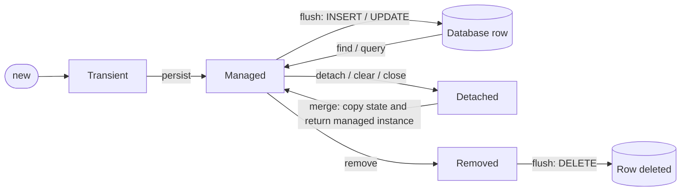
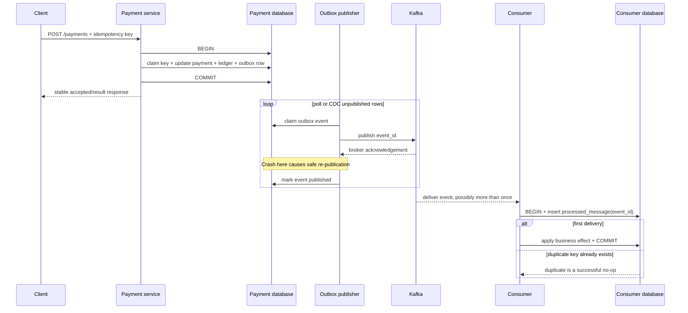

# Spring Senior Backend Reference

- [How to use this book](#how-to-use-this-book)

- [0. Two flows to keep in mind](#0-two-flows-to-keep-in-mind)

- [Part I. Container and Spring Boot](#part-i-container-and-spring-boot)
  - [1. Spring and Spring Boot](#1-spring-and-spring-boot)
  - [2. Configuration and auto-configuration](#2-configuration-and-auto-configuration)
  - [3. IoC dependency injection and beans](#3-ioc-dependency-injection-and-beans)
  - [4. Container startup and extension points](#4-container-startup-and-extension-points)
  - [5. Aspect-oriented programming and Spring proxies](#5-aspect-oriented-programming-aop-and-spring-proxies)

- [Part II. HTTP and security](#part-ii-http-and-security)
  - [6. The servlet request path](#6-the-servlet-request-path)
  - [7. Spring Security architecture](#7-spring-security-architecture)
  - [8. API boundaries, validation and exceptions](#8-api-boundaries-validation-and-exceptions)
  - [9. Method authorization and ownership](#9-method-authorization-and-ownership)

- [Part III. Persistence and consistency](#part-iii-persistence-and-consistency)
  - [10. JPA and the persistence context](#10-jpa-and-the-persistence-context)
  - [11. Mapping fetching and query performance](#11-mapping-fetching-and-query-performance)
  - [12. Concurrent writes and locking](#12-concurrent-writes-and-locking)
  - [13. Spring transactions](#13-spring-transactions)
  - [14. Cross-system consistency](#14-cross-system-consistency)

- [Part IV. Production engineering](#part-iv-production-engineering)
  - [15. Resilience](#15-resilience)
  - [16. Observability and diagnosis](#16-observability-and-diagnosis)
  - [17. Production testing](#17-production-testing)
  - [18. End-to-end banking scenarios](#18-end-to-end-banking-scenarios)
  - [19. Senior answer wall](#19-senior-answer-wall)

- [Primary references](#primary-references)

- [Study map](#study-map)

## How to use this book

This is the **readable answer sheet** for a senior Java/Spring backend
interview. It is self-contained: definitions, runtime flows, code,
trade-offs and failure semantics live together. The companion files are the
active-recall side:

- [Spring Boot basics exercises](spring-boot-basics.md)

- [Container internals exercises](spring-container-internals.md)

- [Spring Security exercises](spring-security-basics.md)

- [JPA and Hibernate performance exercises](spring-data-jpa-performance.md)

- [Deep transaction exercises](spring-boot-transactions-deep.md)

- [Resilience exercises](spring-boot-resilience.md)

- [Observability exercises](spring-boot-observability.md)

- [Production testing exercises](spring-boot-testing-deep.md)

Read a chapter here, close it, and answer the corresponding companion kit
aloud. A senior answer should normally have three layers:

1. **Mechanism** — what actually happens at runtime.

2. **Consequence** — correctness, latency, security or operability impact.

3. **Decision** — what you would choose and what evidence would change it.

Do not begin with annotation vocabulary. Begin with the invariant or failure
you are protecting. For example: *"A debit and its outbox record must commit
together; Kafka publication is asynchronous and the consumer is
idempotent."* Then name the Spring mechanisms.

### The minimum viable path

Do not start in the middle of the book. Learn three connected runtime stories;
each later chapter should attach to one of them.

1. **How the application comes alive:**
   [§1 Boot](#1-spring-and-spring-boot) →
   [§2 configuration](#2-configuration-and-auto-configuration) →
   [§3 one bean](#3-ioc-dependency-injection-and-beans) →
   [§4 context refresh and lifecycle](#4-container-startup-and-extension-points) →
   [§5 one proxied call](#5-aspect-oriented-programming-aop-and-spring-proxies).

2. **How one request reaches business code:**
   [§6 servlet path](#6-the-servlet-request-path) →
   [§7 authentication](#7-spring-security-architecture) →
   [§8 validation/errors](#8-api-boundaries-validation-and-exceptions) →
   [§9 method authorization](#9-method-authorization-and-ownership).

3. **How one business operation becomes durable:**
   [§13 transaction boundary](#13-spring-transactions) →
   [§10 persistence context](#10-jpa-and-the-persistence-context) →
   [§11 SQL/fetch behavior](#11-mapping-fetching-and-query-performance) →
   [§12 concurrent writes](#12-concurrent-writes-and-locking) →
   [§14 cross-system consistency](#14-cross-system-consistency).

If time is short, be able to narrate those three stories before collecting
isolated annotations or edge cases. Then add the production proof:
[§15 resilience](#15-resilience) →
[§16 observability](#16-observability-and-diagnosis) →
[§17 testing](#17-production-testing).

This order is conceptual rather than numeric. It deliberately follows runtime
causality: **start the application → handle a request → commit its effects →
prove it behaves in production.**

### Version boundary

As of **1 September 2026**, the current line is Spring Boot **4.1.1** on
Spring Framework **7.0.x** and Spring Security **7.1.x**. Boot 4.1 requires
at least Java 17. The examples favor APIs and concepts that remain stable
across Boot 3 and 4; version-specific package imports are omitted where they
would distract from the mechanism.

Three migration lines matter in interviews:

| Line | What changes |
|---|---|
| Boot 2.7 → 3.x | Java 17 baseline; Framework 6; `javax.*` EE APIs become `jakarta.*`; Spring Security configuration uses `SecurityFilterChain`, not `WebSecurityConfigurerAdapter`. |
| Boot 3.5 → 4.x | Framework 7/Security 7; Boot modules, starters, test modules and packages are more granular; Jackson 3 is preferred; several test imports and dependencies move. |
| Existing estate → current | Upgrade compatibility is a delivery problem: Java/runtime, servlet/Jakarta APIs, dependencies, tests, observability and deployment platform all need proof. |

The right interview answer is honest: state what you ran, then explain the
upgrade boundary.

---

## 0. Two flows to keep in mind

Most of this book fits into two flows. First, Spring builds the application.
Then the application handles requests. Keeping those flows separate makes the
details easier to place: startup explains how an object becomes a Spring bean;
request handling explains what happens when that bean is called.

### Startup: Spring builds the application

When `main` calls `SpringApplication.run(...)`, the controllers, services and
repositories do not exist yet. Spring Boot reads the application's
configuration and tells Spring which objects are needed. Spring then creates
those objects, supplies their dependencies and prepares them for use.

```text
main
  -> Spring Boot reads configuration
  -> Spring registers bean definitions
  -> Spring creates beans and injects their dependencies
  -> bean post-processors initialize or wrap some beans with proxies
  -> the web server starts
  -> the application is ready
```

By the end of startup, the application has a graph of connected objects. Some
of those objects are proxies that add behavior such as transactions, method
security, caching or asynchronous execution. Part I examines how that graph is
built and why a proxy sometimes changes what a method call does.

### Request handling: the application uses those objects

After startup, an HTTP request follows a different flow:

```text
client
  -> servlet container and filters
  -> Spring Security
  -> DispatcherServlet
  -> controller
  -> service
  -> repository and JPA
  -> connection pool
  -> database
  -> HTTP response
```

Each stage hands work to the next one. Security filters can reject a request
before a controller is called. The controller translates HTTP input into a
Java call and delegates the business work to a service. The service may be a
proxy, so transaction or authorization logic can run around the method. The
repository uses JPA and a pooled database connection to execute SQL.

Calls to another HTTP service or message broker branch away from this path.
They do not become part of a database transaction merely because the service
method has `@Transactional`; cross-system consistency needs an explicit
design, covered in Part III.

In production, logs, metrics and traces show where these flows stopped or
slowed down. Part II follows the request to the service layer, Part III follows
state into and beyond the database, and Part IV covers failure, diagnosis and
testing.

---

# Part I. Container and Spring Boot

Part I follows one application from `main` to its first service call:

```text
SpringApplication.run(...)
  -> configuration and bean definitions are collected
  -> context refresh creates and wires beans
       -> some beans are exposed through proxies
  -> application runners execute
  -> the application becomes ready
  -> another bean calls a service through its exposed reference
```

Chapters 1–4 explain how the application is assembled. Chapter 5 starts after
startup and explains what happens when a proxied bean is called.

## 1. Spring and Spring Boot

### What each one does

The Spring Framework supplies the container and the programming model. It can
create objects, connect their dependencies, manage their lifecycle and add
infrastructure around method calls. Spring MVC, transaction management and
Spring's testing support are also Framework features.

Spring Boot assembles those features into an application. It manages compatible
dependency versions, contributes configuration when suitable libraries are on
the classpath, starts an embedded server and provides production integrations
such as health checks and metrics.

| Spring Framework | Spring Boot |
|---|---|
| Defines beans, dependency injection, AOP, transactions and MVC | Configures those facilities using classpath, properties and existing beans |
| Gives explicit mechanisms | Supplies common defaults and lets application code replace them |
| Can be used without Boot | Uses the Framework underneath |

A useful way to remember the relationship is: **Spring provides the machinery;
Boot decides how much of it can be assembled automatically.**

### The application class

A typical Boot application starts here:

```java
@SpringBootApplication
public class PaymentApplication {
    public static void main(String[] args) {
        SpringApplication.run(PaymentApplication.class, args);
    }
}
```

`@SpringBootApplication` combines three roles:

- `@SpringBootConfiguration` marks the application's main configuration.

- `@ComponentScan` finds application components below the package containing
  the application class.

- `@EnableAutoConfiguration` imports Boot's conditional configuration.

Package placement matters because component scanning starts from the
application class's package:

```text
com.bank                         scanned
  PaymentApplication
  payments.PaymentService       found
  shared.AuditRecorder          found

com.shared.AuditRecorder        not found: outside com.bank
```

Putting the application class in the application's root package gives scanning
a clear boundary. Code outside that boundary must be included deliberately
with `@Import`, another scan, or library auto-configuration.

### Starters and auto-configuration

A starter and an auto-configuration solve different problems.

A **starter** is a dependency descriptor. For example,
`spring-boot-starter-data-jpa` brings in Spring Data JPA, Hibernate and the
supporting libraries using versions managed by Boot.

An **auto-configuration** is code. It looks at the classpath, configuration
properties and beans already registered, then contributes definitions when its
conditions match.

```text
JPA starter added
  -> JPA and database classes appear on the classpath
  -> Boot evaluates database auto-configurations
  -> matching conditions contribute DataSource, JPA and transaction beans
```

Adding a dependency can therefore change application startup even when no
application code refers to it. Conversely, having an auto-configuration class
in a jar does nothing when its conditions do not match.

Boot commonly uses `@ConditionalOnMissingBean` for defaults. If the application
already defines the relevant bean, the condition is false and Boot does not add
its default. This is called **backing off**; Boot is deciding what to register,
not replacing an object later at runtime.

### From `main` to ready

`SpringApplication.run(...)` drives the whole startup. The stable sequence is:

```text
prepare environment
  -> create ApplicationContext
  -> load application and auto-configuration definitions
  -> refresh the context and create beans
  -> start application runners
  -> publish readiness
```

First, Boot builds the `Environment` from configuration sources and determines
which profiles are active. Those values must be available early because they
affect which definitions are registered.

Next, Boot creates the appropriate `ApplicationContext` and loads definitions
from component scanning, `@Bean` methods, imports and auto-configuration. A
definition is a recipe for an object; most application objects do not exist
yet.

The context is then refreshed. During refresh, Spring processes definitions,
installs container extension points and creates the non-lazy singleton beans.
This is where dependency injection, lifecycle callbacks and proxy creation
happen. Chapters 2–4 explain the inputs to refresh and what happens inside it.

After refresh, Boot calls `ApplicationRunner` and `CommandLineRunner` beans.
When they finish, it publishes `ApplicationReadyEvent` and changes its
readiness state to accepting traffic. A runner can therefore delay readiness
or fail startup, so runner work should be bounded.

An initialized web server is not by itself proof that the application is ready.
Traffic should be controlled by a readiness probe that reflects the Boot
readiness state.

---

## 2. Configuration and auto-configuration

Configuration affects startup before most application beans exist. Boot loads
values into the `Environment`; Spring then uses those values while deciding
which definitions to register and how to construct their objects.

### External configuration

Boot can read configuration from packaged files, profile-specific files,
environment variables, system properties, command-line arguments and test
overrides. Later, higher-precedence sources can override earlier ones.

The complete precedence list is best treated as reference material. During a
failure, the useful question is: **which property source supplied the final
value?** Startup diagnostics and secured Actuator environment endpoints can
answer that question. Secret values must remain sanitized.

Command-line `--server.port=9090`, for example, overrides a packaged
`server.port` value. An environment variable is convenient in a container
platform because it changes deployment configuration without rebuilding the
application image.

### Bind related values as one type

Suppose the application needs these settings:

```yaml
payment-switch:
  base-url: https://switch.internal
  connect-timeout: 300ms
  read-timeout: 1500ms
  max-in-flight: 80
```

Bind the group to one validated type:

```java
@ConfigurationProperties("payment-switch")
@Validated
public record SwitchProperties(
        @NotNull URI baseUrl,
        @NotNull Duration connectTimeout,
        @NotNull Duration readTimeout,
        @Min(1) int maxInFlight) { }
```

This gives the application typed values, one place for validation and a clear
description of the configuration it expects. A malformed duration or missing
URL fails startup instead of surfacing during the first request.

The properties type must also be registered. Common choices are
`@EnableConfigurationProperties(SwitchProperties.class)` on a configuration
class or `@ConfigurationPropertiesScan` on the application class.

Boot's relaxed binding maps conventional external names to Java names. For
example, these refer to the same field in the appropriate property source:

```text
payment-switch.max-in-flight
paymentSwitch.maxInFlight
PAYMENT_SWITCH_MAX_IN_FLIGHT
```

Use `@Value` for an isolated value or expression. Prefer
`@ConfigurationProperties` when several values form one configuration concept.

Secrets should come from an approved secret store or platform-provided property
source. Binding a secret into a typed object does not make it safe to log or
expose through an endpoint.

### Profiles

A profile selects a set of bean definitions or configuration files. It is
useful for infrastructure differences such as a local stub:

```java
@Bean
@Profile("local")
FraudClient localFraudClient() {
    return request -> FraudDecision.accepted();
}
```

Profiles become difficult to reason about when they encode many independent
business choices in names such as `prod-bank-a-region-2-dr`. Use typed
properties for values and explicit strategy objects for business variants.

Security-sensitive defaults should fail closed. A misspelled production
profile must not silently activate a permissive local bean.

### How auto-configuration decides

Boot discovers auto-configuration classes from import metadata in libraries;
application component scanning is not responsible for finding them. Each class
uses conditions to state when its definitions are relevant.

Common conditions include:

- `@ConditionalOnClass`: a required API is present;

- `@ConditionalOnMissingBean`: the application has not supplied its own bean;

- `@ConditionalOnProperty`: a setting enables or selects the feature;

- `@ConditionalOnWebApplication`: the expected web application type is in use.

```java
@AutoConfiguration
@ConditionalOnClass(SignedClient.class)
@EnableConfigurationProperties(SignedClientProperties.class)
class SignedClientAutoConfiguration {

    @Bean
    @ConditionalOnMissingBean
    SignedClient signedClient(SignedClientProperties properties) {
        return new SignedClient(properties.baseUrl(), properties.keyId());
    }
}
```

If `SignedClient` is absent, the auto-configuration is irrelevant. If the class
is present but the application already defines a `SignedClient`, the default
backs off. If both conditions match, the definition is registered and its bean
is created during refresh like any other bean.

### Diagnose the decision, do not guess

When an expected auto-configured bean is missing:

1. Confirm that the dependency and expected version are present.

2. Check active profiles and the resolved configuration properties.

3. Enable the condition evaluation report with `--debug`, or inspect the
   secured Actuator `conditions` endpoint.

4. Find the relevant auto-configuration and read why each condition matched or
   did not match.

5. Check whether an application bean caused the default to back off.

6. Check explicit exclusions and package scanning for application components.

Do not copy an auto-configuration class into application code merely to make
the bean appear. First identify which premise was false.

Invalid configuration and unavailable infrastructure need different policies.
A missing issuer URL or invalid timeout should normally fail startup. A valid
but temporarily unreachable dependency may instead keep the application
unready until it recovers, depending on the deployment contract.

---

## 3. IoC dependency injection and beans

The application context is a registry of named objects called **beans**. A bean
is not a special kind of Java object; it is an object whose construction and
lifecycle are managed by Spring.

### Why dependency injection exists

Without dependency injection, a class chooses and constructs its own
collaborators:

```java
class PaymentService {
    private final PaymentRepository repository =
            new OraclePaymentRepository();
}
```

`PaymentService` is now tied to one repository implementation. Replacing the
repository for a test or a different database requires changing the class.

With constructor injection, the class states what it needs and leaves the
choice to its caller:

```java
@Service
class PaymentService {
    private final PaymentRepository repository;
    private final FraudClient fraudClient;

    PaymentService(PaymentRepository repository, FraudClient fraudClient) {
        this.repository = repository;
        this.fraudClient = fraudClient;
    }
}
```

Spring creates the bean, finds matching collaborators and calls the
constructor. A unit test can make the same call with fakes. This is dependency
injection; the inversion of control is that `PaymentService` no longer controls
the assembly of the object graph.

Constructor injection is the normal choice for required dependencies. It makes
them visible, permits `final` fields and prevents a usable instance from being
created without them. A single constructor does not need `@Autowired`.

Field injection hides required inputs and makes ordinary construction awkward.
Setter injection is useful only when a dependency is genuinely optional or
replaceable after construction.

### How a class becomes a bean

Spring needs a bean definition before it can create an object. Common sources
of definitions are:

- component scanning of classes annotated with `@Component` or a specialized
  stereotype;

- `@Bean` methods in configuration classes;

- explicit imports;

- Boot auto-configuration.

The main stereotypes communicate the role of a scanned class:

| Annotation | Intended role |
|---|---|
| `@Component` | general managed component |
| `@Service` | application or business service |
| `@Repository` | persistence component; also enables eligible persistence-exception translation |
| `@Controller` | MVC controller, commonly returning views |
| `@RestController` | MVC controller whose handler return values are written to the response body |

The annotation registers the class; it does not enforce the architecture. A
controller containing SQL is still poor design even though Spring can create
it successfully.

Use a `@Bean` method when construction needs third-party code or explicit setup:

```java
@Configuration(proxyBeanMethods = false)
class TimeConfiguration {
    @Bean
    Clock clock() {
        return Clock.systemUTC();
    }
}
```

Spring manages the returned `Clock` in the same way it manages a scanned bean.

### How Spring chooses a dependency

Spring first looks for beans assignable to the required type. With exactly one
candidate, injection is straightforward. With none, startup normally fails
with `NoSuchBeanDefinitionException`. With several, Spring needs more
information.

```java
interface PaymentRail {
    Receipt send(Payment payment);
}

@Component
class ImpsRail implements PaymentRail { /* ... */ }

@Component
class NeftRail implements PaymentRail { /* ... */ }
```

A constructor that requests one `PaymentRail` is ambiguous. The usual ways to
resolve it are:

- mark one candidate `@Primary` when it is the application-wide default;

- put `@Qualifier("neftRail")` at an injection point when that consumer needs
  a particular candidate;

- inject all candidates as `List<PaymentRail>` or `Map<String, PaymentRail>`
  when the application genuinely needs a set of strategies.

`@Primary` expresses a default on the producing side. `@Qualifier` expresses a
choice on the consuming side and is more specific.

```java
@Service
class BulkSalaryService {
    private final PaymentRail rail;

    BulkSalaryService(@Qualifier("neftRail") PaymentRail rail) {
        this.rail = rail;
    }
}
```

For runtime routing, do not expose bean names as business values. Convert input
to a domain type and build a domain-keyed map:

```java
enum Rail { IMPS, NEFT }

interface PaymentRail {
    Rail rail();
    Receipt send(Payment payment);
}

@Service
class RailRouter {
    private final Map<Rail, PaymentRail> rails;

    RailRouter(List<PaymentRail> implementations) {
        this.rails = implementations.stream()
                .collect(toUnmodifiableMap(PaymentRail::rail, identity()));
    }

    Receipt route(Rail rail, Payment payment) {
        PaymentRail implementation = rails.get(rail);
        if (implementation == null) {
            throw new UnsupportedRailException(rail);
        }
        return implementation.send(payment);
    }
}
```

Bean names remain wiring details, while the API works with the closed set of
values defined by `Rail`.

Use `Optional<T>` for a genuinely optional single dependency and
`ObjectProvider<T>` when lookup must be lazy or repeated. Do not use either one
to hide a dependency that the application cannot function without.

### Scope and shared state

The default bean scope is **singleton per application context**. One singleton
service can be called concurrently by many request threads, so singleton does
not mean thread-safe.

```java
@Service
class BadSequenceService {
    private long next;

    long next() {
        return ++next; // shared mutation and a data race
    }
}
```

Keep singleton services stateless. Durable counters and business state belong
in a store with the required concurrency guarantees; operational counters
belong in a metrics system.

Other scopes include prototype, request and session. Injecting a request-scoped
object into a singleton requires indirection, normally a scoped proxy or an
`ObjectProvider`, so the current request's instance is resolved at call time.

### Circular dependencies

Constructor injection exposes cycles immediately:

```text
PaymentService -> NotificationService -> PaymentService
```

Neither object can be constructed first, so startup fails. That is usually a
design problem, not a container setting to work around.

Typical corrections are:

- extract a third service that owns the workflow involving both components;

- publish a domain event when one component should announce an outcome without
  knowing its consumers;

- separate orchestration from the two capabilities being orchestrated.

`@Lazy` or `ObjectProvider<T>` can defer one lookup and break the construction
cycle, but the runtime dependency cycle still exists. Treat that as a tactical
bridge, not the design goal.

---

## 4. Container startup and extension points

Chapter 3 described the objects Spring creates. This chapter follows the
container work that turns definitions into those objects.

### Definitions are recipes

A `BeanDefinition` records how Spring should create a bean: its type or factory
method, scope, constructor arguments, qualifiers, lifecycle methods and other
metadata. A `BeanDefinitionRegistry` holds those recipes. A `BeanFactory` uses
them to create and connect objects.

An `ApplicationContext` builds on the bean factory. It adds environment and
profile support, resource loading, events, message resolution and application
lifecycle integration.

```text
component scan / @Bean / @Import / auto-configuration
                         |
                         v
                 BeanDefinitions
                         |
                         v
                    BeanFactory
                         |
                         v
                  managed objects
```

Keeping definitions separate from instances lets Spring inspect and modify the
plan before it constructs ordinary application beans.

### Refresh in three stages

`ApplicationContext.refresh()` is the central container operation during Boot
startup. Its implementation has many steps, but three stages explain the
extension model:

```text
1. COMPLETE OR CHANGE DEFINITIONS
   registry and factory post-processors inspect the recipes

2. INSTALL BEAN POST-PROCESSORS
   processors that will participate in bean creation are registered

3. CREATE REMAINING SINGLETONS
   construct -> inject -> initialize -> expose
```

Configuration-class processing, component scanning and imports contribute to
the first stage. Bean post-processors must be installed before normal beans are
created because those processors implement much of annotation injection,
lifecycle handling and proxy creation.

The final stage creates the remaining non-lazy singletons. Web-server and
lifecycle infrastructure are also completed during refresh. When refresh
succeeds, the context contains the references that other beans will use.

### The lifecycle of one bean

For one ordinary singleton, the relevant sequence is:

```text
instantiate
  -> inject dependencies and properties
  -> invoke aware callbacks
  -> BeanPostProcessor: before initialization
  -> @PostConstruct / afterPropertiesSet / custom init method
  -> BeanPostProcessor: after initialization
  -> expose the resulting reference for use
  -> @PreDestroy / destroy method when the context closes
```

A post-processor may return the original object or a replacement reference.
Spring AOP infrastructure commonly returns a proxy that wraps the original
target. Other beans then receive the proxy, not the raw target.

```text
PaymentService target
        |
        | post-processing adds transaction advice
        v
PaymentService proxy  -> reference injected into callers
```

This timing explains why an advised method should not be invoked from
`@PostConstruct`. Initialization runs on the target while the final proxy is
still being prepared, and a call through `this` would bypass that proxy anyway.

Use `@PostConstruct` for fast local initialization that requires injected
dependencies. Avoid slow network calls there: they delay context refresh and
make startup depend on remote availability. Application-level work that must
run after the context is built belongs in a bounded runner or an appropriate
lifecycle component.

Destruction callbacks run for managed singletons when the context closes
normally. Spring does not manage destruction of prototype beans after handing
them to the caller, and no callback is guaranteed after an abrupt process
termination.

### Factory post-processors and bean post-processors

The similar names refer to different stages:

| Extension point | Operates on | Typical use |
|---|---|---|
| `BeanDefinitionRegistryPostProcessor` | the definition registry | add more bean definitions |
| `BeanFactoryPostProcessor` | bean definitions | change metadata before normal objects exist |
| `BeanPostProcessor` | bean instances | injection support, lifecycle callbacks and proxy wrapping |

Creating ordinary beans from a factory post-processor is dangerous because it
pulls them into existence before all bean post-processors are installed. Such a
bean can miss later processing and proxy creation.

Application code rarely needs to implement these interfaces. Their main value
is explanatory: many Spring annotations work because infrastructure
post-processors interpret them at the correct stage.

### `@Configuration` and inter-bean calls

Consider two beans declared in one configuration class:

```java
@Configuration
class LedgerConfiguration {
    @Bean
    Ledger ledger() {
        return new Ledger();
    }

    @Bean
    PostingService postingService() {
        return new PostingService(ledger());
    }
}
```

With the default `proxyBeanMethods = true`, Spring subclasses the configuration
class. The call to `ledger()` is intercepted and returns the managed singleton
rather than constructing another `Ledger`.

When `proxyBeanMethods = false`, the class is not enhanced. Calling one `@Bean`
method from another is then an ordinary Java call and creates a second object.
The safer lite-mode style is parameter injection:

```java
@Configuration(proxyBeanMethods = false)
class LedgerConfiguration {
    @Bean
    Ledger ledger() {
        return new Ledger();
    }

    @Bean
    PostingService postingService(Ledger ledger) {
        return new PostingService(ledger);
    }
}
```

Spring resolves the parameter from the container, so the code does not depend
on configuration-class method interception. This style is explicit and is
widely used by Boot auto-configuration.

### `FactoryBean<T>`

A `FactoryBean<T>` is itself a bean that creates another object when
construction must be delegated to framework-specific factory logic. Looking up
`client` returns the product; looking up `&client` returns the factory.

Do not confuse it with `BeanFactory`: `FactoryBean` creates one kind of product,
while `BeanFactory` is the container that manages all bean definitions and
instances.

---

## 5. Aspect-oriented programming (AOP) and Spring proxies

At this point startup is complete. The container has created a
`PaymentService` and may have exposed a proxy around it. This chapter follows a
call from another bean to that exposed reference.

### Why Spring uses proxies

Transactions, method authorization, caching, retry and asynchronous execution
all need behavior around a method call. Writing that wrapper inside every
business method would mix infrastructure with business logic and repeat the
same policy across many classes.

Spring AOP places the wrapper in a proxy:

```text
caller
  -> proxy
       -> run matching interceptors
       -> call target method
       -> complete matching interceptors
  <- result or exception
```

An annotation such as `@Transactional` is metadata. It does not start a
transaction by itself. Transaction infrastructure finds that metadata and
adds an interceptor to an eligible bean's proxy.

### One transactional call

```java
record SettlementCommand(UUID paymentId) { }
record Receipt(UUID paymentId) { }

@Service
class PaymentService {
    @Transactional
    public Receipt settle(SettlementCommand command) {
        // business and persistence work
        return new Receipt(command.paymentId());
    }
}

@Component
class SettlementCoordinator {
    private final PaymentService payments;

    SettlementCoordinator(PaymentService payments) {
        this.payments = payments;
    }

    Receipt settle(UUID paymentId) {
        return payments.settle(new SettlementCommand(paymentId));
    }
}
```

`SettlementCoordinator` normally receives the exposed `PaymentService` proxy.
The call proceeds as follows:

1. The coordinator calls `settle(...)` on the proxy.

2. The proxy finds the matching transaction interceptor.

3. The interceptor starts or joins a transaction and calls the target method.

4. When the target returns or throws, the interceptor applies the transaction
   completion rules before control returns to the coordinator.

The exact propagation and rollback rules belong to §13. The important point
here is that the call reached the interceptor before it reached the target.

```text
SettlementCoordinator
  -> PaymentService proxy
       -> TransactionInterceptor
            -> PaymentService target
       <- commit or roll back
  <- result or exception
```

Calling `new PaymentService().settle(...)` calls an ordinary Java object. The
container did not create or expose that instance, so no Spring proxy surrounds
the call.

### The small AOP vocabulary

| Term | Meaning in Spring AOP |
|---|---|
| target | the application object containing the method |
| proxy | the object given to callers; it runs interceptors and delegates to the target |
| advice/interceptor | code that runs before, after or around a method call |
| pointcut | a rule selecting which method executions receive advice |
| advisor | a pointcut paired with advice |
| aspect | a component that groups a cross-cutting policy and its selection rule |

Spring AOP supports method-execution join points on Spring-managed beans. Full
AspectJ weaving is a separate bytecode mechanism and is not assumed here.

### Proxy types and method constraints

Spring can expose two common proxy shapes:

| Proxy type | Shape | Main consequence |
|---|---|---|
| JDK dynamic proxy | implements the target's interfaces | callers use an interface implemented by the proxy |
| class-based proxy | generated subclass of the target class | the class and advised methods must be overridable |

Class-based proxies cannot advise `final` methods and cannot subclass a `final`
class. Private methods cannot be advised through either proxy style. Public,
non-final service methods are the least surprising proxy boundary.

Spring Boot commonly enables class-based proxies by default, but application
and feature configuration can change the proxy type. Business design should
not rely on guessing which one was chosen.

### Self-invocation bypasses the proxy

Once a proxy delegates to its target, a call from one target method to another
uses `this`. It does not travel back out through the proxy.

```java
@Service
class SettlementService {
    public void settleBatch(List<UUID> paymentIds) {
        for (UUID paymentId : paymentIds) {
            settleOne(paymentId); // direct call on this
        }
    }

    @Transactional
    public void settleOne(UUID paymentId) {
        // database work
    }
}
```

If `settleBatch` is not transactional, `settleOne` does not acquire a
transaction through its annotation. The same rule affects method security,
caching, retry and `@Async`.

Move the advised operation to a collaborator when it needs an independently
intercepted boundary:

```java
@Service
class SingleSettlementService {
    @Transactional
    public void settle(UUID paymentId) {
        // database work
    }
}

@Service
class BatchSettlementService {
    private final SingleSettlementService single;

    BatchSettlementService(SingleSettlementService single) {
        this.single = single;
    }

    public void settleBatch(List<UUID> paymentIds) {
        paymentIds.forEach(single::settle); // crosses the collaborator proxy
    }
}
```

As written, each item has its own transaction. If the whole batch must be
atomic, put the transaction around the batch instead. Transaction placement is
a business decision, not merely a workaround for self-invocation.

Self-injection and `AopContext.currentProxy()` can force a call back through the
proxy, but they couple business code to the interception mechanism. A separate
collaborator usually makes the intended boundary clearer.

### Other reasons advice appears to be missing

When an annotation seems ineffective, check the call rather than the annotation
first:

- Was the object created and managed by Spring, or with `new`?

- Did the caller receive the exposed proxy, or a raw target reference?

- Did the call come from another object, or from `this`?

- Can the selected proxy type intercept that method?

- Is the feature enabled and is its infrastructure present?

- Did another interceptor change the thread, exception or ordering?

Initialization is another special case. `@PostConstruct` runs before the final
proxy is available for normal use, so it should not depend on an advised
self-call.

Interceptor order also changes behavior. Retry outside a transaction can start
a fresh transaction for each attempt. A transaction outside retry can keep all
attempts inside one transaction that may already be marked rollback-only.
`@Async` moves execution to another thread, so thread-local transaction and
security state do not automatically follow.

### When AOP fits

AOP is a good fit for stable, cross-cutting policy that naturally surrounds a
method call: transactions, authorization, observation and carefully defined
retry or caching rules.

Keep business workflow explicit. Payment state transitions, fee calculation,
compensation and idempotency should be visible in ordinary application code,
not hidden inside an aspect.

Most applications only consume Spring's existing advisors. If an application
defines a custom aspect, keep its pointcut narrow and test both methods that
should match and methods that must not match.

---

# Part II. HTTP and security

Part II follows one HTTP request until it reaches business code:

```text
client
  -> servlet container
  -> servlet filters
       -> Spring Security authenticates and checks the request
  -> DispatcherServlet
       -> select controller
       -> deserialize and validate input
       -> invoke controller
            -> call service proxy
                 -> method authorization
                 -> business operation
       -> serialize the response
```

The order matters. A security filter can reject the request before Spring MVC
selects a controller. MVC exception handling therefore cannot handle every
failure produced during an HTTP request.

## 6. The servlet request path

### From the socket to Spring MVC

In a traditional Spring MVC application, the embedded servlet container owns
the listening socket and a worker-thread pool. It assigns an accepted request
to a thread and invokes the servlet filter chain.

```text
Tomcat or Jetty
  -> Filter 1
  -> Filter 2
  -> Spring Security filter chain
  -> DispatcherServlet
  -> controller
  -> service
```

A filter can inspect or modify the request and response, continue with
`chain.doFilter(...)`, or stop processing and write a response itself. Logging,
correlation, security and compression commonly live in filters because they
need to surround the servlet.

`DispatcherServlet` is the front controller for Spring MVC. Once the filter
chain reaches it, MVC takes over.

### What `DispatcherServlet` delegates

`DispatcherServlet` coordinates other components rather than performing every
step itself:

| Component | Responsibility |
|---|---|
| `HandlerMapping` | find the handler for the request path, method and conditions |
| `HandlerAdapter` | invoke the selected kind of handler |
| argument resolvers | create method arguments such as `@PathVariable`, `Authentication` or `Pageable` |
| `HttpMessageConverter` | read and write formats such as JSON, text and bytes |
| Bean Validation | validate eligible controller arguments |
| `HandlerExceptionResolver` | turn MVC exceptions into responses |

For a REST controller, the normal flow is:

```text
request bytes
  -> message converter creates request DTO
  -> validation checks the DTO
  -> controller calls application service
  -> controller result becomes response DTO
  -> message converter writes response bytes
```

An ordinary `@Controller` commonly returns a view name. `@RestController`
includes response-body behavior, so its return values are written to the HTTP
response.

### Filters, interceptors and advice are different hooks

These extension points sit at different places:

| Hook | Runs around | Can act before controller selection? |
|---|---|---|
| servlet `Filter` | the servlet and everything downstream | yes |
| Spring MVC `HandlerInterceptor` | a mapped MVC handler | no |
| `@ControllerAdvice` | MVC argument, controller and response exception handling | no |
| Spring AOP proxy | a call to an advised Spring bean | unrelated to raw servlet traffic |

Place behavior at the earliest layer that has the information it needs.
Authentication belongs in the security filter chain. HTTP representation and
MVC error mapping belong in MVC. Business ownership checks usually belong on
the service operation and in the data access rule that protects the state.

### The blocking request model

Spring MVC normally keeps one container thread assigned to a request while it
waits for JDBC or blocking network calls. Capacity is therefore constrained by
worker threads, database connections, downstream connections and latency.

If 200 request threads compete for 30 database connections, increasing the
thread count does not create more database throughput. It can instead create a
longer queue and consume more memory.

Virtual threads reduce the cost of blocked threads but do not create additional
database connections or downstream capacity. WebFlux avoids tying up a thread
for non-blocking I/O, but only when the entire relevant path uses non-blocking
drivers and APIs. Mixing blocking JDBC into an event loop removes that benefit.

Timeouts, retries and saturation controls for downstream work are covered in
Part IV.

---

## 7. Spring Security architecture

Spring Security's servlet support is a filter-based layer in front of Spring
MVC. Its job is to establish an identity, apply request-level security rules and
either continue the filter chain or produce a security response.

### Authentication comes before authorization

**Authentication** establishes who the caller is and how that identity was
verified. **Authorization** decides whether that caller may perform an action.

A valid credential is not by itself permission to settle a payment. It creates
an authenticated identity with authorities that later authorization rules can
evaluate.

The main runtime objects are:

| Object | Meaning |
|---|---|
| `Authentication` | principal, authorities, authentication state and mechanism-specific details |
| `SecurityContext` | holder for the current `Authentication` |
| `SecurityContextHolder` | access to the context associated with current execution |
| authority | a granted capability such as `PAYMENT_WRITE` |

### How the security filter chain fits

The servlet container knows about a `DelegatingFilterProxy`. That proxy finds
Spring Security's `FilterChainProxy` bean and delegates to it:

```text
servlet FilterChain
  -> DelegatingFilterProxy
       -> FilterChainProxy
            -> first matching SecurityFilterChain
                 -> exploit protection
                 -> authentication filters
                 -> request authorization
  -> DispatcherServlet
```

Each `SecurityFilterChain` has a request matcher and an ordered set of filters.
`FilterChainProxy` uses the first matching chain. If an API chain matches
`/api/**`, later chains are not added to it; only that chain's filters run.

Inside a chain, authentication must be established before request authorization
can use it. A security filter can stop without calling the next filter, which is
why an unauthenticated request may never reach MVC.

### One bearer-token request

Assume the client sends:

```http
POST /api/payments/7e5b7c0a/settlement HTTP/1.1
Authorization: Bearer eyJ...
Content-Type: application/json
```

The API is a resource server: it accepts an access token issued by an
authorization server and validates that token before serving the protected
resource.

For a JWT, validation includes more than Base64 decoding. The resource server
must verify the signature using a trusted key and validate claims such as
issuer, expiration, not-before and audience. A signed JWT normally provides
integrity, not secrecy, so sensitive data should not be placed in its claims.

Boot can configure standard issuer and audience validation:

```yaml
spring:
  security:
    oauth2:
      resourceserver:
        jwt:
          issuer-uri: https://identity.example.com
          audiences: payments-api
```

The token may carry an application-specific claim:

```json
{
  "iss": "https://identity.example.com",
  "sub": "user-1842",
  "aud": ["payments-api"],
  "exp": 1788778800,
  "permissions": ["PAYMENT_WRITE"]
}
```

Claims are trusted only after signature and claim validation succeeds.

### Configuring the API chain

This configuration maps `permissions` directly to authorities and protects the
API with stateless bearer authentication:

```java
@Configuration(proxyBeanMethods = false)
class SecurityConfiguration {

    @Bean
    JwtAuthenticationConverter jwtAuthenticationConverter() {
        JwtGrantedAuthoritiesConverter authorities =
                new JwtGrantedAuthoritiesConverter();
        authorities.setAuthoritiesClaimName("permissions");
        authorities.setAuthorityPrefix("");

        JwtAuthenticationConverter converter =
                new JwtAuthenticationConverter();
        converter.setJwtGrantedAuthoritiesConverter(authorities);
        return converter;
    }

    @Bean
    @Order(1)
    SecurityFilterChain api(
            HttpSecurity http,
            JwtAuthenticationConverter converter) throws Exception {

        return http
                .securityMatcher("/api/**")
                .sessionManagement(session -> session
                        .sessionCreationPolicy(
                                SessionCreationPolicy.STATELESS))
                .csrf(csrf -> csrf.disable())
                .cors(Customizer.withDefaults())
                .authorizeHttpRequests(auth -> auth
                        .requestMatchers("/api/health/readiness").permitAll()
                        .requestMatchers(HttpMethod.POST, "/api/payments/**")
                            .hasAuthority("PAYMENT_WRITE")
                        .requestMatchers(HttpMethod.GET, "/api/payments/**")
                            .hasAuthority("PAYMENT_READ")
                        .anyRequest().authenticated())
                .oauth2ResourceServer(oauth -> oauth.jwt(jwt -> jwt
                        .jwtAuthenticationConverter(converter)))
                .exceptionHandling(errors -> errors
                        .authenticationEntryPoint(
                                new BearerTokenAuthenticationEntryPoint())
                        .accessDeniedHandler(
                                new BearerTokenAccessDeniedHandler()))
                .build();
    }

    @Bean
    @Order(2)
    SecurityFilterChain fallback(HttpSecurity http) throws Exception {
        return http
                .authorizeHttpRequests(auth -> auth.anyRequest().denyAll())
                .build();
    }
}
```

For the POST request, the flow is:

1. `FilterChainProxy` selects the `/api/**` chain.

2. The bearer filter extracts the token.

3. The JWT decoder verifies the signature and required claims.

4. `JwtAuthenticationConverter` creates an `Authentication` whose authorities
   include `PAYMENT_WRITE`.

5. Request authorization evaluates its matchers in declaration order. The
   first matching POST rule requires that authority.

6. If the rule succeeds, the filter chain continues to `DispatcherServlet`.

The fallback chain prevents requests outside `/api/**` from accidentally
remaining unprotected. Within each authorization block, specific matchers must
appear before broader matchers because the first matching rule applies.

With the default converter, standard `scope` or `scp` claims become authorities
prefixed with `SCOPE_`. The explicit converter is needed here only because the
contract uses a custom `permissions` claim and exact authority names.

### The security context lasts for the request

After successful authentication, the `SecurityContext` holds the resulting
`Authentication`. In the usual servlet model it is available through
`SecurityContextHolder` on the request thread and is cleared when the request
finishes.

Do not store an `Authentication` in a singleton field. Do not assume it follows
work submitted to another executor. Use Spring's context-aware wrappers when
infrastructure truly needs propagation, or pass the minimal business identity
explicitly in an asynchronous command.

### Other authentication mechanisms

Different mechanisms produce the same kind of authenticated result:

| Mechanism | Main path |
|---|---|
| bearer JWT | bearer filter → JWT decoder/validator → converter → `Authentication` |
| username and password | authentication filter → `AuthenticationManager` → `AuthenticationProvider` → `Authentication` |
| existing HTTP session | security-context repository loads the previously stored context |

For username/password authentication, a `UserDetailsService` loads identity
data and a `PasswordEncoder` verifies the submitted password. Store passwords
with an adaptive one-way encoder such as bcrypt, scrypt, PBKDF2 or Argon2.
Never store reversible passwords or fast unsalted hashes.

Session authentication stores server-side context associated with a cookie.
Bearer-token authentication validates a token on each request and normally
does not use a login session. JWT is only a token format; it is not encryption
and does not make revocation or key rotation disappear.

### CSRF and CORS depend on browser behavior

CSRF is a risk when a browser automatically attaches authentication, especially
cookies, to a cross-site request. A server-side session can be stateless from a
business perspective and still need CSRF protection because the browser sends
the cookie automatically.

The API chain above disables CSRF only because it expects a bearer token that
the client code deliberately places in the `Authorization` header and does not
also authenticate through cookies. If cookies authenticate the request, keep
CSRF protection unless the complete threat model justifies another design.

CORS controls whether browser JavaScript from one origin may use a response
from another origin. It is not authentication and does not protect
server-to-server traffic. CORS processing must occur early enough that a valid
preflight request is not rejected as though it were an unauthenticated business
request.

### Who produces 401 and 403

An invalid or missing credential for a protected request leads to
authentication failure. An `AuthenticationEntryPoint` produces the **401**
response.

An authenticated caller without the required authority fails authorization.
An `AccessDeniedHandler` produces the **403** response.

Those failures occur in the security filter chain, before MVC. A
`@ControllerAdvice` cannot handle them because no controller invocation has
started. If the API uses one problem-details schema, configure security handlers
and MVC exception handling to write compatible bodies at their respective
layers.

---

## 8. API boundaries, validation and exceptions

Once the security chain continues, `DispatcherServlet` selects a controller.
The controller is an adapter between HTTP and an application use case.

### Keep the controller focused on HTTP

```java
public record CreatePaymentRequest(
        @NotNull UUID debtorAccountId,
        @NotNull UUID creditorAccountId,
        @NotNull @DecimalMin("0.01") BigDecimal amount,
        @NotBlank @Size(min = 3, max = 3) String currency) { }

@RestController
@RequestMapping("/api/payments")
class PaymentController {
    private final PaymentApplicationService payments;

    PaymentController(PaymentApplicationService payments) {
        this.payments = payments;
    }

    @PostMapping
    ResponseEntity<PaymentResponse> create(
            @RequestHeader("Idempotency-Key") String idempotencyKey,
            @Valid @RequestBody CreatePaymentRequest request,
            Authentication authentication) {

        CreatePaymentCommand command = new CreatePaymentCommand(
                idempotencyKey,
                authentication.getName(),
                request.debtorAccountId(),
                request.creditorAccountId(),
                request.amount(),
                request.currency());

        PaymentResult result = payments.create(command);

        return ResponseEntity
                .created(URI.create("/api/payments/" + result.id()))
                .body(PaymentResponse.from(result));
    }
}
```

The controller reads HTTP-specific input, converts it to an application command
and turns the result into an HTTP response. It does not own payment state
transitions or database transactions.

### Transport validation and business validation

`@Valid @RequestBody` runs Bean Validation while MVC resolves the controller
argument. It can reject a missing field, malformed value or simple structural
constraint before the controller method runs.

Business rules require domain state and context, for example:

- the debtor account is active and belongs to the caller;

- the balance covers the debit;

- the daily transfer limit has not been exceeded;

- the currency and payment rail are compatible.

Those checks belong in the application or domain operation, often within the
same transaction and concurrency control as the write. Checking current
balance in a controller and updating it later creates a time-of-check/
time-of-use race.

Method validation can apply constraints to service arguments and return values
when it is enabled, but it does not replace domain rules that need current
persistent state.

### Keep persistence entities behind the API contract

Returning JPA entities directly couples JSON to persistence mappings. It can
trigger lazy loading during serialization, expose relationships accidentally
and make the external contract change when the schema model changes.

Use request or command types at input and response projections at output. This
does not require one DTO for every method call; introduce a boundary type where
ownership, contract or change rate differs.

### Give failures a stable response shape

A useful error body has a stable machine-readable code and enough safe context
to correlate the failure:

```json
{
  "type": "https://errors.bank.example/payment-conflict",
  "title": "Payment could not be completed",
  "status": 409,
  "code": "PAYMENT_STATE_CONFLICT",
  "correlationId": "01J...",
  "fieldErrors": []
}
```

Spring's `ProblemDetail` represents RFC problem details and allows additional
properties. Keep `code` stable even if human-facing text changes. Never expose
stack traces, SQL, credentials, token claims, internal hostnames or key
material.

`@RestControllerAdvice` handles failures that enter MVC's exception-resolution
path:

```java
@RestControllerAdvice
class ApiExceptionHandler {

    @ExceptionHandler(PaymentNotFound.class)
    ProblemDetail notFound(PaymentNotFound failure) {
        ProblemDetail problem = ProblemDetail.forStatus(404);
        problem.setTitle("Payment not found");
        problem.setProperty("code", "PAYMENT_NOT_FOUND");
        return problem;
    }

    @ExceptionHandler(OptimisticLockingFailureException.class)
    ProblemDetail conflict(OptimisticLockingFailureException failure) {
        ProblemDetail problem = ProblemDetail.forStatus(409);
        problem.setTitle("Payment state changed concurrently");
        problem.setProperty("code", "PAYMENT_STATE_CONFLICT");
        return problem;
    }
}
```

Map expected failures deliberately. For an unexpected exception, log the stack
once at the owning boundary with a correlation or trace identifier and return a
generic 500. Logging it again in every layer creates duplicates without adding
evidence.

Security-filter failures remain owned by the handlers described in §7; they do
not pass through this advice.

### Choose status codes as part of the contract

| Status | Typical meaning here |
|---|---|
| `400 Bad Request` | malformed representation or request constraint failure |
| `401 Unauthorized` | authentication missing or invalid |
| `403 Forbidden` | authenticated identity lacks permission |
| `404 Not Found` | resource absent, or deliberately concealed from another tenant |
| `409 Conflict` | current resource state conflicts with the operation |
| `422 Unprocessable Content` | structurally valid input fails a semantic contract, when the API uses this distinction |
| `429 Too Many Requests` | rate or quota exceeded |
| `503 Service Unavailable` | service is temporarily unable to handle the request |

The status is only one part of the contract. Also define the stable error code,
whether the outcome is retryable and whether repeating the request requires an
idempotency key.

---

## 9. Method authorization and ownership

Request authorization protects an HTTP route. Method authorization protects an
application operation regardless of whether it was reached from MVC, a message
listener, a scheduler or another service bean.

### Apply authorization at the right layers

```text
security filter: may this authority enter POST /api/payments/**?
controller:      translate the authenticated request into a command
service proxy:   may this caller perform this operation on this account?
domain/data:     is the state transition legal and scoped to the tenant?
```

The checks are related but not interchangeable. A route rule is useful and
cheap, but the URL does not always contain enough information for account
ownership or transaction-limit decisions. The service operation has the
business arguments and remains protected when a new entry point is added.

### Enable and apply method security

The security starter does not activate method authorization by itself:

```java
@Configuration
@EnableMethodSecurity
class MethodSecurityConfiguration { }
```

`@EnableMethodSecurity` installs advisors for annotations such as
`@PreAuthorize` and `@PostAuthorize`.

```java
@Service
class AccountApplicationService {

    @PreAuthorize("hasAuthority('PAYMENT_WRITE') " +
                  "and @accountPolicy.canDebit(authentication, #accountId)")
    public PaymentResult debit(UUID accountId, Money amount) {
        return performDebit(accountId, amount);
    }
}
```

`hasAuthority("PAYMENT_WRITE")` checks the exact granted string.
`hasRole("OPS")` conventionally checks for `ROLE_OPS`. Capability-oriented
authorities tend to remain more stable than organization-specific role names.

Move object-level logic into a typed policy bean rather than building a long
expression:

```java
@Component("accountPolicy")
class AccountPolicy {
    private final AccountAccessRepository access;

    AccountPolicy(AccountAccessRepository access) {
        this.access = access;
    }

    public boolean canDebit(
            Authentication authentication,
            UUID accountId) {

        return authentication != null
                && authentication.isAuthenticated()
                && access.mayDebit(authentication.getName(), accountId);
    }
}
```

The expression remains a readable declaration, while the policy can be tested
as ordinary Java. Missing data and dependency failures should deny access unless
the risk model explicitly defines another safe outcome.

### Before, after and filtering annotations

| Annotation | Decision point |
|---|---|
| `@PreAuthorize` | before invocation; usually the clearest choice |
| `@PostAuthorize` | after invocation, with access to `returnObject` |
| `@PreFilter` | removes unsupported elements from eligible input collections |
| `@PostFilter` | removes unsupported elements from eligible result collections |

`@PostAuthorize` is unsuitable when running the method has already exposed
data or produced an irreversible side effect. Filtering is not rejection: an
atomic batch containing one unauthorized item should normally fail, not
silently process the rest. Post-filtering also cannot make an unscoped database
query safe or preserve correct pagination.

Useful expression values include `authentication`, method arguments such as
`#accountId`, bean references such as `@accountPolicy`, and `returnObject` for
post-authorization. The expression itself should be fixed application code;
never evaluate untrusted text as SpEL.

### Method security is proxy-based

Method-security advisors run when a call crosses the Spring proxy. The same
constraints described in §5 apply: self-invocation, objects created with `new`,
non-interceptable methods and calls during initialization can bypass the
advisor.

Authorization on the service method is still not the only safeguard. Tenant or
account ownership should constrain the data-access predicate, and the domain
operation should reject illegal state transitions. Each check protects a
different failure mode.

### Test the access matrix

For a protected money-moving operation, test at least:

| Case | Expected result |
|---|---|
| missing or invalid credential | 401 from the security chain |
| valid identity without route authority | 403 before MVC |
| valid authority but another tenant's account | denial at method/data policy |
| permitted identity and owned account | operation reaches business code |

Also verify that audit records identify the action and decision without storing
credentials or sensitive token contents.

---

# Part III. Persistence and consistency

## 10. JPA and the persistence context

### Separate the layers

- **JPA/Jakarta Persistence** is the ORM specification: entities,
  `EntityManager`, JPQL, mappings and lifecycle semantics.

- **Hibernate** is the most common JPA provider in Spring Boot and supplies
  additional behavior and tuning features.

- **Spring Data JPA** builds repository proxies and query abstractions on top
  of JPA.

- **JDBC** is the database access API underneath an ordinary Hibernate/JPA
  application.

`JpaRepository.save()` is not itself JPA magic, and JPA does not remove SQL.
The relational database remains the consistency and query engine; ORM maps an
object-oriented unit of work onto it.

The small vocabulary needed for the rest of this chapter is:

| Term | Meaning in this chapter |
|---|---|
| ORM | Mapping between Java objects and relational tables while operating inside database transactions. |
| entity | A Java object with persistent identity, normally mapped to one table row. |
| `EntityManager` | The standard JPA API used to persist, find, remove, query and flush entities. |
| persistence context | The set of entity instances currently managed by an `EntityManager`, together with their identity and change-tracking state. |
| JPQL | A query language over entity types and fields; the provider translates it to SQL. |
| repository | A Spring Data interface whose runtime proxy delegates persistence work to JPA. |

### A concrete running example

The examples in this chapter use one deliberately small entity. Imports and
accessors that add no persistence meaning are omitted:

```java
@Entity
@Table(name = "payment",
       uniqueConstraints = @UniqueConstraint(
           name = "uk_payment_tenant_reference",
           columnNames = {"tenant_id", "reference"}))
class Payment {
    @Id
    @GeneratedValue(strategy = GenerationType.UUID)
    private UUID id;

    @Column(name = "tenant_id", nullable = false, updatable = false)
    private String tenantId;

    @Column(nullable = false)
    private String reference;

    @Column(nullable = false, precision = 19, scale = 2)
    private BigDecimal amount;

    @Enumerated(EnumType.STRING)
    @Column(nullable = false)
    private PaymentStatus status;

    @Column(name = "settled_at")
    private Instant settledAt;

    @Column(name = "created_at", nullable = false, updatable = false)
    private Instant createdAt;

    protected Payment() { } // required by JPA; application code need not use it

    Payment(String tenantId, String reference, BigDecimal amount) {
        this.tenantId = tenantId;
        this.reference = reference;
        this.amount = amount;
        this.status = PaymentStatus.PENDING;
        this.createdAt = Instant.now();
    }

    void markSettled(Instant settledAt) {
        if (status != PaymentStatus.PENDING) {
            throw new IllegalStateException("Only pending payments can settle");
        }
        status = PaymentStatus.SETTLED;
        this.settledAt = settledAt;
    }

    void changeReference(String newReference) {
        this.reference = newReference;
    }

    UUID getId() { return id; }
    PaymentStatus getStatus() { return status; }
}

enum PaymentStatus { PENDING, SETTLED }
```

`@Entity` makes the class part of the persistence model; `@Id` identifies a
row; `@GeneratedValue(UUID)` asks the provider to assign the identifier;
`@Column` contributes column constraints; and `@Enumerated(STRING)` stores the
enum name rather than its fragile numeric position. The database migration tool
should still own the production schema—these annotations describe the mapping
and are not a substitute for reviewed DDL.

Because the mapping annotations are on fields, JPA uses field access and can
read/write the private fields directly. The protected no-argument constructor
is for provider construction. Entities are usually ordinary classes rather
than records because their identity and managed lifecycle are mutable; records
remain excellent DTOs at the application boundary.

Spring Data can implement a repository interface for this entity:

```java
interface PaymentRepository extends JpaRepository<Payment, UUID> {
    Optional<Payment> findByTenantIdAndId(String tenantId, UUID id);
}
```

With `spring-boot-starter-data-jpa`, a configured `DataSource`, and a JDBC
driver, Boot normally auto-configures the `EntityManagerFactory`, a JPA
transaction manager, and this repository proxy. Application code places the
transaction around a complete use case. Spring's `@Transactional` annotation
marks that boundary; an AOP proxy begins or joins the transaction before the
method and completes it afterward:

```java
@Service
class PaymentService {
    private final PaymentRepository payments;

    PaymentService(PaymentRepository payments) {
        this.payments = payments;
    }

    @Transactional
    UUID create(String tenantId, String reference, BigDecimal amount) {
        Payment payment = new Payment(tenantId, reference, amount);
        return payments.save(payment).getId();
    }

    @Transactional
    void settle(String tenantId, UUID paymentId, Instant settledAt) {
        Payment payment = payments.findByTenantIdAndId(tenantId, paymentId)
            .orElseThrow();
        payment.markSettled(settledAt);
    }
}
```

The absence of `save(payment)` in `settle` is intentional. The following
sections explain why the loaded entity is already managed and how its mutation
becomes an `UPDATE`.

Most application code can use repositories. Later examples use the lower-level
JPA API to make the mechanism visible. In a Spring-managed component it is
commonly obtained like this:

```java
@PersistenceContext
private EntityManager entityManager;
```

Spring injects a shared proxy that is safe to keep in a singleton bean, not one
globally shared persistence context. Each invocation delegates to the actual
transaction-associated `EntityManager`; that underlying manager and its managed
entities must still not be shared between threads.

The useful runtime picture is:

```text
@Transactional service method
        |
        v
Spring transaction manager
        |
        +-- binds one EntityManager/persistence context to this execution
        |
        v
Hibernate-backed EntityManager
  identity map + snapshots + pending writes + managed entity state
        |
        +-- flush --> ordered SQL through JDBC
        |
        v
database transaction -- commit or rollback
```

The persistence context is therefore more than a cache. It is the unit of
work that decides which Java object represents a row, which changes need SQL,
and when queued writes must be synchronized with the database.

### One transaction from method call to commit

Assume another Spring bean calls `paymentService.settle(...)`. The runtime
sequence is:

1. The call crosses the transactional service proxy. Spring opens or joins a
   database transaction and associates an `EntityManager` with this execution.

2. The repository proxy runs JPQL through that `EntityManager`; Hibernate
   translates it to SQL and obtains a row through JDBC.

3. Hibernate creates a `Payment`, records its original state, and puts it in
   the persistence context. The object returned to the service is now managed.

4. `markSettled` changes an ordinary Java field. An `UPDATE` need not execute
   at the setter call.

5. Before commit, Hibernate flushes the context, detects the status change,
   and sends an `UPDATE` through JDBC.

6. If flush and commit succeed, the database transaction commits. With a
   transaction-scoped context, its entities become detached when that context
   closes.

7. If the method fails with an exception covered by the rollback rules, the
   database work rolls back. Mutating the Java object does not override that
   outcome.

Conceptually, the important SQL is similar to:

```sql
select id, tenant_id, reference, amount, status, settled_at, created_at
from payment
where tenant_id = ? and id = ?;

update payment set status = ?, settled_at = ? where id = ?;
```

The generated SQL is provider- and mapping-dependent, but this lifecycle is
the foundation for understanding the rest of the chapter. Open Session in
View can extend the context through the web request; §11 explains why that
changes the detachment point but does not extend the database transaction.

### Entity lifecycle states

An entity instance is in one of four conceptual states:

| State | Meaning |
|---|---|
| transient | ordinary new object, not associated with a persistence context |
| managed | tracked by the current persistence context; changes can be flushed |
| detached | has identity but is no longer tracked by this context |
| removed | marked for deletion at flush/commit |



```java
Payment payment = new Payment(tenantId, reference, amount); // transient
entityManager.persist(payment);                             // managed
entityManager.flush();                                      // SQL synchronized
entityManager.detach(payment);                              // detached
payment.markSettled(now);                                   // not tracked here
```

`merge(detached)` does not reattach the same Java object. It copies state into
a managed instance and returns that managed instance. Ignoring the return
value is a classic detached-entity bug.

```java
Payment detached = loadInAnEarlierTransaction(id);

Payment managed = entityManager.merge(detached);
assert managed != detached;

managed.markSettled(now);       // tracked
detached.markSettled(later);    // still detached; this change is not tracked
```

For request updates, loading the current managed entity and applying an
explicit command is usually safer than merging a graph supplied by a client:

```java
@Transactional
public void changeReference(UUID id, String newReference) {
    Payment payment = repository.findById(id).orElseThrow();
    payment.changeReference(newReference); // domain rule + managed mutation
}
```

This avoids copying stale or unauthorized fields from a detached graph and
makes the intended mutation visible in code.

### Persistence context and first-level cache

The persistence context is an identity map plus unit of work. Within one
context, one database row identity normally maps to one managed Java instance:

```java
Payment first = entityManager.find(Payment.class, id);
Payment second = entityManager.find(Payment.class, id);
assert first == second;
```

The second lookup can avoid another select, but the first-level cache is not a
general query cache. JPQL may still execute while resolving returned entity
identities through the context.

```java
Payment byId = entityManager.find(Payment.class, id);       // SELECT
Payment again = entityManager.find(Payment.class, id);      // normally no SELECT
Payment byQuery = entityManager.createQuery(
        "select p from Payment p where p.id = :id", Payment.class)
    .setParameter("id", id)
    .getSingleResult();                                     // query still executes

assert byId == again;
assert byId == byQuery; // query row is reconciled with the managed instance
```

Two separate transactions normally use separate persistence contexts and
therefore need not return the same Java object. Do not put managed entities in
static fields or pass them between threads.

The context can also become stale when another transaction or bulk SQL changes
rows. `clear()`, `refresh()` or a new transaction/context may be required when
mixing bulk operations with managed entities.

**Advanced trap — bulk DML:** a JPQL `update` or `delete` operates directly on
matching database rows rather than loading and mutating each entity. That is
efficient, but it bypasses the Java objects already held in the persistence
context:

```java
Payment payment = entityManager.find(Payment.class, id); // status = PENDING

entityManager.createQuery("""
        update Payment p set p.status = :settled where p.id = :id
        """)
    .setParameter("settled", SETTLED)
    .setParameter("id", id)
    .executeUpdate();

assert payment.getStatus() == PENDING; // bulk DML bypassed managed state
entityManager.refresh(payment);
assert payment.getStatus() == SETTLED;
```

### Dirty checking and write-behind

Hibernate tracks or snapshots managed state. At flush, it detects changes and
generates SQL. Several object mutations can therefore become one database
unit of work:

```java
@Transactional
public void markSettled(UUID id, Instant settledAt) {
    Payment payment = repository.findById(id).orElseThrow();
    payment.markSettled(settledAt);
    // no save required for this managed entity; flush writes the update
}
```

No second `save(payment)` is required in this example. Dirty checking—not a
repository call—is what makes the managed mutation persistent. The repository
section below explains where `save` *is* needed and how it handles new and
detached objects.

Dirty checking has an important boundary: it applies only while the object is
managed. Whether a change persists depends on both entity state and transaction
outcome:

| Mutation | Result |
|---|---|
| managed entity, transaction commits | detected and flushed |
| managed entity, transaction rolls back | SQL may run, but is rolled back |
| detached entity | ignored unless explicitly merged/copied to managed state |
| ordinary DTO or scalar projection | never dirty-checked because it is a read value, not a managed entity |

Hibernate can optimize how it detects changed fields and which columns it puts
in an `UPDATE`. Such provider optimizations do not change the managed-state
rule. Inspect generated SQL rather than assuming every setter immediately
executes an `UPDATE`.

### Flush is not commit

**Flush** synchronizes pending persistence-context changes to SQL. **Commit**
makes the database transaction durable/visible according to database rules.
A flush can occur:

- explicitly through `flush()`;

- before commit;

- before a query whose result could be affected by pending changes;

- according to configured flush mode.

SQL can therefore execute before the method returns, and a constraint failure
may appear at flush rather than at `save`. Conversely, a rollback after flush
still undoes the database transaction.

```java
@Transactional
public Payment create(CreatePayment command) {
    Payment payment = repository.save(command.toEntity());
    repository.flush(); // surfaces a unique/FK/not-null violation here
    return payment;     // commit still happens after the method succeeds
}
```

A query can also cause pending writes to flush so that its result is consistent
with those writes:

```java
entityManager.persist(new Payment(tenantId, "REF-42", amount));

long count = entityManager.createQuery(
        "select count(p) from Payment p where p.reference = :ref", Long.class)
    .setParameter("ref", "REF-42")
    .getSingleResult(); // AUTO flush may issue INSERT before SELECT
```

Exact timing depends on flush mode, provider, which tables a query touches and
identifier generation. For example, a database identity-column strategy can
require an early insert to obtain the id. Code should rely on transaction
semantics, not on a guessed SQL timestamp.

Tests that never flush can pass while production commit fails. Force a flush
when a test claims to prove a database constraint. Clear the context as well
when it must prove that a value survives a real database and mapping
round-trip:

```java
repository.save(payment);
entityManager.flush();
entityManager.clear();

Payment reloaded = repository.findById(payment.getId()).orElseThrow();
assertThat(reloaded.getStatus()).isEqualTo(PENDING);
```

### Persistence-context size

Reading or writing 500,000 entities in one transaction retains managed state
and snapshots, consumes heap and makes dirty checking expensive. Batch work in
bounded chunks and periodically flush/clear:

```java
for (int i = 0; i < commands.size(); i++) {
    entityManager.persist(map(commands.get(i)));
    if ((i + 1) % 100 == 0) {
        entityManager.flush();
        entityManager.clear();
    }
}
```

`flush()` alone does not release managed entities; `clear()` is what detaches
them. After clearing, keep scalar identifiers rather than assuming earlier
entity references are still tracked.

The loop above bounds memory but still represents one database transaction if
the surrounding boundary is a single `@Transactional` method. True transaction
chunking requires each chunk to cross a separate transactional boundary, for
example through another Spring bean or `TransactionTemplate`:

```java
for (List<ImportRow> chunk : chunks(rows, 100)) {
    transactionTemplate.executeWithoutResult(status -> {
        chunk.forEach(row -> entityManager.persist(map(row)));
        entityManager.flush();
        entityManager.clear();
    });
}
```

Chunking changes atomicity: chunk 1 can commit while chunk 2 fails. Decide
whether partial progress is allowed and design checkpointing, restart and
idempotency before selecting the boundary. If callbacks, cascades and entity
invariants are unnecessary, bulk SQL or JDBC may be a better tool.

### Entity identity and equality

Database-generated identifiers may be absent until persistence, so equality
based solely on a generated id can change while an entity sits in a hash-based
collection. Mutable business fields are worse. Choose identity deliberately:

- a stable assigned business key can support equality when truly immutable;

- generated-id equality needs careful transient-instance semantics;

- entities often remain inside aggregate boundaries rather than being generic
  set keys.

Never include lazy associations in `equals`, `hashCode` or `toString`; that can
trigger queries, recurse through bidirectional graphs or fail outside a
context.

The tempting implementation below is unsafe because two new objects both have
`null` ids, and because `hashCode` changes after persistence assigns an id:

```java
// Do not copy this generated-id equality implementation.
@Override
public boolean equals(Object other) {
    return other instanceof Payment that && Objects.equals(id, that.id);
}

@Override
public int hashCode() {
    return Objects.hash(id);
}
```

If those methods were added to `Payment`, this apparently ordinary use could
break:

```java
Set<Payment> payments = new HashSet<>();
Payment payment = new Payment(tenantId, reference, amount); // id is null
payments.add(payment);

entityManager.persist(payment);  // generated id may now change hashCode
assert payments.contains(payment); // can now be false
```

There is no universal equality template: generated ids, assigned immutable
keys, inheritance and Hibernate proxies impose different constraints. State
the chosen identity model, keep the fields used by `hashCode` stable while the
object is in a set/map, and test transient, managed, detached and proxied cases.
The running `Payment` deliberately keeps Java's default reference equality;
that is often safer than an incorrect entity-wide equality contract.

### Repository proxy behavior

Spring Data creates a proxy for the repository interface. Method names may be
parsed into queries, declared queries may be validated, and CRUD operations
delegate to the persistence provider. A repository method name is an API, not
a guarantee of efficient SQL.

```java
record PaymentSummary(UUID id, String reference, PaymentStatus status,
                      BigDecimal amount) { }

interface PaymentRepository extends JpaRepository<Payment, UUID> {
    Optional<Payment> findByTenantIdAndId(String tenantId, UUID id);

    @Query("""
           select new com.bank.api.PaymentSummary(
               p.id, p.reference, p.status, p.amount)
           from Payment p
           where p.tenantId = :tenantId
           order by p.createdAt desc, p.id desc
           """)
    Slice<PaymentSummary> findRecent(String tenantId, Pageable page);
}
```

`findByTenantIdAndId` is a **derived query**: Spring parses the Java property
names and creates the JPQL. `@Query` supplies JPQL explicitly. The constructor
expression returns a record rather than managed entities, while `Pageable`
provides the requested limit and ordering and `Slice` reports whether another
window exists. JPQL names the Java entity and its fields (`Payment`,
`tenantId`), not the SQL table and column names (`payment`, `tenant_id`).

Tenant scoping in the query prevents unauthorized rows from becoming managed.
Method-level post-filtering does not.

`save` is frequently misunderstood. Conceptually, Spring Data performs this
decision (simplified pseudocode):

```java
if (entityInformation.isNew(payment)) {
    entityManager.persist(payment);
    return payment;
} else {
    return entityManager.merge(payment);
}
```

New-state detection commonly examines a nullable optimistic-lock version field
(introduced in §12), if one exists, and otherwise the identifier. An entity
with an application-assigned id may therefore look existing. Such a model can
implement Spring Data's `Persistable` interface to report explicitly whether
it is new. Also remember the return-value distinction: `persist` manages the
argument, whereas `merge` returns the managed copy.

For the running `Payment`, the generated id is `null` before first persistence,
so `save` recognizes it as new and delegates to `persist`. Once the provider
assigns the UUID, that same Java object is managed.

Repository interfaces should express bounded data-access operations, while a
service transaction composes them into one use case. CRUD method
`@Transactional` settings do not replace that service boundary, and a derived
method name says nothing about indexes, row counts, locking or fetch shape.

---

## 11. Mapping fetching and query performance

### Model aggregate boundaries before annotations

An ORM association should reflect an ownership/use-case boundary, not every
foreign key. A payment may need a debtor-account identifier without loading a
mutable `Account` object graph. Large bidirectional graphs invite accidental
cascades, serialization loops and unpredictable queries.

Use entities for transactional behavior inside an aggregate. Use identifiers
and explicit queries across aggregate boundaries.

### Owning side and `mappedBy`

In a bidirectional relationship, the owning side controls the foreign-key
update. `mappedBy` names the Java field on the owning side; it is not a column
name.

```java
@Entity
class Payment {
    @ManyToOne(fetch = FetchType.LAZY, optional = false)
    @JoinColumn(name = "batch_id")
    private PaymentBatch batch;                 // owning side
}

@Entity
class PaymentBatch {
    @OneToMany(mappedBy = "batch",
               cascade = CascadeType.ALL,
               orphanRemoval = true)
    private final List<Payment> payments = new ArrayList<>();

    void add(Payment payment) {
        payments.add(payment);
        payment.attachTo(this);                  // maintain both Java sides
    }
}
```

Changing only the inverse collection does not guarantee a foreign-key update.
Helper methods keep both in-memory sides consistent.

### Cascade versus orphan removal

Cascade propagates entity-manager operations from parent to child:
`PERSIST`, `MERGE`, `REMOVE`, `REFRESH`, `DETACH` or `ALL`.
`orphanRemoval = true` deletes a child removed from the parent's owned
collection/reference.

They are not interchangeable. Cascade remove says "deleting parent deletes
children"; orphan removal says "removing a child from this ownership relation
deletes it." Do not cascade remove across shared references or aggregate
boundaries. `CascadeType.ALL` is not a harmless default.

### Fetch defaults are not fetch plans

JPA defaults to eager for to-one relationships and lazy for to-many
relationships. Defaults rarely describe every use case. Mapping everything
eager creates large joins and over-fetching; mapping everything lazy without
query plans creates N+1 and detached-access failures.

Prefer conservative mappings—commonly lazy—and select an explicit fetch plan
per query:

- JPQL `join fetch`;

- `@EntityGraph` or named entity graph;

- DTO/interface projections;

- provider batch fetching;

- a separate aggregate query when two collection joins would explode rows.

### N+1

N+1 occurs when one query loads N parents and later access triggers one query
per parent association:

```java
List<Payment> payments = repository.findByStatus(PENDING); // 1 query
for (Payment payment : payments) {
    log.info("rail={}", payment.getRail().getName());       // up to N queries
}
```

Fix according to the use case:

```java
@Query("""
       select p from Payment p
       join fetch p.rail
       where p.status = :status
       """)
List<Payment> findWithRail(PaymentStatus status);
```

For a read-only screen, a projection is often better than hydrated entities:

```java
record PendingPaymentRow(UUID id, String reference, String railCode,
                         BigDecimal amount) { }

@Query("""
       select new com.bank.read.PendingPaymentRow(
           p.id, p.reference, r.code, p.amount)
       from Payment p join p.rail r
       where p.status = :status
       """)
List<PendingPaymentRow> findPendingRows(PaymentStatus status);
```

N+1 is an access-pattern problem, not simply "lazy is bad." Eager mappings can
still produce secondary selects or load much more data than needed.

### Cartesian explosion

Joining one parent to two to-many collections multiplies result rows. Ten
payments × five audit entries produces fifty rows for one parent before ORM
deduplication. This increases database work, network transfer and heap use,
and some providers reject simultaneous bag fetching.

Use two bounded queries, batch fetching, aggregation/projection or redesign
the read model. A single SQL statement is not automatically faster.

### Pagination

Offset pagination becomes expensive at large offsets and can shift under
concurrent inserts. Keyset/seek pagination uses the last stable sort key:

```sql
select id, created_at, status, amount
from payment
where tenant_id = :tenant
  and (created_at, id) < (:last_created_at, :last_id)
order by created_at desc, id desc
fetch first :limit rows only
```

Always use a deterministic order with a unique tie-breaker. `Slice` avoids a
count query when the client only needs "has next"; `Page` includes totals and
usually requires that additional count.

Pagination over a collection fetch join is dangerous because SQL rows are
children, while the page contract is parents. Use a two-step pattern: page
parent ids, then fetch the desired graph by those ids while preserving order.

### JDBC batching

Batching reduces network round trips; it does not make a huge persistence
context cheap. Configure a batch size, use a database/provider-compatible id
generation strategy, order inserts/updates where useful, and flush/clear in
bounded chunks.

Identity-column generation can prevent insert batching because each generated
key may require immediate execution. Measure actual driver batches rather
than assuming a property worked.

### Bulk DML

JPQL/SQL bulk update/delete operates directly on rows and bypasses managed
entity state, dirty checking, entity callbacks and often version semantics:

```java
@Modifying(clearAutomatically = true, flushAutomatically = true)
@Query("""
       update Payment p
          set p.status = :expired
        where p.status = :pending and p.expiresAt < :now
       """)
int expirePending(PaymentStatus pending,
                  PaymentStatus expired,
                  Instant now);
```

Flush compatible pending changes first and clear/refresh stale managed
objects. If optimistic versioning is required, include and increment the
version deliberately or use provider support whose semantics you have tested.

### Second-level and query caches

The mandatory first-level cache belongs to one persistence context. A
provider's optional **second-level cache** can share entity/collection state
across contexts in the same cache domain. A **query cache** stores query-result
references/identifiers and depends on compatible entity cache/invalidation
behavior.

Caching creates a freshness and invalidation contract. It is often suitable
for stable reference data with a high read/write ratio; rapidly changing
balances, limits and authorization state demand much stronger justification.
Multiple writers, bulk SQL and other applications can make cached state stale
unless the chosen strategy coordinates them.

Spring's `@Cacheable` abstraction is another layer and is also commonly
proxy-based. It does not turn JPA entities into safe detached cached objects.
Cache DTOs or explicit values with deliberate keys, TTL/eviction and
multi-tenant isolation, then measure hit rate and stale-result risk.

### Open Session in View

Open Session/EntityManager in View keeps the persistence context open through
web rendering, allowing lazy access after the service transaction. It can hide
N+1 in serializers, run queries outside the intended service transaction and
couple the HTTP response to entity graphs.

For APIs, a strong default is to disable OSIV and materialize a deliberate DTO
inside the service/query boundary. Disabling it does not fix missing fetch
plans; it exposes them earlier.

### Diagnose with evidence

Enable SQL and bind values safely in a non-production reproduction, inspect
database execution plans, and record statement counts in focused tests.
Production signals should include query latency, connection-pool acquisition
time, active/waiting connections, slow queries and lock waits.

The sequence for a slow repository call is:

1. Count statements and rows returned.

2. Separate pool wait from SQL execution.

3. Inspect the actual SQL and parameters/cardinality.

4. Run the database plan with realistic statistics.

5. Check indexes, sorts, joins and lock waits.

6. Measure the revised query under representative data.

"Add an index" is not a diagnosis until the query predicate, ordering and plan
support it.

---

## 12. Concurrent writes and locking

### The lost-update problem

Two transactions can read the same balance, calculate from the same old
value, and overwrite each other. `@Transactional` alone does not prevent it;
the isolation level and chosen concurrency control matter.

```text
T1 reads balance 100
T2 reads balance 100
T1 writes 90
T2 writes 80
final 80; T1's debit disappeared
```

Money ledgers often avoid mutable balance as the sole source of truth, but any
mutable aggregate still needs a concurrency strategy.

### Optimistic locking

```java
@Entity
class Payment {
    @Id
    private UUID id;

    @Version
    private long version;

    @Enumerated(EnumType.STRING)
    private PaymentStatus status;

    void approve() {
        if (status != PaymentStatus.PENDING) {
            throw new IllegalStateException("Only pending can be approved");
        }
        status = PaymentStatus.APPROVED;
    }
}
```

The update includes the expected version:

```sql
update payment
set status = ?, version = version + 1
where id = ? and version = ?
```

If zero rows update, another transaction changed the entity and JPA raises an
optimistic-lock failure. This works well when conflicts are uncommon and
readers should not block.

Retry the **whole business operation** in a fresh transaction: reread current
state, reevaluate invariants and attempt the transition. Retrying only `save`
repeats stale reasoning. Never blindly retry a step that already emitted an
uncoordinated external side effect.

### Pessimistic locking

A pessimistic lock asks the database to lock selected rows, commonly mapping
to `FOR UPDATE`:

```java
@Lock(LockModeType.PESSIMISTIC_WRITE)
@Query("select a from Account a where a.id = :id")
Optional<Account> findForUpdate(UUID id);
```

It simplifies some hot-resource workflows but holds locks and connections,
reduces concurrency, and can deadlock. Keep the transaction short, define a
lock timeout, acquire multiple locks in a deterministic order and never wait
on a remote call while holding them.

Database dialect and provider behavior determine exact SQL and lock coverage.
Test against the production database, not H2 assumptions.

### Atomic conditional update

When the invariant can be expressed in SQL, a single conditional update may
be clearer and faster:

```sql
update account
set available_balance = available_balance - :amount,
    version = version + 1
where id = :id
  and available_balance >= :amount
```

One affected row means success; zero means absent or insufficient/concurrent
state and requires a defined mapping. This avoids a read-modify-write race but
does not remove the need for ledger entries, audit and idempotency.

### Deadlocks

A deadlock is a wait cycle, often from inconsistent lock order:

```text
T1 holds account A, waits for B
T2 holds account B, waits for A
```

The database aborts a victim. Prevention and recovery are both needed:

- lock accounts in a deterministic order;

- keep transactions and result sets small;

- index predicates so updates do not lock unintended rows;

- inspect database deadlock graphs;

- retry the complete idempotent unit with bounded jitter.

Retrying without fixing lock order can turn a rare deadlock into a retry storm.

### Choosing the strategy

| Situation | Likely starting point |
|---|---|
| rare edits to ordinary entity | optimistic `@Version` |
| short hot critical section | pessimistic lock with timeout |
| simple numeric/state invariant | atomic conditional update |
| append-only financial truth | immutable ledger entries plus derived balance |
| cross-service workflow | state machine, idempotency and saga/outbox |

The right answer begins with conflict rate, invariant and required failure
behavior—not an annotation preference.

---

## 13. Spring transactions

### Transaction vocabulary and guarantees

A transaction groups resource operations into one outcome. In this chapter the
resource is normally one relational database; a JDBC connection carries the
physical database transaction.

| Term | Meaning |
|---|---|
| resource manager | The system that owns transactional data and guarantees commit/rollback, normally the database. |
| transaction manager | Spring adapter that starts, joins, suspends and completes transactions for a resource technology. |
| physical transaction | The database transaction associated with a connection. |
| logical transaction scope | One `@Transactional` method boundary participating in a physical transaction. |
| propagation | Rule for whether a logical scope joins, creates, suspends or rejects a transaction. |
| isolation | Rules controlling what concurrent transactions may observe. |
| rollback-only | State recording that a transaction may no longer commit successfully. |

The familiar ACID properties belong primarily to the database, not to the
annotation:

| Property | Practical meaning |
|---|---|
| atomicity | All writes in the transaction commit, or none of them do. |
| consistency | Committed data satisfies database constraints; application code must still encode business invariants. |
| isolation | Concurrent transactions interact according to the selected database isolation and locking/version rules. |
| durability | After a successful commit, the database preserves the result according to its durability contract. |

Rollback reverses enlisted resource work. It does not rewind Java heap
mutations, retract an email, cancel an ordinary HTTP request or unsend a normal
Kafka record.

### What a Spring transaction actually coordinates

Transaction advice asks a `PlatformTransactionManager` to begin, join,
suspend, commit or roll back resource work around a method call. Common
managers include JDBC, JPA and JTA variants. The resource manager—the
database—ultimately supplies atomicity and isolation.

```text
caller -> transactional proxy
          -> transaction manager begins/joins
          -> target method
               -> repository -> EntityManager/JDBC connection
          -> commit if successful
             or mark/perform rollback on failure
```

Spring does not invent a database transaction in memory. It binds relevant
resource state to the execution context and applies consistent demarcation.

Typical manager choices are:

| Manager | Coordinates |
|---|---|
| `JpaTransactionManager` | A JPA `EntityManager` and normally its underlying JDBC connection. |
| `DataSourceTransactionManager` / `JdbcTransactionManager` | JDBC work against one `DataSource`. |
| JTA transaction manager | Compatible XA resources participating in a distributed transaction. |

For an ordinary imperative application, Spring associates transaction state
with the current thread. Repository calls on that thread can therefore share
the same transaction-bound `EntityManager`/connection. Work moved to
`@Async`, a raw executor or another thread does not silently join it. Reactive
transaction managers use the reactive context instead of a thread-local model.

`@Transactional` is proxy metadata, as explained in §5. The boundary activates
only when a call crosses an eligible Spring proxy; self-invocation and objects
created with `new` do not gain transaction behavior.

The examples use Spring's
`org.springframework.transaction.annotation.Transactional`. With no attributes,
it means `REQUIRED` propagation, the database's default isolation, a read-write
transaction, the manager's default timeout, and rollback for `RuntimeException`
or `Error` but not ordinary checked exceptions. Each of those defaults can be
overridden deliberately; the later subsections explain the consequences.

### Put the boundary around a use case

```java
@Service
class TransferService {
    private final AccountRepository accounts;
    private final LedgerRepository ledger;
    private final OutboxRepository outbox;
    private final TransferRequestRepository requests;

    TransferService(AccountRepository accounts,
                    LedgerRepository ledger,
                    OutboxRepository outbox,
                    TransferRequestRepository requests) {
        this.accounts = accounts;
        this.ledger = ledger;
        this.outbox = outbox;
        this.requests = requests;
    }

    @Transactional
    public TransferId transfer(TransferCommand command) {
        TransferRequest request = requests.claim(command.idempotencyKey());
        if (request.isCompleted()) {
            return request.transferId();
        }

        Account debit = accounts.findForUpdate(command.debtor()).orElseThrow();
        Account credit = accounts.findForUpdate(command.creditor()).orElseThrow();

        debit.debit(command.amount());
        credit.credit(command.amount());
        LedgerEntry entry = ledger.save(LedgerEntry.forTransfer(command));
        outbox.save(OutboxEvent.transferPosted(entry));
        request.complete(entry.transferId());
        return entry.transferId();
    }
}
```

The invariant is local: account changes, ledger fact, outbox event and
idempotency claim either commit together or roll back together. The method
does not call a remote switch while holding locks. Here `requests.claim` is a
domain-shaped repository operation backed by a unique idempotency key; its
implementation must resolve concurrent duplicate claims rather than perform an
unsafe unprotected "check then insert."

### One transfer from proxy entry to commit

Assume a controller calls the proxied `TransferService`. A successful execution
looks like this:

1. The transaction interceptor asks `JpaTransactionManager` to begin a
   transaction. The manager associates an `EntityManager` and database
   connection with the current execution.

2. Every repository call participates in that same transaction because the
   repositories use the transaction-bound `EntityManager`.

3. `requests.claim` establishes idempotent ownership. The account queries lock
   or otherwise protect the rows according to their repository contract.

4. `debit.debit(...)`, `credit.credit(...)`, and `request.complete(...)` mutate
   managed entities. Hibernate records pending changes; `save` queues new
   ledger and outbox entities.

5. When the method returns, commit first requires a JPA flush. Hibernate sends
   the needed `INSERT` and `UPDATE` statements through JDBC, where constraints
   can still reject them.

6. If flush succeeds, the database commits the physical transaction and Spring
   returns the `TransferId` to the caller.

7. If the target throws an exception matching the rollback rules, or the
   transaction was marked rollback-only, Spring rolls back the database work
   instead. The exception still propagates unless application code translates
   it.

Conceptually, the database observes one boundary:

```sql
begin;
insert into transfer_request (...) values (...);       -- unique key claim
select ... from account where id in (?, ?) for update;
update account set balance = ... where id = ?;
update account set balance = ... where id = ?;
insert into ledger_entry (...) values (...);
insert into outbox_event (...) values (...);
update transfer_request set transfer_id = ?, status = 'COMPLETED' where ...;
commit;
```

The exact SQL and ordering depend on the mappings and provider. The essential
claim is narrower: all statements use the same database transaction, and no
success is reported until flush and commit succeed.

### Logical and physical transactions

Each transactional method creates a **logical scope** with its own rollback
rules. With `REQUIRED`, nested logical scopes usually participate in the same
physical database transaction.



```mermaid
flowchart TB
    subgraph REQ["REQUIRED: shared physical transaction"]
        RO[Outer logical scope] --> RP[(Physical transaction / connection 1)]
        RI[Inner logical scope] --> RP
        RI -- failure marks --> RB[Physical transaction rollback-only]
        RP -. state becomes .-> RB
        RB -- outer commit attempt --> UE[UnexpectedRollbackException]
    end

    subgraph NEW["REQUIRES_NEW: independent physical transaction"]
        NO[Outer logical scope] --> NP1[(Physical transaction / connection 1)]
        NI[Inner logical scope] --> NP2[(Physical transaction / connection 2)]
        NI -. suspends while inner runs .-> NO
        NP2 --> NC[Independent commit or rollback]
        NC -. resume .-> NO
    end

    subgraph NEST["NESTED: savepoint in one physical transaction"]
        XO[Outer logical scope] --> XP[(Physical transaction / connection 1)]
        XI[Inner logical scope] --> XS{{Savepoint}}
        XS -. belongs to .-> XP
        XI -- rollback to --> XS
        XP --> XF[Outer scope owns final commit or rollback]
    end
```

If the inner scope marks the shared transaction rollback-only and the outer
scope catches the exception and returns normally, the outer commit cannot
honestly succeed. Spring throws `UnexpectedRollbackException` so the caller is
not misled into believing a commit occurred.

```java
@Transactional
public void outer() {
    try {
        riskService.recordRisk(); // REQUIRED; throws and marks rollback-only
    } catch (RuntimeException ignored) {
        // continuing does not clear rollback-only
    }
    repository.save(audit);       // appears to run, but final commit fails
}
```

If audit must survive independently, model that requirement explicitly with a
separate bean and `REQUIRES_NEW`, or emit operational evidence outside the
database transaction. Do not use independent commits casually for business
facts that must remain atomic.

### Propagation

| Propagation | Behavior | Senior concern |
|---|---|---|
| `REQUIRED` | join existing or create new | default; inner failure can mark shared transaction rollback-only |
| `REQUIRES_NEW` | suspend existing and create independent transaction | requires another connection while outer resources may remain held |
| `NESTED` | savepoint inside one physical transaction | mainly JDBC/savepoint support; not portable across all managers/providers |
| `SUPPORTS` | join if present, otherwise run without one | behavior depends on caller |
| `MANDATORY` | require existing transaction | useful assertion for internal components |
| `NOT_SUPPORTED` | suspend and run non-transactionally | explicit non-transactional section |
| `NEVER` | fail if transaction exists | rare assertion |

`REQUIRES_NEW` can exhaust a pool: N outer transactions each hold a connection
and wait for an inner connection. Size and load-test the pool, minimize the
outer scope, and question whether independent transactions are necessary.

`NESTED` rolls part of the work back to a savepoint while retaining the outer
physical transaction. It is not a tiny independent commit and cannot survive
an outer rollback.

### Rollback rules

By default, Spring rolls back for unchecked `RuntimeException` and `Error`,
not checked exceptions. Configure `rollbackFor` when a checked business or
integration exception must abort:

```java
@Transactional(rollbackFor = SettlementFileException.class)
public void importSettlement(Path file) throws SettlementFileException {
    // ...
}
```

Broad rules such as `rollbackFor = Exception.class` can be valid at a use-case
boundary but should be intentional. A caught exception is invisible to the
transaction interceptor unless code marks rollback-only or throws another
matching failure.

Never catch `Exception`, log and return success from a money-moving method.
Either translate and rethrow with the cause, or return a modeled business
outcome only after transactional state is consistent.

### Isolation

Isolation defines which concurrent effects a transaction may observe. Common
anomalies are dirty reads, non-repeatable reads and phantoms; lost update also
depends on the actual read/write pattern and database controls.

| Anomaly | Example |
|---|---|
| dirty read | Transaction B reads a balance written by A before A commits; A later rolls back. |
| non-repeatable read | B reads one account row twice and sees A's committed update the second time. |
| phantom | B repeats a predicate query and sees rows that A inserted and committed in between. |
| lost update | A and B read the same value, calculate independently, and one write overwrites the other. |
| write skew | A and B update different rows after reading a shared invariant, leaving the combined state invalid. |

- `READ_COMMITTED` prevents dirty reads and is a common default.

- `REPEATABLE_READ` stabilizes rows read in a transaction, with exact behavior
  varying by database implementation.

- `SERIALIZABLE` aims to make concurrent outcomes equivalent to serial
  execution, with lower concurrency and possible serialization failures.

Do not answer that `SERIALIZABLE` automatically makes financial code correct.
Unique constraints, version checks, conditional updates, row locks and retry
policy express concrete invariants more directly.

Spring's isolation declaration usually applies only when it starts a new
physical transaction; joining an existing one does not renegotiate the
database transaction.

### `readOnly`, timeout and manager selection

`readOnly = true` is a hint/optimization. It can alter flush behavior or inform
the driver/database, but it is not a security boundary and does not portably
guarantee writes are impossible.

A transaction timeout bounds transactional work according to manager support.
It does not replace JDBC query, pool-acquisition or HTTP timeouts. The smallest
applicable deadline should win.

With multiple databases, name the intended manager explicitly or use a
qualified composed annotation:

```java
@Transactional(transactionManager = "ledgerTransactionManager")
public void postLedgerEntry(...) { /* ... */ }
```

Two local transaction managers do not create one atomic distributed
transaction.

### Programmatic boundaries

`TransactionTemplate` is useful when the boundary is data-dependent or a
remote call must clearly occur after commit:

```java
UUID id = transactionTemplate.execute(status -> {
    Payment payment = repository.save(new Payment(
            command.tenantId(), command.reference(), command.amount()));
    outbox.save(OutboxEvent.paymentCreated(payment));
    return payment.getId();
});

// local transaction has completed here
return queryPayment(id);
```

Programmatic transactions make sequencing explicit but couple the code to
Spring transaction APIs. Declarative transactions remain clearer for ordinary
use-case methods.

Transaction synchronization callbacks can perform small after-commit hooks,
but an in-memory callback is lost if the process dies immediately after the
commit. Use a durable outbox for required publication.

### Remote calls and transaction duration

Holding a database transaction open across an HTTP/RMI call retains a
connection and possibly locks while network latency is unbounded. A timeout is
ambiguous and the remote system cannot roll back with the database.

Preferred shapes include:

- remote read first, then short local validation/write when staleness is safe;

- local intent/outbox commit, then asynchronous remote work;

- explicit state machine: `PENDING -> SENT -> CONFIRMED/FAILED/UNKNOWN`;

- idempotent remote command with reconciliation for unknown outcomes.

There is no universal "remote calls always outside transactions" rule. The
point is to expose the consistency trade-off and avoid pretending network I/O
joined the local ACID boundary.

---

## 14. Cross-system consistency

### Why a local transaction cannot cover everything

A JPA transaction can atomically commit changes in its enlisted database. An
ordinary Kafka publish, email, cache update or HTTP request is a second system.
The naive dual write has two failure windows:

```text
DB commit succeeds -> process dies -> Kafka publish never happens
Kafka publish succeeds -> DB commit fails -> event describes nonexistent fact
```

Reversing the order only swaps the inconsistency. A broad `@Transactional`
annotation cannot make a remote service or ordinary producer participate.

XA/two-phase commit exists for compatible resources but adds coordinator
availability, operational complexity and limited ecosystem support. Modern
service workflows commonly choose local atomicity plus durable messaging and
idempotency.

### Transactional outbox

Write the business state and an event record to the same database transaction:

```sql
create table outbox_event (
    event_id       uuid primary key,
    aggregate_type varchar(80) not null,
    aggregate_id   varchar(120) not null,
    event_type     varchar(120) not null,
    payload        text not null,
    occurred_at    timestamp not null,
    published_at   timestamp null,
    attempts       integer not null default 0
);
```



The publisher can crash after Kafka accepts the event but before
`published_at` commits, so it may publish again. Outbox gives reliable
**at-least-once publication**, not magical exactly-once end-to-end behavior.

Claim rows safely with a lease/status, `SKIP LOCKED` pattern where supported,
or change-data-capture infrastructure. Preserve per-aggregate ordering when
required, bound retries, and operate poison events visibly rather than leaving
the table to grow silently.

### Idempotent consumer

A consumer records the event/business key in the same transaction as its
database effect:

```sql
create table processed_message (
    consumer_name varchar(100) not null,
    message_id    uuid not null,
    processed_at  timestamp not null,
    primary key (consumer_name, message_id)
);
```

```java
@Transactional
public void handle(PaymentPosted event) {
    if (!processed.tryInsert("reconciliation", event.eventId())) {
        return;                         // duplicate is a successful no-op
    }
    reconciliation.apply(event);
}
```

The unique constraint is the concurrency control. A separate "exists then
insert" check races under concurrent delivery.

Deduplication key semantics matter. A transport event id deduplicates one
publication; a payment idempotency key may deduplicate retried business
commands that produced different transport messages.

### API idempotency

For `POST /payments`, the client supplies a high-entropy idempotency key scoped
to the authenticated client/operation. The service atomically claims it and
stores a request fingerprint plus the stable outcome.

| Same key | Request fingerprint | Result |
|---|---|---|
| first use | any valid request | execute once and persist outcome |
| retry | same request | return/replay the original outcome |
| collision/misuse | different request | reject with conflict |
| concurrent duplicate | same request | one owner executes; other waits or reads result |

An in-memory map is not enough across replicas or restarts. Define retention,
security scope and what happens while the first execution is still pending.

### Saga and compensation

A saga is a sequence of local transactions with persisted workflow state.
Failure triggers a compensating business action where possible:

```text
PAYMENT_ACCEPTED
  -> DEBIT_POSTED
  -> SWITCH_SEND_PENDING
  -> SWITCH_SENT
  -> CONFIRMED

on definitive rejection:
  -> REVERSAL_PENDING
  -> REVERSED

on timeout:
  -> OUTCOME_UNKNOWN
  -> status enquiry / reconciliation
```

Compensation is not rollback. A reversal is a new auditable fact and can fail,
be retried or require manual repair. Some actions are irreversible; the saga
must prevent or contain them rather than pretend an undo exists.

Orchestration stores a central state machine and commands participants.
Choreography reacts to events without a central controller. Orchestration is
often easier to audit and reason about for regulated payment flows;
choreography can reduce coupling but becomes opaque when chains grow.

### Kafka transaction boundaries

Kafka producer transactions can atomically write records to Kafka partitions,
and consume-transform-produce pipelines can coordinate consumed offsets with
produced Kafka records. That guarantee does not automatically include an
Oracle update. Spring can synchronize transaction managers in some shapes,
but crash windows and commit order must be understood; it is not a replacement
for an explicit consistency design.

End-to-end "exactly once" requires the business effect to be idempotent or
transactionally deduplicated at every boundary. Broker marketing terminology
does not make an external bank debit execute once.

### Reconciliation is part of correctness

Distributed outcomes can remain unknown after timeouts, process crashes or
partner outages. Production design therefore needs:

- durable states including `UNKNOWN`/`PENDING_RECONCILIATION`;

- scheduled status enquiry or file-based reconciliation;

- immutable evidence and operator-visible aging queues;

- safe manual repair with four-eyes control where required;

- metrics for stuck states, duplicates and compensation failures.

If the design has no answer for "the partner debited but our response timed
out," it is incomplete regardless of its annotations.

---

# Part IV. Production engineering

## 15. Resilience

### Begin with a deadline budget

A caller's end-to-end deadline must cover queueing, local work, every network
attempt and response serialization. Configure component timeouts from that
budget:

```text
client deadline:                    2000 ms
gateway + network allowance:         200 ms
our queue + controller + database:   500 ms
downstream budget remaining:        1300 ms

possible downstream policy:
  pool acquisition 100 ms
  connection       200 ms
  response/read    700 ms
  one retry only if remaining deadline permits
```

Timeout types protect different waits:

- **connection timeout** — establishing a socket/TLS connection;

- **pool-acquisition timeout** — waiting for a reusable client connection;

- **response/read timeout** — waiting for response progress/data;

- **database query/lock timeout** — database work or lock acquisition;

- **overall deadline** — the whole operation, including retries and queues.

A long library default is not a resilience strategy. Set all relevant bounds
and verify them with a delayed stub.

### Retry only safe failures and operations

Two questions gate a retry:

1. Is the failure plausibly transient?

2. Is repeating the operation safe?

| Failure | Usually retry? | Reason |
|---|---|---|
| connection refused during brief failover | bounded yes | request likely did not reach peer, but policy still needs a budget |
| HTTP 429/503 with useful retry signal | sometimes | overload/transient; respect deadline and `Retry-After` |
| timeout after sending payment | not blindly | outcome is unknown; use idempotency/status enquiry |
| validation 400 | no | same input will fail again |
| authentication 401/authorization 403 | no | not transient |
| optimistic conflict/deadlock | bounded whole-operation retry | fresh transaction must reread and reevaluate |
| code bug/null pointer | no | repetition increases harm |

Use a small maximum attempt count, exponential backoff and jitter. Jitter
prevents synchronized clients from retrying together. Honor the remaining
deadline before starting another attempt.

Retries multiply load. Three layers each making three attempts can create up
to 27 downstream calls for one original request. Choose one owning layer and
make attempt metrics visible.

### Idempotency before retry

Reads are usually safe to repeat but not always cheap. A command is retryable
when repeated execution has the same business effect, commonly protected by a
durable idempotency key or conditional state transition.

```text
PUT /payments/{known-id}            naturally addressable, still needs state rules
POST /payments + Idempotency-Key    retry-safe only if server claims/stores key atomically
POST /transfers without key         unsafe after ambiguous timeout
```

Idempotency is a business guarantee, not an HTTP-method slogan.

### Circuit breaker

A circuit breaker avoids spending resources on a dependency that is failing
or too slow:

```text
CLOSED --threshold exceeded--> OPEN
  ^                              |
  |                              | wait duration
  +----- enough probe success -- HALF_OPEN
              probe failure ------> OPEN
```

- **Closed:** calls flow and outcomes populate a sliding window.

- **Open:** calls fail fast or use a safe fallback.

- **Half-open:** a limited number of probes test recovery.

Tune minimum sample size, failure-rate threshold, slow-call threshold,
open-state wait and permitted probes. A breaker is not a root-cause fix and
does not reduce demand unless callers handle fast failures appropriately.

Record only failures relevant to dependency health. A user's insufficient-
funds response should not open the bank-switch circuit.

### Bulkhead and rate limiter

A bulkhead limits how much of the service one dependency/workload can occupy.
A semaphore bulkhead caps concurrent calls; a thread-pool bulkhead isolates
work behind its own bounded executor and queue. Reject or degrade when full—an
unbounded queue only delays the outage.

A rate limiter controls admissions per time window. It protects capacity and
enforces quotas; it does not authenticate callers. Use caller/tenant-aware
limits where fairness matters and avoid high-cardinality in-process state that
cannot coordinate across replicas.

### Composition order

For one downstream operation, a reasonable conceptual composition is:

```text
overall deadline
  -> rate limiter
  -> bulkhead
  -> circuit breaker
  -> retry policy
       -> per-attempt timeout
       -> HTTP client
```

Exact framework aspect order must be verified. The intended semantics matter:

- one bulkhead permit should usually cover the complete logical operation,
  not let every retry evade concurrency control;

- the breaker may need to observe each attempt or only the final call outcome,
  depending on what its rate is meant to describe;

- a per-attempt timeout sits inside retry, while the overall deadline sits
  outside;

- retry outside transaction normally creates a fresh transaction per attempt.

Annotation stacking without an ordering test is not proof.

```java
RetryConfig retry = RetryConfig.custom()
        .maxAttempts(3)
        .waitDuration(Duration.ofMillis(100))
        .retryExceptions(TransientSwitchException.class)
        .ignoreExceptions(RejectedPaymentException.class)
        .build();
```

Configuration syntax varies by library version. Test the observed invocation
count and total duration, not just property binding.

Resilience4j annotations and Spring Retry's `@Retryable` are proxy-based.
Self-invocation can bypass them, exception classification must match the type
that actually crosses the proxy, and combining both libraries can accidentally
create nested retries. Keep one policy owner and test advisor order together
with transaction behavior.

### Saturation and queueing

Finite resources form a pipeline:

```text
incoming rate
  -> server threads / accept queue
  -> application executor / queue
  -> JDBC pool / waiters
  -> database locks and CPU
  -> HTTP client pool / downstream capacity
```

When arrival rate remains above service rate, the queue grows until latency or
rejection does. More threads can make it worse by increasing contention and
the number of callers waiting on a smaller pool.

Watch active/max and wait time for pools, executor active/queued/rejected,
request concurrency, downstream latency and database lock wait. Apply bounded
queues, admission control, load shedding and backpressure at the appropriate
edge.

### Fallback safety

A fallback must preserve the business contract. Safe examples include:

- serve slightly stale product-catalog data with an explicit freshness rule;

- return a pending status for an asynchronous payment workflow;

- disable an optional recommendation feature;

- reject safely when authorization or fraud evidence is unavailable.

Inventing a zero balance, treating an unknown fraud result as approved, or
returning "payment failed" after an ambiguous timeout is not graceful
degradation.

### Graceful shutdown

Safe termination is a sequence:

1. Mark the instance unready so traffic routing drains.

2. Stop accepting new work.

3. Allow bounded in-flight HTTP requests and consumers to finish.

4. Stop pollers/listeners and flush acknowledged work according to semantics.

5. Close executors, pools and telemetry exporters.

6. Terminate before the platform's hard grace deadline.

Readiness removal must propagate before the process exits. Work that cannot
finish must be retryable/idempotent after restart. A long shutdown timeout does
not help if Kubernetes sends traffic until the final millisecond.

---

## 16. Observability and diagnosis

### Observability is evidence, not output volume

Logs, metrics and traces answer different questions:

- **logs** explain discrete events with rich context;

- **metrics** summarize rates, distributions and resource state cheaply;

- **traces** connect latency and errors across a distributed request path.

Spring Boot Actuator integrates Micrometer Observation for metrics and traces
and provides operational endpoints. Instrumentation should allow an engineer
to move from an SLO alert to a trace, then to the relevant log and resource
signal.

### Structured logs

Prefer stable fields over sentences that must be parsed:

```json
{
  "timestamp": "2026-09-01T10:15:20.123Z",
  "level": "INFO",
  "service": "payment-api",
  "event": "payment_state_changed",
  "paymentId": "7f4...",
  "fromState": "PENDING",
  "toState": "SENT",
  "traceId": "a91...",
  "durationMs": 42
}
```

Log identifiers and state transitions, not full payment payloads. Redact or
exclude passwords, tokens, session ids, PINs, CVV, full account/card numbers,
private keys and sensitive personal data. Hashing a low-entropy secret does
not necessarily anonymize it.

Use the trace id for technical correlation and a safe business reference for
domain lookup. A client-supplied correlation id must be validated/bounded
before logging to prevent injection and cardinality abuse.

Log an unexpected exception once at the boundary that owns handling, with its
cause and context. Lower layers can add structured fields or translate types;
repeated identical stack traces obscure the signal.

### Metrics

Micrometer's common meter types include:

- **counter** — monotonic event count; graph its rate;

- **timer** — call count and duration distribution;

- **distribution summary** — distribution of non-time values such as batch
  size;

- **gauge** — current sampled value such as queue depth;

- **long-task timer** — duration/count of work still running.

```java
@Component
class PaymentMetrics {
    private final Counter accepted;
    private final Timer switchLatency;

    PaymentMetrics(MeterRegistry registry) {
        accepted = Counter.builder("payments.accepted")
                .description("Accepted payment commands")
                .register(registry);
        switchLatency = Timer.builder("payments.switch.duration")
                .publishPercentileHistogram()
                .register(registry);
    }

    void accepted() { accepted.increment(); }

    <T> T timeSwitch(Supplier<T> call) {
        return switchLatency.record(call);
    }
}
```

Use bounded low-cardinality tags such as operation, outcome, rail and region.
Never tag a metric with payment id, user id, raw URL, exception message or
account number; each new value creates another time series and can overwhelm
the monitoring backend.

Percentiles generally need distribution/histogram configuration and are not
freely aggregatable when calculated only at each instance. Use histogram
buckets appropriate to the service-level objective.

### Tracing and context propagation

A trace contains spans representing operations along one distributed request.
Trace context is propagated through supported HTTP and messaging
instrumentation. Custom executors, manual threads and unusual clients can lose
it.

```java
@Component
class RiskObservation {
    private final ObservationRegistry observations;

    RiskObservation(ObservationRegistry observations) {
        this.observations = observations;
    }

    RiskDecision evaluate(String rail, Supplier<RiskDecision> call) {
        return Observation.createNotStarted("risk.evaluate", observations)
                .lowCardinalityKeyValue("rail", rail)
                .observe(call);
    }
}
```

Low-cardinality observation values can become metric tags and trace
attributes. High-cardinality values may belong only on traces, subject to data
policy. Instrument meaningful boundaries rather than every private method.

Sampling means not every request has a stored trace. Metrics remain the basis
for aggregate detection; traces provide representative causal detail.

### Actuator exposure and security

Actuator can expose health, metrics, mappings, conditions, loggers, thread
dumps, heap information and more. Exposure is an attack-surface decision:

- expose only required endpoints;

- separate the management port/network where appropriate;

- authenticate and authorize sensitive endpoints;

- sanitize environment/config values;

- restrict heap/thread dumps because they can contain secrets and customer
  data;

- audit operational changes such as runtime log-level modification.

`/actuator/health` being public does not imply every health component or detail
must be public.

### Liveness readiness and dependency health

- **Liveness** answers: should the platform restart this process? It should
  fail for an unrecoverable internal state, not for every remote outage.

- **Readiness** answers: should this instance receive new traffic now? It can
  fail while starting, draining, or unable to serve its contract.

If liveness depends on the database, a database outage can restart every
healthy instance and amplify the incident. If readiness depends on every
optional downstream, one optional outage can remove all service capacity.
Classify dependencies by whether the instance can still serve a safe useful
contract.

A health endpoint is not a substitute for SLO metrics. A dependency ping can
succeed while real calls are slow or authorization is broken.

### Golden signals and SLOs

The golden signals are:

- **latency** — distribution, including successful versus failed calls;

- **traffic** — request/message rate;

- **errors** — rate by meaningful outcome;

- **saturation** — how close finite resources are to capacity.

Define a service-level indicator from user-visible outcomes, for example:
"99.9% of valid payment-status reads complete successfully within 400 ms over
28 days." Alert on meaningful error-budget burn rather than every single
error or a raw cumulative counter.

Banking workflows also need business correctness signals: payments stuck in
pending, reconciliation mismatches, duplicate commands, outbox age and
compensation failure. Technical uptime can be green while money is stuck.

### Diagnose a slow endpoint

Use one representative slow trace and aggregate metrics; then decompose:

```text
total request 1800 ms
  security filters              8 ms
  executor queue              520 ms
  transaction/pool wait       610 ms
  SQL execution               120 ms
  downstream switch           480 ms
  JSON/other                   62 ms
```

Diagnostic sequence:

1. Confirm scope: endpoint, tenant/region, success/error and time window.

2. Compare rate and latency percentiles with the baseline.

3. Inspect saturation: servlet/executor queues, JDBC/HTTP pool wait, CPU,
   memory/GC and database sessions.

4. Use trace spans to allocate time to queue, SQL and downstream calls.

5. Count SQL and inspect slow plans/locks when database time is implicated.

6. Check deployment/config changes and dependency telemetry.

7. Mitigate safely—load shed, rollback, reduce concurrency, isolate a
   dependency—then verify with the same signals.

Average latency can remain healthy while p99 collapses. CPU can remain low
while every thread waits for a pool. Start with time decomposition, not a
favorite root cause.

### Correlation across asynchronous messaging

An HTTP trace ends before an asynchronous consumer may run. Propagate standard
trace context in message headers where the observability model supports it,
and retain a separate stable business correlation key in the event schema.

Retries and redelivery can create new processing spans linked to the producer
context. Do not assume one infinitely long parent-child trace is the only
correct representation. Ensure message headers are bounded and do not trust
arbitrary incoming trace ids as authorization evidence.

---

## 17. Production testing

### Testing pyramid: match test scope to the risk

The goal is confidence with useful failure localization, not the maximum
number of `@SpringBootTest` annotations.

The conventional **testing pyramid** keeps a broad base of fast, isolated unit
tests, a smaller middle of focused Spring slice/component tests, and fewer
full-system tests at the top. It is a risk-allocation heuristic, not a required
percentage: persistence, security and distributed failure semantics deserve
integration coverage even when most business branches remain plain unit tests.

Most Spring Boot projects start with `spring-boot-starter-test` in the test
scope. It brings Spring Test and Spring Boot's test support together with JUnit
Jupiter, Mockito, AssertJ and other common test libraries. Boot 3 commonly
manages JUnit 5; newer Boot lines may manage a later JUnit generation while
retaining the Jupiter programming model, so let the project's Boot dependency
management choose compatible versions.

```kotlin
testImplementation("org.springframework.boot:spring-boot-starter-test")
```

Having the starter available does not require loading Spring in every test.
JUnit, Mockito and AssertJ work in ordinary unit tests; annotations such as
`@WebMvcTest`, `@DataJpaTest` and `@SpringBootTest` opt into increasingly broad
framework support.

| Scope | Loads | Best for | Does not prove |
|---|---|---|---|
| plain unit test | object plus fakes/mocks | business branches, state machines, policy, mapping | Spring wiring, SQL, serialization |
| MVC slice | MVC/security subset | routing, JSON, validation, status/error contract | real DB and full app wiring |
| JPA slice | entities/repositories | mappings, queries, constraints, fetch plans | HTTP and whole app startup |
| full context | application configuration | wiring, auto-configuration and cross-layer behavior | production infrastructure unless supplied |
| deployed/black-box | real server and dependencies/stubs | filters, network, transaction boundaries, operations | every rare branch cheaply |

Most business logic should be testable without Spring:

```java
@Test
void rejectedPaymentCannotBeSent() {
    Payment payment = Payment.pending(id, amount);
    payment.reject("LIMIT_EXCEEDED");

    assertThatThrownBy(payment::markSent)
            .isInstanceOf(IllegalStateException.class);
}
```

### Test slices

`@WebMvcTest(PaymentController.class)` loads focused MVC infrastructure and
selected controllers. Supply service collaborators with the version-
appropriate test override (`@MockitoBean` in current Framework/Boot; older
Boot code commonly uses `@MockBean`). Assert serialization and error
contracts, not service implementation.

```java
@WebMvcTest(PaymentController.class)
class PaymentControllerTest {
    @Autowired MockMvc mvc;
    @MockitoBean PaymentApplicationService payments;

    @Test
    @WithMockUser(authorities = "PAYMENT_WRITE")
    void rejectsInvalidAmount() throws Exception {
        mvc.perform(post("/payments")
                .with(csrf())
                .contentType(APPLICATION_JSON)
                .content("""
                    {"debtorAccountId":"00000000-0000-0000-0000-000000000001",
                     "creditorAccountId":"00000000-0000-0000-0000-000000000002",
                     "amount":0,"currency":"INR"}
                    """))
            .andExpect(status().isBadRequest());
    }
}
```

Whether CSRF is required in the test must match the tested security chain and
credential model, not habit.

`@DataJpaTest` loads JPA/repository infrastructure, is transactional by
default, and commonly uses an embedded database unless replacement is
disabled or a service connection supplies the real database. Assert generated
behavior against the production engine when dialect, locking, indexes or
constraints matter.

`@SpringBootTest` loads the full application context. With a mock web
environment it does not prove a real socket/server path; with a random port,
the client and server execute on different threads. Boot 4 modularized test
starters/packages and introduced `RestTestClient` support, so use the imports
and client appropriate to the project line.

### Testcontainers and the real database

```java
@Testcontainers
@SpringBootTest
class PaymentRepositoryIntegrationTest {

    @Container
    @ServiceConnection
    static PostgreSQLContainer<?> postgres =
            new PostgreSQLContainer<>("postgres:17");
}
```

`@ServiceConnection` lets Boot derive connection details from a supported
container and those details take precedence over ordinary connection
properties. Pin a compatible image line, run the same migrations as
production, and wait for actual readiness.

Testcontainers costs more than H2 but catches real SQL dialect, collation,
locking, constraint, sequence and execution-plan behavior. Reuse a container
across tests when safe; reset data/schema deterministically so speed does not
create order dependence.

### Transaction rollback traps in tests

1. **Deferred flush:** a test calls `save`, asserts nothing, then the
   test-managed transaction rolls back. A production commit-time constraint
   was never observed. Call `flush()` when asserting it.

2. **False cleanup confidence:** automatic rollback hides code that committed
   independently with `REQUIRES_NEW` or used another resource.

3. **Different thread:** a random-port `@SpringBootTest` sends a real request;
   the server transaction is not the test method's transaction. Test rollback
   cannot undo a committed server write.

4. **Persistence-context illusion:** querying in the same context may return a
   cached managed entity. Clear before verifying database-visible state.

Explicit cleanup, isolated schema/database, truncation or uniquely scoped
fixtures may be required for full network tests.

### Security tests

Cover at least:

- missing credential → 401;

- malformed/expired/wrong-issuer or audience token → 401;

- valid identity without authority → 403;

- valid authority but wrong tenant/account → 403 or deliberate 404;

- allowed request → correct outcome;

- CORS preflight and CSRF behavior for browser credential mode.

`@WithMockUser` is useful for MVC/method authorization but does not test JWT
signature/claim conversion. Security request post-processors can create a
mock JWT with claims/authorities for resource-server authorization. A smaller
set of integration tests should exercise real decoder configuration against
controlled keys or a stub issuer.

### External dependency stubs

Use WireMock, MockWebServer or an equivalent programmable server to assert the
wire contract:

- path, method, headers, signature and payload;

- success and business rejection;

- delayed response beyond read timeout;

- connection reset/malformed response;

- 429/503 and retry signal;

- ambiguous timeout after request receipt;

- retry count, backoff and idempotency-key reuse.

Mocking the Java client method cannot prove HTTP serialization, TLS/header
configuration or timeout behavior. Conversely, not every service branch needs
a network stub; keep unit tests fast.

### Query-count and N+1 regression tests

Create enough parent/child rows to make N+1 observable, clear the persistence
context, reset statement statistics, execute the use case and assert a bounded
statement count. Avoid asserting every generated SQL string character because
provider upgrades can make harmless changes.

```text
given 20 payments, each with a rail
when listPaymentSummaries runs
then result has 20 rows
and select statement count <= 2
```

A one-row fixture cannot reveal N+1. A statement-count test complements a
realistic performance test; it does not prove the database plan is efficient.

### Concurrency tests

A credible concurrency test uses separate transactions/connections and a
synchronization barrier so operations overlap:

```text
thread A: begin -> read version 3 -> barrier -> update -> commit
thread B: begin -> read version 3 -> barrier -> update -> commit
assert: one wins, one gets optimistic conflict
assert: invariant and audit outcome remain valid
```

Do not use one shared `EntityManager`; it is not thread-safe. Repeat the
scenario enough to expose races but make the overlap deterministic. For
deadlock retry, deliberately acquire resources in conflicting order in the
test setup, then assert bounded whole-operation retry and final consistency.

### Idempotency tests

Test both sequential and concurrent duplicates:

- same key + same payload returns the same payment/result;

- same key + different payload is rejected;

- two concurrent first requests cause one business effect;

- crash-like retry after local commit returns the committed result;

- downstream retry reuses the same business idempotency key;

- retention expiry behavior is explicit.

Assert database facts—one ledger debit, one business payment—not merely equal
HTTP bodies.

### Contracts fixtures and isolation

Use consumer/provider contract tests for independently deployed HTTP/event
schemas, while keeping a smaller set of end-to-end tests. A contract proves
shape and agreed semantics, not dependency performance or production routing.

Prefer fixture builders or explicit SQL/migrations over an enormous shared
context dataset. `@Sql` is useful when setup/cleanup is local and visible.
Generate unique business identifiers, control `Clock`, random seeds and
locale/time zone, and avoid tests whose correctness depends on execution
order.

Parallel tests must not mutate shared ports, system properties, singleton
stubs, static clocks or the same database rows without isolation. Flaky tests
are concurrency bugs in the test system and should be diagnosed, not retried
forever in CI.

### What to run where

- Pull request: unit tests, slices, repository tests with shared/reusable real
  database, focused contracts.

- Merge/main: broader integration, migrations from representative versions,
  concurrency/idempotency and security integration.

- Pre-release/nightly: load, soak, fault injection, graceful shutdown,
  backup/restore and reconciliation drills.

- Production: synthetics and canaries that avoid real financial side effects,
  plus alerts derived from user-visible SLOs.

Test the failure semantics you claim in an interview.

---

## 18. End-to-end banking scenarios

### Scenario 1 duplicate payment submissions

**Situation:** A mobile client times out and sends `POST /payments` twice. Two
replicas receive the requests concurrently.

**Weak answer:** synchronize the controller, check whether the payment exists,
or assume the load balancer sends both requests to one instance.

**Senior design:**

1. Scope an idempotency key to authenticated client and operation.

2. In the payment database, atomically insert a unique claim containing a
   request fingerprint.

3. The owner performs the state transition, ledger write and outbox insert in
   the same transaction.

4. A concurrent duplicate observes the claim/result; a different payload with
   the key receives a conflict.

5. The publisher and consumers tolerate duplicate events.

6. Metrics expose claim conflict rate and commands stuck in progress.

This connects security identity, unique constraints, transaction boundaries,
outbox and consumer idempotency.

### Scenario 2 endpoint latency jumps after deployment

**Situation:** p99 for `GET /accounts/{id}/payments` rises from 250 ms to four
seconds while CPU is 25%.

**Investigation:**

1. Compare release/config timing and split success/error latency.

2. A trace shows most time waiting for a JDBC connection.

3. Pool metrics show active at max; database query time itself is moderate.

4. Statement-count logs reveal a new serializer walking a lazy audit
   collection under OSIV, causing N+1.

5. Mitigate/rollback, replace entity serialization with a projection, disable
   accidental graph access, and add a query-budget test.

Low CPU was consistent with threads waiting. Raising pool size without
checking database capacity could merely move saturation to the database.

### Scenario 3 caught failure still rolls back

**Situation:** an outer transactional method catches an exception from an
inner `REQUIRED` service and writes an audit row, but returns an
`UnexpectedRollbackException` at the end.

**Explanation:** both logical scopes shared one physical transaction. The
inner interceptor marked it rollback-only; catching the Java exception did not
make it committable. The outer boundary detects the rollback at attempted
commit and refuses to report success.

**Decision:** if the audit must commit independently, call a separate proxied
bean with `REQUIRES_NEW` and capacity-test the additional connection. If it is
operational evidence, structured logging may be enough. If it is part of the
business invariant, keep it in the original atomic outcome rather than
forcing independence.

### Scenario 4 partner timeout after debit request

**Situation:** the switch call times out after the request body was sent. The
service does not know whether the partner debited.

**Unsafe response:** retry immediately with a new reference or mark failed and
reverse blindly.

**Senior response:** persist `OUTCOME_UNKNOWN`, retain the same idempotent
business reference, query partner status/reconcile, and allow only a
contractually safe retry. A confirmed debit advances; a definitive rejection
can compensate; an unresolved item ages into an operator queue. The HTTP
response communicates pending/unknown semantics instead of a false failure.

### Scenario 5 cross-tenant data exposure

**Situation:** the JWT has `PAYMENT_READ`, and `/payments/{id}` returns a
payment belonging to another tenant.

**Root cause:** route authorization checked a coarse capability, while the
repository loaded by globally unique id and no object-level policy constrained
ownership.

**Correction:** derive trusted tenant identity from validated authentication,
query `findByTenantIdAndId`, optionally enforce a method policy for defense in
depth, and test cross-tenant access. Never accept a tenant header as truth
unless the authenticated gateway/channel contract makes it trustworthy and
the service cannot be bypassed.

### Scenario 6 deployment causes retry storm

**Situation:** a downstream dependency returns 503. Gateway, service and HTTP
client each retry three times; queues and connection pools saturate.

**Correction:** assign one retry owner, enforce one end-to-end deadline, use a
small jittered attempt budget, open a circuit on relevant dependency failures,
bound concurrency and shed excess load. Ensure the operation is idempotent.
Observe original request rate separately from attempt rate.

### Scenario 7 graceful shutdown loses consumer work

**Situation:** Kubernetes terminates a pod while a Kafka listener is handling
a payment event. The offset was committed before the database effect.

**Correction:** stop new delivery during drain, commit offsets only according
to the chosen processing guarantee, keep the database effect idempotent, and
fit processing plus shutdown into the platform grace period. If commit follows
processing, a crash can redeliver; deduplication makes that safe. If commit
precedes processing, a crash can lose work.

### Scenario 8 application starts with the wrong client

**Situation:** a real switch client appears in local tests despite a stub
configuration.

**Investigation:** inspect active profiles, bean definitions and the condition
evaluation report. Determine whether the stub was outside component scanning,
a profile name was wrong, or auto-configuration did not back off because its
`@ConditionalOnMissingBean` checked a different type/name.

**Correction:** use a typed interface, explicit profile/test bean and a
context-startup test that asserts the selected implementation. Do not enable
bean-definition overriding to hide ambiguity.

---

## 19. Senior answer wall

These are opening answers. Stop after the first sentence or two and expand
only when the interviewer asks.

### Container and Boot

- **Spring versus Spring Boot?** Spring provides the container and frameworks;
  Boot supplies curated dependencies, conditional configuration, executable
  runtime and production conventions.

- **How does a Spring Boot application start?** `SpringApplication.run`
  prepares the environment, registers bean definitions, refreshes the context
  to create and post-process beans, runs startup runners, and then publishes
  readiness: **environment → definitions → beans → ready**.

- **What is IoC?** Object construction and wiring move from application code
  to the container; dependency injection is how collaborators are supplied.

- **Why constructor injection?** It makes required dependencies explicit,
  permits immutable fields, prevents partial initialization and enables plain
  unit tests.

- **What is a bean?** An object whose creation, dependency wiring, lifecycle
  and possible post-processing are managed by a Spring container.

- **`BeanDefinition` versus bean?** A definition is the creation recipe in the
  registry; a bean is the resulting object, possibly exposed through a proxy.

- **`BeanFactory` versus `ApplicationContext`?** The factory creates/resolves
  beans; the context adds environment, resources, events, lifecycle and
  automatic discovery of infrastructure processors.

- **Factory post-processor versus bean post-processor?** The first changes
  metadata before ordinary instances exist; the second processes instances
  and can replace them with proxies.

- **Starter versus auto-configuration?** A starter brings dependencies;
  auto-configuration conditionally creates bean definitions based on the
  classpath, properties and existing beans.

- **How do you debug auto-configuration?** Inspect the condition report and
  check classpath, properties/profiles, existing beans, exclusions and scan
  boundaries.

- **Why can an annotation be ignored?** The object may not be managed, the call
  may bypass its proxy, the method may not be interceptable, the feature may
  not be enabled, or advisor order may differ from intent.

### Web and security

- **Filter versus interceptor?** A filter surrounds the servlet and can act
  before MVC; an interceptor surrounds a mapped MVC handler inside
  `DispatcherServlet`.

- **Why does controller advice miss security errors?** The security filter
  chain normally rejects before `DispatcherServlet`, so its entry point or
  access-denied handler owns that response.

- **Authentication versus authorization?** Authentication verifies identity;
  authorization decides whether that identity may perform an operation on a
  resource.

- **What is `SecurityFilterChain`?** It is the ordered set of security filters
  selected by `FilterChainProxy` for a request; the first matching chain wins.

- **401 versus 403?** 401 means no valid authenticated identity and is handled
  by an entry point; 403 means an authenticated identity lacks permission and
  is handled by an access-denied handler.

- **`hasRole` versus `hasAuthority`?** Authority compares the exact string;
  role conventionally adds `ROLE_`.

- **Why route and method security?** Routes protect HTTP entry, while method
  rules protect business operations across HTTP, messaging, scheduling and
  internal callers.

- **JWT validation?** Verify signature/algorithm/key plus issuer, expiration,
  not-before, audience and required claims; decoding is not trust.

- **CSRF decision?** Base it on whether a browser automatically attaches the
  credential; cookie-authenticated state changes generally need protection.

- **CORS?** A browser cross-origin response policy, not authentication and not
  server-to-server protection.

- **`@PreFilter`/`@PostFilter`?** They remove failing elements; they do not
  reject an atomic batch or make an over-broad database query efficient.

- **SpEL risk?** It can invoke properties, methods and beans, so never evaluate
  an untrusted expression string; keep expressions fixed or use typed policy
  code.

### JPA and transactions

- **What is a persistence context?** An identity map and unit of work that
  tracks managed entities, performs dirty checking and writes changes at
  flush.

- **Flush versus commit?** Flush sends pending SQL inside the transaction;
  commit makes the transaction durable. A later rollback undoes flushed work.

- **What are entity states?** Transient, managed, detached and removed;
  `merge` copies detached state into and returns a managed instance.

- **First-level cache?** Per persistence context and mandatory; it preserves
  identity for managed rows but is not a general query-result cache.

- **Owning side?** The association side responsible for the foreign-key
  update; `mappedBy` points from the inverse side to its Java field.

- **Cascade versus orphan removal?** Cascade propagates persistence operations;
  orphan removal deletes a child removed from an owned relationship.

- **What is N+1?** One query loads parents and later association access issues
  up to one query per parent; fix the use-case fetch plan or projection and
  prove it with statement counts.

- **Why not make everything eager?** It replaces hidden secondary queries with
  over-fetching, Cartesian products and inflexible query plans.

- **OSIV trade-off?** It permits lazy access during web rendering but hides
  database work outside the service transaction; APIs should prefer explicit
  projections/fetch plans.

- **Optimistic locking?** `@Version` makes the update conditional on the
  version; conflicts require a fresh transaction that rereads and reevaluates
  the whole operation.

- **Pessimistic locking?** Database row locks serialize contenders but hold
  connections, reduce concurrency and can deadlock; keep them short and
  ordered.

- **Does `@Transactional` stop lost updates?** Not by itself. Use an isolation
  and concurrency strategy such as versioning, row lock or conditional update
  that protects the actual invariant.

- **Logical versus physical transaction?** Each annotated scope has logical
  rollback semantics; multiple `REQUIRED` scopes can share one physical
  database transaction.

- **`UnexpectedRollbackException`?** An inner participant marked the shared
  transaction rollback-only, and the outer scope tried to commit; Spring
  refuses to report a false success.

- **`REQUIRES_NEW` risk?** It suspends the outer scope and needs an independent
  transaction/connection, which can exhaust the pool when outer calls hold
  their connections.

- **`NESTED`?** A savepoint inside one physical transaction where supported;
  it is not an independent commit and an outer rollback still wins.

- **Default rollback?** Unchecked exceptions and errors roll back by default;
  checked exceptions require an explicit rule if they should roll back.

- **`readOnly`?** A manager/provider optimization hint, not a portable
  prohibition or authorization boundary.

- **Why avoid remote calls in DB transactions?** They hold scarce connections
  and locks across uncertain latency, and the remote effect cannot roll back
  atomically with the local database.

### Distributed production behavior

- **Why not DB plus Kafka in one `@Transactional`?** A local database manager
  cannot atomically commit an ordinary Kafka publish; dual writes have a crash
  window.

- **Outbox?** Commit business state and an event row together, then publish
  asynchronously; publication remains at least once, so consumers deduplicate.

- **Saga?** Persisted local transactions plus compensating business actions;
  compensation is a new auditable action, not rollback.

- **Exactly once?** Broker guarantees have a boundary. External business
  effects still require idempotency or transactional deduplication.

- **Timeout before retry?** An overall deadline and per-attempt timeouts bound
  cost; retry only transient failures while time remains.

- **Circuit breaker?** It stops spending resources on a dependency whose
  recent relevant calls show failure/slow behavior; half-open probes recovery.

- **Bulkhead?** It caps concurrency/resources for a dependency or workload so
  one failure cannot consume the whole service.

- **Rate limiter?** Admission control for capacity/fairness, not identity or
  authorization.

- **Safe fallback?** One that preserves the contract—pending or explicit stale
  data may be safe; invented financial or authorization answers are not.

- **Logs metrics traces?** Logs explain events, metrics detect aggregate
  behavior and saturation, traces allocate one distributed request's time.

- **Cardinality trap?** Never use payment/user/account ids or raw URLs as metric
  tags; every distinct value creates a time series.

- **Liveness versus readiness?** Liveness asks whether restart can repair the
  process; readiness asks whether this instance should receive traffic.

- **How do you diagnose a slow endpoint?** Decompose total time into queue,
  pool acquisition, SQL/locks, downstream and serialization using metrics and
  traces before choosing a fix.

- **Unit/slice/integration?** Unit tests prove isolated business behavior;
  slices prove one Spring boundary; full integration proves wiring and
  cross-layer behavior with realistic infrastructure.

- **Test transaction trap?** Deferred flush and test rollback can hide
  production commit failures, while random-port server work occurs in a
  different transaction and will not be rolled back by the test.

- **How do you test N+1?** Use realistic multi-row fixtures, clear context,
  execute the use case and assert a bounded statement count plus plan/latency
  evidence where needed.

- **How do you test idempotency?** Send same-key same-payload sequentially and
  concurrently, verify one durable business effect, and reject key reuse with
  a different payload.

---

## Primary references

These are authoritative starting points; use the version selector for the
line running in the target system.

- [Spring Boot project and current release](https://spring.io/projects/spring-boot/)

- [Spring Boot system requirements](https://docs.spring.io/spring-boot/system-requirements.html)

- [Spring Boot reference](https://docs.spring.io/spring-boot/reference/)

- [Boot 4 migration guide](https://github.com/spring-projects/spring-boot/wiki/Spring-Boot-4.0-Migration-Guide)

- [Spring Framework core container](https://docs.spring.io/spring-framework/reference/core/beans.html)

- [Container extension points](https://docs.spring.io/spring-framework/reference/core/beans/factory-extension.html)

- [Spring AOP proxying mechanisms](https://docs.spring.io/spring-framework/reference/core/aop/proxying.html)

- [Spring MVC reference](https://docs.spring.io/spring-framework/reference/web/webmvc.html)

- [Declarative transactions](https://docs.spring.io/spring-framework/reference/data-access/transaction/declarative.html)

- [Spring Security servlet architecture](https://docs.spring.io/spring-security/reference/servlet/architecture.html)

- [Spring Security method authorization](https://docs.spring.io/spring-security/reference/servlet/authorization/method-security.html)

- [Spring Data JPA reference](https://docs.spring.io/spring-data/jpa/reference/)

- [Hibernate ORM user guide](https://docs.jboss.org/hibernate/orm/current/userguide/html_single/Hibernate_User_Guide.html)

- [Spring Boot observability](https://docs.spring.io/spring-boot/reference/actuator/observability.html)

- [Spring Boot metrics](https://docs.spring.io/spring-boot/reference/actuator/metrics.html)

- [Spring Boot tracing](https://docs.spring.io/spring-boot/reference/actuator/tracing.html)

- [Spring Boot testing](https://docs.spring.io/spring-boot/reference/testing/)

- [Spring Boot Testcontainers service connections](https://docs.spring.io/spring-boot/reference/testing/testcontainers.html)

- [Micrometer concepts](https://docs.micrometer.io/micrometer/reference/concepts.html)

- [Resilience4j documentation](https://resilience4j.readme.io/docs)

---

## Study map

| Reference chapter | Active-recall companion | Evidence to produce |
|---|---|---|
| §1–§4 Boot/container | [Boot basics](spring-boot-basics.md) and [container internals](spring-container-internals.md) | explain startup and diagnose one conditional-bean failure |
| §5 proxies | [Boot basics §8](spring-boot-basics.md) | reproduce self-invocation and show collaborator fix |
| §6 and §8 MVC/API | [Boot basics §5–§6](spring-boot-basics.md) | controller test for JSON, validation and problem details |
| §7 and §9 security | [Security kit](spring-security-basics.md) | 401/403/cross-tenant tests and filter-chain explanation |
| §10–§12 persistence | [JPA performance kit](spring-data-jpa-performance.md) | query-count test and one concurrent-write test |
| §13–§14 consistency | [Transaction kit](spring-boot-transactions-deep.md) | rollback-only reproduction and outbox/idempotency design |
| §15 resilience | [Resilience kit](spring-boot-resilience.md) | delayed/failing stub proves deadline, attempts and fallback |
| §16 observability | [Observability kit](spring-boot-observability.md) | slow-request trace plus pool/query evidence |
| §17 testing | [Production testing kit](spring-boot-testing-deep.md) | real-database, security, concurrency and idempotency tests |
| §18 scenarios | all companions | five-minute end-to-end design answer with failure states |
| §19 answer wall | this reference | blind aloud rep; expand only on follow-up |

The construction state of the companion material is recorded in the
[Spring senior-core checklist](senior-core-checklist.md). Study readiness
belongs in each exercise kit's rep scorecard.
