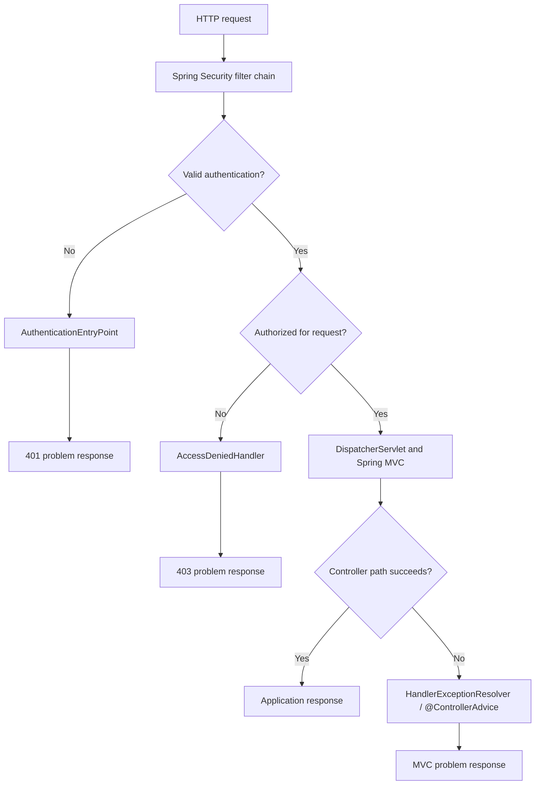
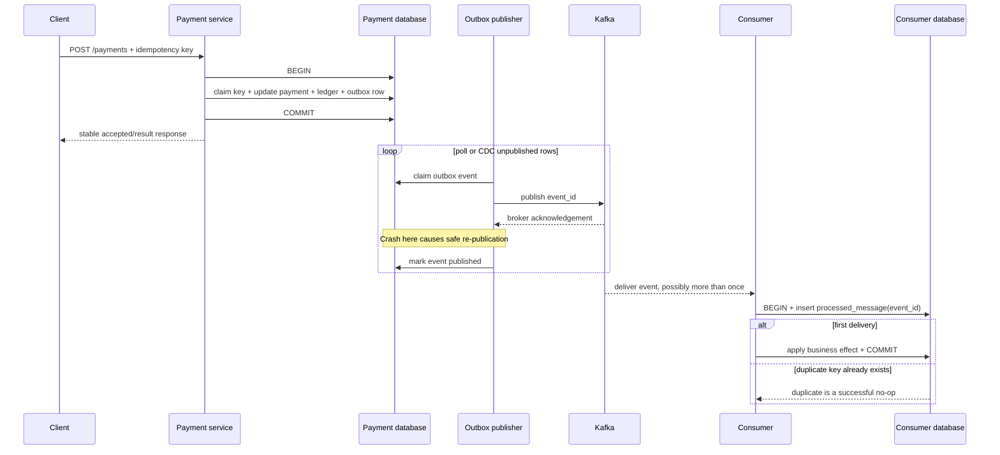

# Spring Senior Backend Reference

- [How to use this book](#how-to-use-this-book)
- [0. The complete runtime picture](#0-the-complete-runtime-picture)
- [Part I. Container and Spring Boot](#part-i-container-and-spring-boot)
  - [1. Spring and Spring Boot](#1-spring-and-spring-boot)
  - [2. IoC dependency injection and beans](#2-ioc-dependency-injection-and-beans)
  - [3. Container startup and extension points](#3-container-startup-and-extension-points)
  - [4. Configuration and auto-configuration](#4-configuration-and-auto-configuration)
  - [5. AOP proxies](#5-aop-proxies)
- [Part II. HTTP and security](#part-ii-http-and-security)
  - [6. The servlet request path](#6-the-servlet-request-path)
  - [7. API boundaries validation and exceptions](#7-api-boundaries-validation-and-exceptions)
  - [8. Spring Security architecture](#8-spring-security-architecture)
  - [9. Route and method authorization](#9-route-and-method-authorization)
- [Part III. Persistence and consistency](#part-iii-persistence-and-consistency)
  - [10. JPA and the persistence context](#10-jpa-and-the-persistence-context)
  - [11. Mapping fetching and query performance](#11-mapping-fetching-and-query-performance)
  - [12. Concurrent writes and locking](#12-concurrent-writes-and-locking)
  - [13. Spring transactions](#13-spring-transactions)
  - [14. Cross-system consistency](#14-cross-system-consistency)
- [Part IV. Production engineering](#part-iv-production-engineering)
  - [15. Resilience](#15-resilience)
  - [16. Observability and diagnosis](#16-observability-and-diagnosis)
  - [17. Production testing](#17-production-testing)
  - [18. End-to-end banking scenarios](#18-end-to-end-banking-scenarios)
  - [19. Senior answer wall](#19-senior-answer-wall)
- [Primary references](#primary-references)
- [Study map](#study-map)

## How to use this book

This is the **readable answer sheet** for a senior Java/Spring backend
interview. It is self-contained: definitions, runtime flows, code,
trade-offs and failure semantics live together. The companion files are the
active-recall side:

- [Spring Boot basics exercises](spring-boot-basics.md)
- [Container internals exercises](spring-container-internals.md)
- [Spring Security exercises](spring-security-basics.md)
- [JPA and Hibernate performance exercises](spring-data-jpa-performance.md)
- [Deep transaction exercises](spring-boot-transactions-deep.md)
- [Resilience exercises](spring-boot-resilience.md)

Read a chapter here, close it, and answer the corresponding companion kit
aloud. A senior answer should normally have three layers:

1. **Mechanism** — what actually happens at runtime.
2. **Consequence** — correctness, latency, security or operability impact.
3. **Decision** — what you would choose and what evidence would change it.

Do not begin with annotation vocabulary. Begin with the invariant or failure
you are protecting. For example: *"A debit and its outbox record must commit
together; Kafka publication is asynchronous and the consumer is
idempotent."* Then name the Spring mechanisms.

### The minimum viable path

If the interview is close, own these chapters first:

> **[§5](#5-aop-proxies) → [§6](#6-the-servlet-request-path) →
> [§8](#8-spring-security-architecture) →
> [§10](#10-jpa-and-the-persistence-context) →
> [§11](#11-mapping-fetching-and-query-performance) →
> [§13](#13-spring-transactions) →
> [§14](#14-cross-system-consistency) →
> [§15](#15-resilience) → [§16](#16-observability-and-diagnosis)**

That path covers the questions that distinguish "used Spring" from
"understands production Spring": proxy boundaries, filter/MVC boundaries,
the persistence context, N+1, rollback-only state, outbox/idempotency,
timeout/retry composition and evidence-led diagnosis.

### Version boundary

As of **1 September 2026**, the current line is Spring Boot **4.1.1** on
Spring Framework **7.0.x** and Spring Security **7.1.x**. Boot 4.1 requires
at least Java 17. The examples favor APIs and concepts that remain stable
across Boot 3 and 4; version-specific package imports are omitted where they
would distract from the mechanism.

Three migration lines matter in interviews:

| Line | What changes |
|---|---|
| Boot 2.7 → 3.x | Java 17 baseline; Framework 6; `javax.*` EE APIs become `jakarta.*`; Spring Security configuration uses `SecurityFilterChain`, not `WebSecurityConfigurerAdapter`. |
| Boot 3.5 → 4.x | Framework 7/Security 7; Boot modules, starters, test modules and packages are more granular; Jackson 3 is preferred; several test imports and dependencies move. |
| Existing estate → current | Upgrade compatibility is a delivery problem: Java/runtime, servlet/Jakarta APIs, dependencies, tests, observability and deployment platform all need proof. |

The right interview answer is honest: state what you ran, then explain the
upgrade boundary. A production Boot 2.7 system does not become current
because a candidate memorizes a Boot 4 version number.

---

## 0. The complete runtime picture

Spring is easiest when treated as a set of runtime pipelines rather than a
bag of annotations.

```text
configuration metadata
  @Configuration / @Bean / component scan / auto-configuration
                         |
                         v
BeanDefinitionRegistry stores recipes for objects
                         |
                         v
BeanFactory creates objects and resolves dependencies
                         |
                         v
BeanPostProcessors initialize or replace objects with proxies
  transactions / method security / caching / async / retry
                         |
                         v
ApplicationContext adds environment, resources, events and lifecycle

HTTP request
  -> servlet filters
  -> Spring Security FilterChainProxy
  -> DispatcherServlet
  -> HandlerMapping -> controller -> service proxy -> repository proxy
  -> transaction manager -> EntityManager -> JDBC pool -> database
  -> response or mapped exception

Production evidence crosses the whole path
  logs + metrics + traces + health + profiles + thread/connection state
```

The five boundaries that explain most failures are:

- **Container boundary:** only Spring-managed objects receive injection,
  lifecycle callbacks and proxy-based behavior.
- **Proxy boundary:** advice runs only when an invocation crosses the proxy.
- **Servlet/security boundary:** security filters run before MVC, so MVC
  exception handling cannot catch most security failures.
- **Transaction boundary:** a local transaction controls resources enlisted
  in that transaction, not an HTTP peer or ordinary Kafka publish.
- **Capacity boundary:** threads, connections, queues and downstream budgets
  are finite; retries multiply demand.

### The payment request as one connected story

Suppose `POST /payments` receives an idempotency key and a transfer command.
A robust path is:

1. The security chain validates the bearer token and establishes an
   `Authentication`.
2. Route authorization requires `PAYMENT_WRITE`; MVC then deserializes and
   validates the command.
3. Method authorization checks account ownership at the service boundary.
4. A transactional service claims the idempotency key, locks or version-checks
   mutable state, records the payment and inserts an outbox row.
5. The database commit makes those local facts atomic.
6. A publisher sends the outbox event to Kafka and marks publication state;
   duplicate sends remain safe.
7. Metrics, structured logs and traces carry the same payment-safe correlation
   identifiers without leaking account or credential data.

No annotation supplies that design. Spring supplies mechanisms for each
boundary; the engineer supplies the invariants.

---

# Part I. Container and Spring Boot

## 1. Spring and Spring Boot

### What Spring owns

The Spring Framework provides the programming model and infrastructure:

- an IoC container and dependency injection;
- bean lifecycle and extension points;
- AOP and proxy infrastructure;
- transaction abstraction;
- Spring MVC and WebFlux;
- testing support, events, validation integration and data-access helpers.

### What Spring Boot adds

Spring Boot is an opinionated assembly and operational layer over Spring. It
adds:

- curated, version-aligned **starters**;
- conditional **auto-configuration**;
- executable applications with embedded servers;
- externalized configuration and configuration metadata;
- Actuator endpoints, metrics, health and production conventions;
- test slices and integration with common infrastructure.

**Interview answer:** Spring provides the container and application
frameworks. Spring Boot chooses sensible defaults and configures them based
on the classpath, properties and beans, while allowing explicit application
configuration to override those defaults.

### `@SpringBootApplication`

It composes three annotations:

```java
@SpringBootConfiguration   // @Configuration specialization
@EnableAutoConfiguration  // import Boot auto-configurations
@ComponentScan            // scan this package and descendants
public @interface SpringBootApplication { }
```

Place the application class in a root package. If it sits in
`com.bank.payments`, components in `com.bank.shared` are siblings and are not
found unless scanning or imports are configured explicitly.

### Starter versus auto-configuration

These are related but different:

- A **starter** is a dependency descriptor. It brings a coherent set of jars.
- **Auto-configuration** is code in those jars that conditionally contributes
  bean definitions.

Adding a JDBC starter puts JDBC, a pool and supporting libraries on the
classpath. Auto-configuration then sees a `DataSource` type and database
properties and may create a `DataSource`, transaction manager and template.
If the application defines its own relevant bean, Boot commonly **backs off**.

### What `SpringApplication.run` does

A useful senior-level sequence is:

1. Determine the application type and create the appropriate context.
2. Prepare the `Environment` from property sources and profiles.
3. Apply initializers and publish startup events.
4. Load application and auto-configuration bean definitions.
5. Refresh the context: run factory post-processors, register bean
   post-processors, create eager singletons and start lifecycle components.
6. Start the embedded web server during context refresh.
7. Invoke `ApplicationRunner` and `CommandLineRunner` beans.
8. Publish readiness/application-ready events if startup succeeds.

A runner executes after the context exists, but it can still delay readiness
or fail startup. Heavy data migration in a runner is therefore an operational
decision, not harmless initialization.

### A clean application edge

```java
@SpringBootApplication
public class PaymentApplication {
    public static void main(String[] args) {
        SpringApplication.run(PaymentApplication.class, args);
    }
}

@ConfigurationProperties("payments")
@Validated
public record PaymentProperties(
        @NotNull URI switchBaseUrl,
        @NotNull Duration requestTimeout,
        @Min(1) int maxInFlight) { }

@Configuration(proxyBeanMethods = false)
@EnableConfigurationProperties(PaymentProperties.class)
class PaymentConfiguration {
    @Bean
    Clock clock() {
        return Clock.systemUTC();
    }
}
```

The domain service depends on `Clock`, not `Instant.now()`, and on the typed
properties object, not scattered strings. The result is validated startup
configuration and deterministic tests.

---

## 2. IoC dependency injection and beans

### IoC and DI

**Inversion of Control** means application code no longer controls object
construction and wiring. The container owns that lifecycle. **Dependency
Injection** is the technique by which the container supplies collaborators.

Without DI:

```java
class PaymentService {
    private final PaymentRepository repository = new OraclePaymentRepository();
}
```

With constructor injection:

```java
@Service
class PaymentService {
    private final PaymentRepository repository;
    private final FraudClient fraudClient;

    PaymentService(PaymentRepository repository, FraudClient fraudClient) {
        this.repository = repository;
        this.fraudClient = fraudClient;
    }
}
```

Constructor injection is the default choice because dependencies are explicit,
required fields can be `final`, invalid partially initialized objects cannot
exist, and a unit test can call `new PaymentService(fakeRepo, fakeFraud)`.
One constructor needs no `@Autowired`.

Field injection hides dependencies, prevents ordinary construction and often
allows a class with too many responsibilities to look deceptively small.
Setter injection is appropriate for a genuinely optional or reconfigurable
dependency, which is uncommon in business services.

### Stereotypes

`@Component` is the generic stereotype. `@Service`, `@Repository` and
`@Controller` specialize it to communicate architectural intent.

- `@Service` identifies application/business behavior.
- `@Repository` identifies persistence code and participates in Spring's
  persistence-exception translation where applicable.
- `@Controller` returns views unless a method uses `@ResponseBody`.
- `@RestController` is `@Controller + @ResponseBody` for every handler.

The annotation does not enforce clean architecture. A controller can still
contain SQL; it is simply a bad design with a correct stereotype.

### Candidate selection

When one interface has multiple beans, dependency resolution needs a rule:

```java
interface PaymentRail { Receipt send(Payment payment); }

@Component("impsRail")
class ImpsRail implements PaymentRail { /* ... */ }

@Component("neftRail")
class NeftRail implements PaymentRail { /* ... */ }

@Service
class Router {
    private final Map<String, PaymentRail> rails;

    Router(Map<String, PaymentRail> rails) {
        this.rails = Map.copyOf(rails);
    }
}
```

Spring can inject all beans as a list or a name-to-bean map. For a single
candidate, use `@Qualifier` when the injection point deliberately chooses a
variant; use `@Primary` for one system-wide default. A qualifier is more
specific and wins over the primary candidate.

Do not turn bean names into uncontrolled business routing. Validate external
rail names and map them to a closed domain type.

### Scopes and thread safety

The default scope is **singleton per `ApplicationContext`**, not one instance
per JVM or per classloader. Other common scopes are prototype, request and
session.

Singleton does not imply thread-safe. Every request thread can enter the same
service object:

```java
@Service
class BadSequenceService {
    private long next;                // shared mutable state
    long next() { return ++next; }    // data race, not atomic
}
```

Keep singleton services stateless. Put durable counters in a store with the
required atomic semantics, and operational counters in Micrometer. A request-
scoped bean is not a cure for business data that must survive processes or
restarts.

Injecting a shorter-lived bean into a singleton requires indirection such as a
scoped proxy or `ObjectProvider<T>`; otherwise construction-time resolution
cannot supply a fresh instance for each request.

### Lifecycle

A simplified bean lifecycle is:

```text
instantiate
  -> populate dependencies and properties
  -> aware callbacks
  -> BeanPostProcessor before-initialization callbacks
  -> @PostConstruct / InitializingBean / custom init method
  -> BeanPostProcessor after-initialization callbacks, possibly a proxy
  -> ready for use
  -> @PreDestroy / DisposableBean / custom destroy method on shutdown
```

Avoid network calls and long-running work in constructors or `@PostConstruct`.
They make startup fragile, occur before the application is ready, and can
interact badly with proxies. Use an explicit lifecycle component or runner
when startup work is truly required, with a clear failure policy.

Prototype bean destruction is not managed automatically after the container
hands out the instance. Request/session destruction is tied to the web scope.

### Circular dependencies

Constructor cycle `A -> B -> A` cannot produce either fully constructed
object, so startup fails. That is useful: it exposes a confused ownership
boundary. Field/setter cycles were historically sometimes resolved through
early references, but are fragile around proxies and are disallowed by modern
Boot defaults.

Preferred fixes:

- extract the shared rule into a third service;
- reverse one dependency using a domain event;
- separate orchestration from capabilities;
- as a tactical last resort, inject `ObjectProvider<T>` or use `@Lazy` while
  planning the design correction.

---

## 3. Container startup and extension points

### Definitions are recipes; beans are objects

A `BeanDefinition` describes how to create a bean: class or factory method,
scope, constructor arguments, property values, qualifiers, init/destroy
methods, laziness and role. A `BeanDefinitionRegistry` stores those recipes.

A `BeanFactory` uses the recipes to create and wire objects. An
`ApplicationContext` builds on the factory and adds automatic post-processor
detection, environment/profiles, resources, message resolution, events and
lifecycle integration.

```text
scan / @Import / @Bean / auto-configuration
                 |
                 v
      BeanDefinitionRegistry
                 |
       definitions may change
                 |
                 v
             BeanFactory
                 |
       instances are constructed
                 |
                 v
   initialization and proxy wrapping
```

This distinction explains why Spring can reason about thousands of future
objects before constructing most of them.

### The important refresh phases

`ApplicationContext.refresh()` has many implementation details. The stable
interview model is:

1. Prepare or obtain the bean factory and register initial configuration
   sources.
2. Invoke `BeanDefinitionRegistryPostProcessor` implementations; Spring's
   configuration-class processor parses configuration classes, scans and
   imports and registers further definitions here.
3. Invoke remaining `BeanFactoryPostProcessor` implementations against the
   complete definition metadata.
4. Register `BeanPostProcessor` implementations.
5. Initialize message source and application event machinery.
6. Initialize infrastructure such as the embedded server where relevant.
7. Instantiate remaining eager singleton beans.
8. Publish refresh lifecycle events and start lifecycle components.

Do not memorize private method names. Explain which phase can safely mutate
metadata and which can wrap instances.

### `BeanFactoryPostProcessor` versus `BeanPostProcessor`

| Extension | Operates on | Runs | Typical purpose |
|---|---|---|---|
| `BeanDefinitionRegistryPostProcessor` | registry and definitions | earliest | register more definitions |
| `BeanFactoryPostProcessor` | definitions/metadata | before ordinary bean creation | resolve placeholders or alter recipes |
| `BeanPostProcessor` | bean instances | around initialization | injection callbacks, validation, proxy wrapping |

Calling `getBean()` inside a factory post-processor creates an object too
early. That object can miss later post-processing and therefore miss AOP
proxies. Dependencies of a bean post-processor can suffer the same early-
initialization problem.

An illustrative processor that changes metadata—not application code—is:

```java
@Component
class DefaultLazyProcessor implements BeanFactoryPostProcessor {
    @Override
    public void postProcessBeanFactory(
            ConfigurableListableBeanFactory factory) {
        for (String name : factory.getBeanDefinitionNames()) {
            BeanDefinition definition = factory.getBeanDefinition(name);
            if (definition.getRole() == BeanDefinition.ROLE_APPLICATION) {
                definition.setLazyInit(true);
            }
        }
    }
}
```

This is educational, not a blanket production recommendation: global lazy
startup moves configuration failures into first traffic and can create a
latency spike.

### How proxies appear

Some bean post-processors inspect metadata such as `@Transactional` or
method-security annotations. After the target initializes, they may return a
proxy instead of the raw target. Other beans therefore receive the proxy:

```text
PaymentService target
        |
        v
transaction/security advisors selected
        |
        v
PaymentService proxy injected into controller
```

The bean name remains the same while its runtime class may be a JDK proxy or a
generated subclass. Debug behavior through the injected reference, not a raw
instance created with `new`.

### `FactoryBean<T>`

`FactoryBean<T>` lets a Spring bean manufacture another object whose
construction is complex or framework-controlled. Looking up `client` returns
the product; looking up `&client` returns the factory itself.

```java
class SignedClientFactory implements FactoryBean<SignedClient> {
    @Override public SignedClient getObject() { return buildClient(); }
    @Override public Class<?> getObjectType() { return SignedClient.class; }
    @Override public boolean isSingleton() { return true; }
}
```

Do not confuse `FactoryBean` with `BeanFactory`: the first is an application
extension that creates one product; the second is the container.

### Full and lite configuration

```java
@Configuration(proxyBeanMethods = true)
class FullConfiguration {
    @Bean Ledger ledger() { return new Ledger(); }
    @Bean PostingService postingService() {
        return new PostingService(ledger());
    }
}
```

With proxying enabled, Spring intercepts the inter-bean `ledger()` call and
returns the managed singleton. With `proxyBeanMethods = false`, the Java call
constructs a second `Ledger`. Lite mode avoids configuration-class proxying
and is safe when `@Bean` methods receive dependencies as parameters:

```java
@Configuration(proxyBeanMethods = false)
class LiteConfiguration {
    @Bean Ledger ledger() { return new Ledger(); }
    @Bean PostingService postingService(Ledger ledger) {
        return new PostingService(ledger);
    }
}
```

Prefer parameter injection; it makes method-call semantics irrelevant.

---

## 4. Configuration and auto-configuration

### Externalized configuration

Configuration varies by environment; code should not. Boot combines property
sources such as packaged configuration, profile-specific files, environment
variables, system properties, command-line arguments and test overrides.
Higher-precedence sources override lower ones. The exact full ordering is a
reference lookup; the operational rule is to know **which source won**.

Command-line `--server.port=9090`, for example, overrides the value in a
packaged `application.yml`. Actuator's environment/configuration reports and
startup logs can help diagnose unexpected values, but sensitive values must
be sanitized and endpoints secured.

### Typed properties over scattered `@Value`

```yaml
payment-switch:
  base-url: https://switch.internal
  connect-timeout: 300ms
  read-timeout: 1500ms
  max-in-flight: 80
```

```java
@ConfigurationProperties("payment-switch")
@Validated
public record SwitchProperties(
        @NotNull URI baseUrl,
        @NotNull Duration connectTimeout,
        @NotNull Duration readTimeout,
        @Min(1) int maxInFlight) { }
```

`@ConfigurationProperties` gives relaxed binding, type conversion, metadata,
nested structure and validation. `${name}` is a property placeholder;
`#{expression}` is a Spring Expression Language expression. Do not evaluate
untrusted text as SpEL.

Secrets belong in a secret manager or platform-provided source, not Git,
container images, exception messages or logs. Configuration binding does not
make a value safe to expose.

### Profiles

Profiles select bean/configuration variants, not arbitrary branches scattered
through business code. Useful examples are `local` infrastructure or a
platform adapter. Avoid a matrix such as `prod-bank-a-region-2-dr` that makes
the application impossible to reason about. Prefer ordinary typed properties
for values and explicit strategies for business variants.

```java
@Bean
@Profile("local")
FraudClient stubFraudClient() {
    return request -> FraudDecision.accepted();
}
```

Never let a permissive local security bean activate because a production
profile was misspelled. Fail closed and validate essential configuration.

### How auto-configuration decides

An auto-configuration class is imported by Boot and guarded by conditions:

- `@ConditionalOnClass` — a library/API is present;
- `@ConditionalOnMissingBean` — the application did not provide its own bean;
- `@ConditionalOnProperty` — a property enables or selects behavior;
- `@ConditionalOnWebApplication` — the expected application type exists;
- custom conditions — a deliberate extension point, used sparingly.

Conceptually:

```java
@AutoConfiguration
@ConditionalOnClass(SignedClient.class)
@EnableConfigurationProperties(SignedClientProperties.class)
class SignedClientAutoConfiguration {

    @Bean
    @ConditionalOnMissingBean
    SignedClient signedClient(SignedClientProperties properties) {
        return new SignedClient(properties.baseUrl(), properties.keyId());
    }
}
```

Modern Boot discovers auto-configuration through import metadata in the jar;
application component scanning is not what finds it. Conditions are evaluated
against the application context being built. Ordering can arrange evaluation
relative to other auto-configurations, but it does not force a condition to
match.

### Diagnosing the magic

When a bean is missing or surprising:

1. Confirm the dependency and its version are present.
2. Inspect the configuration-properties value and active profiles.
3. Enable the condition evaluation report (`--debug`) or inspect the Actuator
   conditions endpoint in a secured environment.
4. Find the candidate auto-configuration and read each matched/unmatched
   condition.
5. Check whether an application bean caused back-off.
6. Check package scanning and exclusions.

Do not fix an unexplained condition by copying a whole auto-configuration
class into application code. Identify the failed premise.

### Configuration failure policy

A required database URL, issuer, key alias or downstream timeout should fail
validation at startup. A dynamically unavailable dependency is different:
the application may start unready and become ready after recovery, depending
on the platform contract. Distinguish **invalid configuration** from
**temporarily unavailable infrastructure**.

---

## 5. AOP proxies

### The mechanism behind the annotations

Spring AOP wraps a target object with a proxy. A call crossing that proxy can
run advice before, after or around the target method.

```text
caller
  -> proxy
       -> security check
       -> open/join transaction
       -> invoke target
       -> commit or roll back
       -> record observation
  <- result or exception
```

Transactions, method authorization, caching, retry and `@Async` commonly use
this mechanism. The annotation is metadata; the proxy is the runtime behavior.

### JDK and class-based proxies

- A JDK dynamic proxy implements interfaces and delegates to the target.
- A class-based proxy subclasses the target.

Class-based proxies cannot override `final` methods; neither proxy style can
intercept `private` methods. Modern Spring supports more visibility cases for
class-based proxies than older versions, but public service methods remain the
least surprising boundary.

Code should depend on service interfaces for design reasons where a useful
abstraction exists, not merely to satisfy old proxy folklore. Spring can use
class-based proxies without an interface.

### Self-invocation

```java
@Service
class SettlementService {

    public void settleBatch(List<Payment> payments) {
        for (Payment payment : payments) {
            settleOne(payment);       // call on this, bypasses proxy
        }
    }

    @Transactional(propagation = Propagation.REQUIRES_NEW)
    public void settleOne(Payment payment) { /* ... */ }
}
```

The external call enters the proxy once for `settleBatch`. The internal Java
call `this.settleOne(...)` never re-enters it, so `REQUIRES_NEW` advice does
not run. The same trap applies to method security, caching, retry and async
advice.

Prefer an explicit collaborator:

```java
@Service
class SingleSettlementService {
    @Transactional(propagation = Propagation.REQUIRES_NEW)
    public void settle(Payment payment) { /* ... */ }
}

@Service
class BatchSettlementService {
    private final SingleSettlementService single;

    BatchSettlementService(SingleSettlementService single) {
        this.single = single;
    }

    public void settleBatch(List<Payment> payments) {
        payments.forEach(single::settle); // crosses collaborator proxy
    }
}
```

Self-injecting the proxy or calling `AopContext.currentProxy()` couples
business code to interception machinery and usually hides a missing boundary.

### Other proxy traps

- An object created with `new` is not a managed bean and receives no advice.
- `@PostConstruct` executes during initialization; do not assume the bean's
  final proxy is intercepting self-calls there.
- A caught exception may prevent transaction advice from seeing the failure.
- Advice order matters. Retry outside a transaction creates one transaction
  per attempt; transaction outside retry can retain the same doomed
  transaction across attempts.
- `@Async` changes threads. Thread-local transaction and security state do not
  automatically become one shared context.
- The runtime class in a debugger may be generated. Inspect the proxy and its
  advisors before blaming the database.

### When not to use AOP

Use AOP for stable cross-cutting policies with clear boundaries. Do not hide
core business workflow in an aspect. A transfer's state transition,
compensation and idempotency belong in explicit code; transaction and
authorization checks can wrap that code.

**Senior answer:** When an annotation appears ineffective, I verify that the
object is Spring-managed, the call crosses the proxy, the method is
interceptable, the feature is enabled, and advice ordering matches the
intended boundary.

---

# Part II. HTTP and security

## 6. The servlet request path

### One request from socket to service

In a traditional Spring MVC application, an embedded servlet container owns
the network connection and a bounded worker-thread pool. A request typically
travels through:

```text
Tomcat/Jetty connector and worker thread
  -> servlet Filter chain
       -> tracing/correlation filter
       -> Spring Security FilterChainProxy
  -> DispatcherServlet
       -> HandlerMapping selects controller method
       -> HandlerAdapter invokes it
       -> argument resolvers deserialize parameters/body
       -> Bean Validation checks request DTO
       -> controller calls service proxy
       -> return value handled by message converters
  -> servlet response
```

The exact filters vary, but the ownership boundaries are important:

- A **servlet filter** surrounds the servlet and can reject before MVC.
- A Spring MVC **`HandlerInterceptor`** surrounds controller handling after
  `DispatcherServlet` has mapped the request.
- A **controller advice** handles MVC exceptions and model/response concerns.
- An **AOP proxy** surrounds Spring bean method calls, not raw servlet traffic.

Choose the earliest layer that has the information needed. Authentication
belongs in the security chain. Business ownership usually belongs at the
service boundary. JSON error formatting for controller failures belongs in
MVC advice.

### `DispatcherServlet` is a coordinator

`DispatcherServlet` does not contain every web behavior. It delegates:

| Collaborator | Responsibility |
|---|---|
| `HandlerMapping` | find the handler for path, verb and conditions |
| `HandlerAdapter` | invoke that handler model |
| argument resolvers | construct values such as `@PathVariable`, principal and pageable |
| `HttpMessageConverter` | deserialize/serialize JSON, text or bytes |
| `HandlerExceptionResolver` | turn eligible exceptions into responses |
| view resolver | resolve a view for ordinary MVC controllers |

`@RestController` adds response-body semantics, so returning `"home"` writes
the string body; an ordinary `@Controller` may interpret it as a view name.

### A thin HTTP adapter

```java
@RestController
@RequestMapping("/payments")
class PaymentController {
    private final PaymentApplicationService payments;

    PaymentController(PaymentApplicationService payments) {
        this.payments = payments;
    }

    @PostMapping
    ResponseEntity<PaymentResponse> create(
            @RequestHeader("Idempotency-Key") String idempotencyKey,
            @Valid @RequestBody CreatePaymentRequest request,
            Authentication authentication) {

        var command = new CreatePaymentCommand(
                idempotencyKey,
                authentication.getName(),
                request.debtorAccountId(),
                request.creditorAccountId(),
                request.amount());

        PaymentResult result = payments.create(command);
        return ResponseEntity
                .created(URI.create("/payments/" + result.id()))
                .body(PaymentResponse.from(result));
    }
}
```

The controller owns HTTP translation: headers, authentication-to-command
mapping, status and representation. The service owns the use case. The entity
does not cross the HTTP boundary.

### Thread-per-request consequences

Blocking MVC normally dedicates one container thread while the request waits
for JDBC or a downstream HTTP call. Throughput is therefore bounded by worker
threads, connection pools and dependency latency—not CPU alone.

If the database pool has 30 connections and 200 servlet threads, at most
roughly 30 concurrent database users can make progress; the others wait or do
non-database work. Increasing the web thread count can increase queueing and
memory while leaving throughput unchanged.

Virtual threads can reduce the cost of blocked threads, but they do not create
database connections or remove downstream limits. Reactive WebFlux can
efficiently compose non-blocking I/O, but mixing it with blocking JDBC on an
event loop destroys the benefit. Choose a model from the whole call chain,
not fashion.

### Outbound HTTP clients

For new synchronous code, prefer the supported modern synchronous client
(`RestClient` in current Spring) or an interface client built on it. `WebClient`
is the reactive client and can also be used in blocking code, but blocking it
does not make the path reactive. `RestTemplate` remains common in older
systems but is not the direction for new designs.

Every production client needs:

- connect, pool-acquisition and response/read timeouts;
- bounded connections and pending work;
- TLS and hostname verification;
- authentication and safe header propagation;
- error mapping that preserves retryability information;
- metrics/traces with low-cardinality tags;
- an idempotency decision before retries.

An HTTP 500, socket reset and timeout are not equivalent. A timeout is
**ambiguous**: the peer may have completed the operation after the caller gave
up.

---

## 7. API boundaries validation and exceptions

### Transport validation versus business validation

Transport validation rejects malformed input before the use case:

```java
public record CreatePaymentRequest(
        @NotNull UUID debtorAccountId,
        @NotNull UUID creditorAccountId,
        @NotNull @DecimalMin("0.01") BigDecimal amount,
        @NotBlank @Size(max = 3) String currency) { }
```

`@Valid @RequestBody` triggers nested Bean Validation during MVC argument
resolution. Method parameter/return validation can enforce constraints on
service methods when method validation is enabled.

Business validation needs current domain state:

- account is active;
- debtor owns the account;
- available balance covers the debit;
- daily transfer limit is not exceeded;
- currency pair and rail are allowed.

These rules belong in the domain/application layer and often inside the same
transaction or lock boundary as the write. A pre-query in the controller has
a time-of-check/time-of-use race.

### Error contract

A consistent error response should contain stable machine-readable data and
safe human context:

```json
{
  "type": "https://errors.bank.example/payment-conflict",
  "title": "Payment could not be completed",
  "status": 409,
  "code": "PAYMENT_STATE_CONFLICT",
  "correlationId": "01J...",
  "fieldErrors": []
}
```

Spring's `ProblemDetail` models RFC problem details and can carry additional
properties. Keep the application error `code` stable; titles and messages can
change or be localized. Never expose stack traces, SQL, key material, token
claims or internal hostnames.

### MVC exception boundary

```java
@RestControllerAdvice
class ApiExceptionHandler {

    @ExceptionHandler(PaymentNotFound.class)
    ResponseEntity<ProblemDetail> notFound(PaymentNotFound failure) {
        ProblemDetail problem = ProblemDetail.forStatus(404);
        problem.setTitle("Payment not found");
        problem.setProperty("code", "PAYMENT_NOT_FOUND");
        return ResponseEntity.status(404).body(problem);
    }

    @ExceptionHandler(OptimisticLockingFailureException.class)
    ResponseEntity<ProblemDetail> conflict(Exception failure) {
        ProblemDetail problem = ProblemDetail.forStatus(409);
        problem.setTitle("Payment state changed concurrently");
        problem.setProperty("code", "PAYMENT_STATE_CONFLICT");
        return ResponseEntity.status(409).body(problem);
    }
}
```

Map expected domain failures precisely. For unexpected exceptions, log once
at the owning boundary with a correlation/trace identifier and return a
generic 500. Logging the same stack at controller, service and repository
creates noise without information.

`@ControllerAdvice` participates in MVC's exception-resolution path. An
authentication or authorization failure in a security filter happens before
`DispatcherServlet`, so it normally requires an `AuthenticationEntryPoint` or
`AccessDeniedHandler`, not MVC advice.

### Status-code decisions

- `400 Bad Request` — malformed representation or request constraint failure.
- `401 Unauthorized` — authentication missing or invalid; despite the name,
  it means unauthenticated.
- `403 Forbidden` — authenticated identity lacks permission.
- `404 Not Found` — resource absent; sometimes also used deliberately to avoid
  exposing whether another tenant's resource exists.
- `409 Conflict` — current resource state conflicts, including a surfaced
  optimistic-lock conflict.
- `422 Unprocessable Content` — syntactically valid but semantically invalid
  input, when the API contract chooses this distinction.
- `429 Too Many Requests` — rate or quota exceeded; include a useful retry
  signal when safe.
- `503 Service Unavailable` — temporarily unable to serve, possibly with
  `Retry-After`; not a generic wrapper for every dependency error.

Status alone is insufficient. Define idempotency, retryability and error-code
semantics in the API contract.

### DTOs and entity boundaries

Returning JPA entities directly couples the wire contract to persistence,
risks lazy loading during serialization, exposes unintended relationships,
and makes schema evolution difficult. Use command/request DTOs at input and
projection/response DTOs at output.

Do not create one DTO per layer mechanically. Create a boundary type when the
contract, ownership or change rate differs.

---

## 8. Spring Security architecture

### Authentication and authorization

- **Authentication** establishes *who* the caller is and how that claim was
  verified.
- **Authorization** decides whether that authenticated caller may perform a
  particular action on a particular resource.

A valid token proves neither account ownership nor permission to transfer a
specific amount. Authentication is evidence used by authorization.

### The servlet security chain

```text
Servlet container FilterChain
  -> DelegatingFilterProxy
       -> Spring bean named springSecurityFilterChain
            -> FilterChainProxy
                 -> first matching SecurityFilterChain
                      -> exploit protection
                      -> authentication filters
                      -> authorization filter
  -> DispatcherServlet
```

`FilterChainProxy` selects the **first matching** `SecurityFilterChain`. Inside
a chain, filters also have a defined order because authentication must be
available before authorization. Security filters can stop the request and
write the response without invoking MVC.

Multiple chains are useful when `/api/**` is stateless JWT while an admin UI
uses a session. Make chain matchers mutually understandable and always define
a safe fallback.

### Security context and authentication object

`SecurityContextHolder` exposes the current `SecurityContext`, which holds an
`Authentication`. A successful `Authentication` generally contains:

- principal — identity/user representation;
- credentials — often cleared after authentication;
- authorities — granted capabilities such as `PAYMENT_WRITE`;
- details — request or mechanism-specific metadata;
- authenticated flag.

In the ordinary servlet model the context is associated with the current
thread for the request and cleared afterward. Moving work to another executor
does not safely propagate it by accident. Use Spring's context-aware wrappers
or, better, pass the minimal business identity explicitly into an asynchronous
command. Never retain an `Authentication` in a singleton field.

### Authentication pipeline

For username/password-style authentication, the components line up as:

```text
authentication filter extracts credentials
  -> unauthenticated Authentication token
  -> AuthenticationManager
       -> ProviderManager delegates to AuthenticationProvider(s)
            -> load identity / verify credential with PasswordEncoder
  -> authenticated Authentication with authorities
  -> SecurityContext for the request
```

An `AuthenticationProvider` supports particular token types. `ProviderManager`
tries suitable providers and can delegate to a parent. A `UserDetailsService`
loads user data; it does not by itself authenticate an HTTP request.

For a JWT resource server, the bearer filter extracts the token, a JWT
authentication provider uses a decoder to verify and validate it, and a
converter maps trusted claims to principal/authorities. The resulting context
feeds route and method authorization. The resource server does not compare a
JWT to a stored password on every request.

A `SecurityContextRepository` can load/save context for session-based flows.
A stateless resource-server chain should not create a login session as an
authentication cache. In both designs, security infrastructure must clear the
thread-associated context at request completion to prevent identity leakage
into reused container threads.

### A stateless resource-server chain

```java
@Configuration(proxyBeanMethods = false)
@EnableMethodSecurity
class SecurityConfiguration {

    @Bean
    SecurityFilterChain api(HttpSecurity http) throws Exception {
        return http
                .securityMatcher("/api/**")
                .sessionManagement(session -> session
                        .sessionCreationPolicy(SessionCreationPolicy.STATELESS))
                .csrf(csrf -> csrf.disable())
                .cors(Customizer.withDefaults())
                .authorizeHttpRequests(auth -> auth
                        .requestMatchers("/api/health/readiness").permitAll()
                        .requestMatchers(HttpMethod.POST, "/api/payments/**")
                            .hasAuthority("PAYMENT_WRITE")
                        .requestMatchers(HttpMethod.GET, "/api/payments/**")
                            .hasAuthority("PAYMENT_READ")
                        .anyRequest().authenticated())
                .oauth2ResourceServer(oauth -> oauth.jwt(Customizer.withDefaults()))
                .exceptionHandling(errors -> errors
                        .authenticationEntryPoint(problem401())
                        .accessDeniedHandler(problem403()))
                .build();
    }
}
```

Disabling CSRF is justified here only because browsers do not automatically
attach the bearer credential and the chain is truly stateless. If a browser
authenticates with cookies, CSRF protection normally remains necessary.

### Route matcher ordering

Within request authorization, rules are evaluated in declaration order and
the first matching rule applies. Put specific rules before broad rules:

```java
.requestMatchers("/actuator/health/liveness").permitAll()
.requestMatchers("/actuator/**").hasAuthority("OPS")
.anyRequest().authenticated()
```

If `/**.permitAll()` comes first, later restrictions never participate. If a
broad deny comes first, intended public endpoints are unreachable. The same
first-match principle applies when selecting among multiple security chains.

### Sessions versus stateless authentication

With session authentication, credentials are verified once and the server
persists a security context associated with a session cookie. Advantages
include simple logout/revocation and small subsequent requests; costs include
server-side state, CSRF exposure for browser cookies and distributed-session
operations when horizontally scaled.

With bearer-token resource-server authentication, every request presents a
token. The service validates it and derives an `Authentication`; it does not
need a login session. Advantages include service autonomy and horizontal
scaling. Costs include token lifecycle, key rotation, revocation difficulty,
claim design and larger request credentials.

"JWT" is a token format, not an architecture and not encryption. Do not place
secrets in claims.

### JWT resource-server validation

A resource server should validate at least:

- signature with an allowed algorithm and trusted current key;
- issuer (`iss`);
- expiration (`exp`) and not-before (`nbf`) with controlled clock skew;
- audience (`aud`) when the token is intended for specific services;
- required claim types and mapping to authorities.

Decoding Base64 is not validation. Accepting the algorithm chosen by an
untrusted token, skipping audience checks or trusting a gateway-injected
identity header on a bypassable network path are authentication failures.

The authorization server authenticates users/clients and issues tokens. The
resource server validates access tokens and enforces access. An access token
is for APIs; an OpenID Connect ID token describes a login to a client and
should not be used as a general API credential.

### Passwords

Store a password using an adaptive one-way password encoder such as bcrypt,
scrypt, PBKDF2 or Argon2, with a per-password salt handled by the encoder.
The work factor should make offline guessing expensive while fitting login
capacity. Use a delegating encoder format when supporting algorithm upgrades.

Never store reversible encrypted passwords or fast unsalted hashes. Never log
credentials. Rate limit authentication attempts, design recovery carefully,
and treat MFA/recovery as part of the trust model.

### CSRF and CORS

**CSRF** exploits credentials that a browser attaches automatically, such as
session cookies, by causing the browser to send an unwanted state-changing
request. A CSRF token or same-site cookie policy helps prove the request came
from the intended application. Stateless does not automatically mean
CSRF-safe; the credential transport determines the risk.

**CORS** is a browser policy controlling whether JavaScript from one origin
may read/use a cross-origin response. It is not authentication and does not
protect server-to-server calls. Preflight requests may be unauthenticated and
need CORS processing before an authentication rejection.

### 401 and 403 boundaries

- An `AuthenticationEntryPoint` handles a request that needs authentication
  but has no valid authenticated identity: **401**.
- An `AccessDeniedHandler` handles an authenticated caller denied access:
  **403**.



`ExceptionTranslationFilter` bridges eligible security exceptions to those
handlers. A custom filter placed incorrectly may throw outside that handling
region; filter position is part of correctness.

Write the same safe problem-details schema at both security and MVC
boundaries, but do not force security-filter exceptions through a controller.

---

## 9. Route and method authorization

### Why use both boundaries

Route authorization cheaply protects HTTP entry points by method/path and
coarse authority. Method authorization protects business operations wherever
they are invoked—from MVC, messaging, scheduling or another service bean.

```text
request rule: may PAYMENT_WRITE callers enter POST /payments?
service rule: may this caller debit this account for this command?
domain rule: is this payment transition legal in current state?
```

They are complementary. A controller path is not a durable business boundary;
a service might later gain a Kafka listener or batch caller.

### Enabling and using method security

Adding the security starter does not by itself activate method authorization.
Enable it explicitly:

```java
@Configuration
@EnableMethodSecurity
class MethodSecurityConfiguration { }
```

```java
@Service
class AccountApplicationService {

    @PreAuthorize("hasAuthority('PAYMENT_WRITE') " +
                  "and @accountPolicy.canDebit(authentication, #accountId)")
    public PaymentResult debit(UUID accountId, Money amount) {
        // business rule and state change
    }

    @PostAuthorize("returnObject.ownerId() == authentication.name")
    public AccountView read(UUID accountId) {
        return load(accountId);
    }
}
```

- `@PreAuthorize` decides before invocation and is the default choice.
- `@PostAuthorize` decides using `returnObject` after invocation. Avoid it
  when executing the method already reveals data or produces side effects.
- `@PreFilter` removes unauthorized elements from supported input
  collections before invocation.
- `@PostFilter` removes unauthorized elements from returned collections after
  invocation.

Filtering is not rejection. An atomic batch that contains one unauthorized
payment should normally fail as a whole, not silently process the remainder.
Post-filtering does not prevent rows from being read and breaks the meaning of
database pagination; constrain tenant/ownership in the query.

### Roles authorities and policy beans

`hasAuthority("PAYMENT_WRITE")` compares the exact granted string.
`hasRole("OPS")` conventionally checks for `ROLE_OPS`. Prefer stable
capabilities over an explosion of organization-specific roles.

Complex object authorization is clearer in a typed policy bean:

```java
@Component("accountPolicy")
class AccountPolicy {
    private final AccountAccessRepository access;

    public boolean canDebit(Authentication authentication, UUID accountId) {
        return authentication != null
                && authentication.isAuthenticated()
                && access.mayDebit(authentication.getName(), accountId);
    }
}
```

Keep the expression short and test the policy as ordinary Java. Authorization
must fail closed on missing data or dependency failure unless the business
risk explicitly supports another decision.

### SpEL vocabulary

Spring Expression Language appears in configuration and security:

| Form | Meaning |
|---|---|
| `${payments.timeout}` | property placeholder resolved from the environment |
| `#{2 * 1000}` | evaluated SpEL expression |
| `@accountPolicy` | bean reference inside SpEL |
| `#accountId` | method argument/variable |
| `authentication` | current security authentication in method expressions |
| `principal` | current principal |
| `returnObject` | method return value in post-authorization |
| `filterObject` | current element/entry during pre/post filtering |

SpEL can navigate properties, call methods, perform selection and invoke
beans. That power is exactly why untrusted strings must never be evaluated as
expressions. Use a fixed expression with data passed as variables, or a typed
policy API.

### Proxy implications

Method security is proxy-based by default. Self-invocation, `new` objects,
private/final non-interceptable methods and calls during initialization can
bypass it just like transactions. Do not assume a protected annotation on a
method proves every call path crossed the proxy.

For the most sensitive invariant, also enforce tenant/account ownership in the
data access predicate and domain operation. Defense in depth should repeat the
invariant at meaningful boundaries, not duplicate opaque expressions
everywhere.

### Security review checklist

For a money-moving endpoint, be ready to state:

- who issues and who validates credentials;
- issuer/audience/key-rotation expectations;
- route rule and method/object rule;
- tenant/account scoping in the query;
- CSRF decision based on credential transport;
- 401 and 403 response owners;
- audit data captured without sensitive payloads;
- tests for missing, invalid, insufficient and cross-tenant identities.

---

# Part III. Persistence and consistency

## 10. JPA and the persistence context

### Separate the layers

- **JPA/Jakarta Persistence** is the ORM specification: entities,
  `EntityManager`, JPQL, mappings and lifecycle semantics.
- **Hibernate** is the most common JPA provider in Spring Boot and supplies
  additional behavior and tuning features.
- **Spring Data JPA** builds repository proxies and query abstractions on top
  of JPA.
- **JDBC** is the database access API underneath an ordinary Hibernate/JPA
  application.

`JpaRepository.save()` is not itself JPA magic, and JPA does not remove SQL.
The relational database remains the consistency and query engine; ORM maps an
object-oriented unit of work onto it.

### Entity lifecycle states

An entity instance is in one of four conceptual states:

| State | Meaning |
|---|---|
| transient | ordinary new object, not associated with a persistence context |
| managed | tracked by the current persistence context; changes can be flushed |
| detached | has identity but is no longer tracked by this context |
| removed | marked for deletion at flush/commit |


```java
Payment payment = new Payment(reference, amount); // transient
entityManager.persist(payment);                   // managed
entityManager.flush();                            // SQL synchronized
entityManager.detach(payment);                    // detached
payment.markSettled();                            // not dirty-checked here
```

`merge(detached)` does not reattach the same Java object. It copies state into
a managed instance and returns that managed instance. Ignoring the return
value is a classic detached-entity bug.

### Persistence context and first-level cache

The persistence context is an identity map plus unit of work. Within one
context, one database row identity normally maps to one managed Java instance:

```java
Payment first = entityManager.find(Payment.class, id);
Payment second = entityManager.find(Payment.class, id);
assert first == second;
```

The second lookup can avoid another select, but the first-level cache is not a
general query cache. JPQL may still execute while resolving returned entity
identities through the context.

The context can also become stale when another transaction or bulk SQL changes
rows. `clear()`, `refresh()` or a new transaction/context may be required when
mixing bulk operations with managed entities.

### Dirty checking and write-behind

Hibernate snapshots managed state. At flush, it detects changes and generates
SQL:

```java
@Transactional
public void markSettled(UUID id, Instant settledAt) {
    Payment payment = repository.findById(id).orElseThrow();
    payment.markSettled(settledAt);
    // no save required for this managed entity; flush writes the update
}
```

Calling `save` is not wrong merely because dirty checking exists, but do not
claim it is what makes a managed change persist. Spring Data `save` generally
chooses `persist` for a new entity and `merge` for an existing one.

### Flush is not commit

**Flush** synchronizes pending persistence-context changes to SQL. **Commit**
makes the database transaction durable/visible according to database rules.
A flush can occur:

- explicitly through `flush()`;
- before commit;
- before a query whose result could be affected by pending changes;
- according to configured flush mode.

SQL can therefore execute before the method returns, and a constraint failure
may appear at flush rather than at `save`. Conversely, a rollback after flush
still undoes the database transaction.

Tests that never flush can pass while production commit fails. Force a flush
when the test claims to prove a database constraint.

### Persistence-context size

Reading or writing 500,000 entities in one transaction retains managed state
and snapshots, consumes heap and makes dirty checking expensive. Batch work in
bounded chunks and periodically flush/clear:

```java
for (int i = 0; i < commands.size(); i++) {
    entityManager.persist(map(commands.get(i)));
    if ((i + 1) % 100 == 0) {
        entityManager.flush();
        entityManager.clear();
    }
}
```

Chunking changes atomicity. Decide whether partial progress is allowed and how
restart/idempotency works before selecting the chunk boundary.

### Entity identity and equality

Database-generated identifiers may be absent until persistence, so equality
based solely on a generated id can change while an entity sits in a hash-based
collection. Mutable business fields are worse. Choose identity deliberately:

- a stable assigned business key can support equality when truly immutable;
- generated-id equality needs careful transient-instance semantics;
- entities often remain inside aggregate boundaries rather than being generic
  set keys.

Never include lazy associations in `equals`, `hashCode` or `toString`; that can
trigger queries, recurse through bidirectional graphs or fail outside a
context.

### Repository proxy behavior

Spring Data creates a proxy for the repository interface. Method names may be
parsed into queries, declared queries may be validated, and CRUD operations
delegate to the persistence provider. A repository method name is an API, not
a guarantee of efficient SQL.

```java
interface PaymentRepository extends JpaRepository<Payment, UUID> {
    Optional<Payment> findByTenantIdAndId(String tenantId, UUID id);

    @Query("""
           select new com.bank.api.PaymentSummary(
               p.id, p.reference, p.status, p.amount)
           from Payment p
           where p.tenantId = :tenantId
           order by p.createdAt desc, p.id desc
           """)
    Slice<PaymentSummary> findRecent(String tenantId, Pageable page);
}
```

Tenant scoping in the query prevents unauthorized rows from becoming managed.
Method-level post-filtering does not.

---

## 11. Mapping fetching and query performance

### Model aggregate boundaries before annotations

An ORM association should reflect an ownership/use-case boundary, not every
foreign key. A payment may need a debtor-account identifier without loading a
mutable `Account` object graph. Large bidirectional graphs invite accidental
cascades, serialization loops and unpredictable queries.

Use entities for transactional behavior inside an aggregate. Use identifiers
and explicit queries across aggregate boundaries.

### Owning side and `mappedBy`

In a bidirectional relationship, the owning side controls the foreign-key
update. `mappedBy` names the Java field on the owning side; it is not a column
name.

```java
@Entity
class Payment {
    @ManyToOne(fetch = FetchType.LAZY, optional = false)
    @JoinColumn(name = "batch_id")
    private PaymentBatch batch;                 // owning side
}

@Entity
class PaymentBatch {
    @OneToMany(mappedBy = "batch",
               cascade = CascadeType.ALL,
               orphanRemoval = true)
    private final List<Payment> payments = new ArrayList<>();

    void add(Payment payment) {
        payments.add(payment);
        payment.attachTo(this);                  // maintain both Java sides
    }
}
```

Changing only the inverse collection does not guarantee a foreign-key update.
Helper methods keep both in-memory sides consistent.

### Cascade versus orphan removal

Cascade propagates entity-manager operations from parent to child:
`PERSIST`, `MERGE`, `REMOVE`, `REFRESH`, `DETACH` or `ALL`.
`orphanRemoval = true` deletes a child removed from the parent's owned
collection/reference.

They are not interchangeable. Cascade remove says "deleting parent deletes
children"; orphan removal says "removing a child from this ownership relation
deletes it." Do not cascade remove across shared references or aggregate
boundaries. `CascadeType.ALL` is not a harmless default.

### Fetch defaults are not fetch plans

JPA defaults to eager for to-one relationships and lazy for to-many
relationships. Defaults rarely describe every use case. Mapping everything
eager creates large joins and over-fetching; mapping everything lazy without
query plans creates N+1 and detached-access failures.

Prefer conservative mappings—commonly lazy—and select an explicit fetch plan
per query:

- JPQL `join fetch`;
- `@EntityGraph` or named entity graph;
- DTO/interface projections;
- provider batch fetching;
- a separate aggregate query when two collection joins would explode rows.

### N+1

N+1 occurs when one query loads N parents and later access triggers one query
per parent association:

```java
List<Payment> payments = repository.findByStatus(PENDING); // 1 query
for (Payment payment : payments) {
    log.info("rail={}", payment.getRail().getName());       // up to N queries
}
```

Fix according to the use case:

```java
@Query("""
       select p from Payment p
       join fetch p.rail
       where p.status = :status
       """)
List<Payment> findWithRail(PaymentStatus status);
```

For a read-only screen, a projection is often better than hydrated entities:

```java
record PendingPaymentRow(UUID id, String reference, String railCode,
                         BigDecimal amount) { }

@Query("""
       select new com.bank.read.PendingPaymentRow(
           p.id, p.reference, r.code, p.amount)
       from Payment p join p.rail r
       where p.status = :status
       """)
List<PendingPaymentRow> findPendingRows(PaymentStatus status);
```

N+1 is an access-pattern problem, not simply "lazy is bad." Eager mappings can
still produce secondary selects or load much more data than needed.

### Cartesian explosion

Joining one parent to two to-many collections multiplies result rows. Ten
payments × five audit entries produces fifty rows for one parent before ORM
deduplication. This increases database work, network transfer and heap use,
and some providers reject simultaneous bag fetching.

Use two bounded queries, batch fetching, aggregation/projection or redesign
the read model. A single SQL statement is not automatically faster.

### Pagination

Offset pagination becomes expensive at large offsets and can shift under
concurrent inserts. Keyset/seek pagination uses the last stable sort key:

```sql
select id, created_at, status, amount
from payment
where tenant_id = :tenant
  and (created_at, id) < (:last_created_at, :last_id)
order by created_at desc, id desc
fetch first :limit rows only
```

Always use a deterministic order with a unique tie-breaker. `Slice` avoids a
count query when the client only needs "has next"; `Page` includes totals and
usually requires that additional count.

Pagination over a collection fetch join is dangerous because SQL rows are
children, while the page contract is parents. Use a two-step pattern: page
parent ids, then fetch the desired graph by those ids while preserving order.

### JDBC batching

Batching reduces network round trips; it does not make a huge persistence
context cheap. Configure a batch size, use a database/provider-compatible id
generation strategy, order inserts/updates where useful, and flush/clear in
bounded chunks.

Identity-column generation can prevent insert batching because each generated
key may require immediate execution. Measure actual driver batches rather
than assuming a property worked.

### Bulk DML

JPQL/SQL bulk update/delete operates directly on rows and bypasses managed
entity state, dirty checking, entity callbacks and often version semantics:

```java
@Modifying(clearAutomatically = true, flushAutomatically = true)
@Query("""
       update Payment p
          set p.status = :expired
        where p.status = :pending and p.expiresAt < :now
       """)
int expirePending(PaymentStatus pending,
                  PaymentStatus expired,
                  Instant now);
```

Flush compatible pending changes first and clear/refresh stale managed
objects. If optimistic versioning is required, include and increment the
version deliberately or use provider support whose semantics you have tested.

### Second-level and query caches

The mandatory first-level cache belongs to one persistence context. A
provider's optional **second-level cache** can share entity/collection state
across contexts in the same cache domain. A **query cache** stores query-result
references/identifiers and depends on compatible entity cache/invalidation
behavior.

Caching creates a freshness and invalidation contract. It is often suitable
for stable reference data with a high read/write ratio; rapidly changing
balances, limits and authorization state demand much stronger justification.
Multiple writers, bulk SQL and other applications can make cached state stale
unless the chosen strategy coordinates them.

Spring's `@Cacheable` abstraction is another layer and is also commonly
proxy-based. It does not turn JPA entities into safe detached cached objects.
Cache DTOs or explicit values with deliberate keys, TTL/eviction and
multi-tenant isolation, then measure hit rate and stale-result risk.

### Open Session in View

Open Session/EntityManager in View keeps the persistence context open through
web rendering, allowing lazy access after the service transaction. It can hide
N+1 in serializers, run queries outside the intended service transaction and
couple the HTTP response to entity graphs.

For APIs, a strong default is to disable OSIV and materialize a deliberate DTO
inside the service/query boundary. Disabling it does not fix missing fetch
plans; it exposes them earlier.

### Diagnose with evidence

Enable SQL and bind values safely in a non-production reproduction, inspect
database execution plans, and record statement counts in focused tests.
Production signals should include query latency, connection-pool acquisition
time, active/waiting connections, slow queries and lock waits.

The sequence for a slow repository call is:

1. Count statements and rows returned.
2. Separate pool wait from SQL execution.
3. Inspect the actual SQL and parameters/cardinality.
4. Run the database plan with realistic statistics.
5. Check indexes, sorts, joins and lock waits.
6. Measure the revised query under representative data.

"Add an index" is not a diagnosis until the query predicate, ordering and plan
support it.

---

## 12. Concurrent writes and locking

### The lost-update problem

Two transactions can read the same balance, calculate from the same old
value, and overwrite each other. `@Transactional` alone does not prevent it;
the isolation level and chosen concurrency control matter.

```text
T1 reads balance 100
T2 reads balance 100
T1 writes 90
T2 writes 80
final 80; T1's debit disappeared
```

Money ledgers often avoid mutable balance as the sole source of truth, but any
mutable aggregate still needs a concurrency strategy.

### Optimistic locking

```java
@Entity
class Payment {
    @Id
    private UUID id;

    @Version
    private long version;

    @Enumerated(EnumType.STRING)
    private PaymentStatus status;

    void approve() {
        if (status != PaymentStatus.PENDING) {
            throw new IllegalStateException("Only pending can be approved");
        }
        status = PaymentStatus.APPROVED;
    }
}
```

The update includes the expected version:

```sql
update payment
set status = ?, version = version + 1
where id = ? and version = ?
```

If zero rows update, another transaction changed the entity and JPA raises an
optimistic-lock failure. This works well when conflicts are uncommon and
readers should not block.

Retry the **whole business operation** in a fresh transaction: reread current
state, reevaluate invariants and attempt the transition. Retrying only `save`
repeats stale reasoning. Never blindly retry a step that already emitted an
uncoordinated external side effect.

### Pessimistic locking

A pessimistic lock asks the database to lock selected rows, commonly mapping
to `FOR UPDATE`:

```java
@Lock(LockModeType.PESSIMISTIC_WRITE)
@Query("select a from Account a where a.id = :id")
Optional<Account> findForUpdate(UUID id);
```

It simplifies some hot-resource workflows but holds locks and connections,
reduces concurrency, and can deadlock. Keep the transaction short, define a
lock timeout, acquire multiple locks in a deterministic order and never wait
on a remote call while holding them.

Database dialect and provider behavior determine exact SQL and lock coverage.
Test against the production database, not H2 assumptions.

### Atomic conditional update

When the invariant can be expressed in SQL, a single conditional update may
be clearer and faster:

```sql
update account
set available_balance = available_balance - :amount,
    version = version + 1
where id = :id
  and available_balance >= :amount
```

One affected row means success; zero means absent or insufficient/concurrent
state and requires a defined mapping. This avoids a read-modify-write race but
does not remove the need for ledger entries, audit and idempotency.

### Deadlocks

A deadlock is a wait cycle, often from inconsistent lock order:

```text
T1 holds account A, waits for B
T2 holds account B, waits for A
```

The database aborts a victim. Prevention and recovery are both needed:

- lock accounts in a deterministic order;
- keep transactions and result sets small;
- index predicates so updates do not lock unintended rows;
- inspect database deadlock graphs;
- retry the complete idempotent unit with bounded jitter.

Retrying without fixing lock order can turn a rare deadlock into a retry storm.

### Choosing the strategy

| Situation | Likely starting point |
|---|---|
| rare edits to ordinary entity | optimistic `@Version` |
| short hot critical section | pessimistic lock with timeout |
| simple numeric/state invariant | atomic conditional update |
| append-only financial truth | immutable ledger entries plus derived balance |
| cross-service workflow | state machine, idempotency and saga/outbox |

The right answer begins with conflict rate, invariant and required failure
behavior—not an annotation preference.

---

## 13. Spring transactions

### What a Spring transaction actually coordinates

Transaction advice asks a `PlatformTransactionManager` to begin, join,
suspend, commit or roll back resource work around a method call. Common
managers include JDBC, JPA and JTA variants. The resource manager—the
database—ultimately supplies atomicity and isolation.

```text
caller -> transactional proxy
          -> transaction manager begins/joins
          -> target method
               -> repository -> EntityManager/JDBC connection
          -> commit if successful
             or mark/perform rollback on failure
```

Spring does not invent a database transaction in memory. It binds relevant
resource state to the execution context and applies consistent demarcation.

### Put the boundary around a use case

```java
@Service
class TransferService {
    private final AccountRepository accounts;
    private final LedgerRepository ledger;
    private final OutboxRepository outbox;

    @Transactional
    public TransferId transfer(TransferCommand command) {
        TransferId existing = findClaimedId(command.idempotencyKey());
        if (existing != null) return existing;

        Account debit = accounts.findForUpdate(command.debtor()).orElseThrow();
        Account credit = accounts.findForUpdate(command.creditor()).orElseThrow();

        debit.debit(command.amount());
        credit.credit(command.amount());
        LedgerEntry entry = ledger.save(LedgerEntry.forTransfer(command));
        outbox.save(OutboxEvent.transferPosted(entry));
        claim(command.idempotencyKey(), entry.transferId());
        return entry.transferId();
    }
}
```

The invariant is local: account changes, ledger fact, outbox event and
idempotency claim either commit together or roll back together. The method
does not call a remote switch while holding locks.

### Logical and physical transactions

Each transactional method creates a **logical scope** with its own rollback
rules. With `REQUIRED`, nested logical scopes usually participate in the same
physical database transaction.

```mermaid
flowchart TB
    subgraph REQ["REQUIRED: shared physical transaction"]
        RO[Outer logical scope] --> RP[(Physical transaction / connection 1)]
        RI[Inner logical scope] --> RP
        RI -- failure marks --> RB[Physical transaction rollback-only]
        RP -. state becomes .-> RB
        RB -- outer commit attempt --> UE[UnexpectedRollbackException]
    end

    subgraph NEW["REQUIRES_NEW: independent physical transaction"]
        NO[Outer logical scope] --> NP1[(Physical transaction / connection 1)]
        NI[Inner logical scope] --> NP2[(Physical transaction / connection 2)]
        NI -. suspends while inner runs .-> NO
        NP2 --> NC[Independent commit or rollback]
        NC -. resume .-> NO
    end

    subgraph NEST["NESTED: savepoint in one physical transaction"]
        XO[Outer logical scope] --> XP[(Physical transaction / connection 1)]
        XI[Inner logical scope] --> XS{{Savepoint}}
        XS -. belongs to .-> XP
        XI -- rollback to --> XS
        XP --> XF[Outer scope owns final commit or rollback]
    end
```



If the inner scope marks the shared transaction rollback-only and the outer
scope catches the exception and returns normally, the outer commit cannot
honestly succeed. Spring throws `UnexpectedRollbackException` so the caller is
not misled into believing a commit occurred.

```java
@Transactional
public void outer() {
    try {
        riskService.recordRisk(); // REQUIRED; throws and marks rollback-only
    } catch (RuntimeException ignored) {
        // continuing does not clear rollback-only
    }
    repository.save(audit);       // appears to run, but final commit fails
}
```

If audit must survive independently, model that requirement explicitly with a
separate bean and `REQUIRES_NEW`, or emit operational evidence outside the
database transaction. Do not use independent commits casually for business
facts that must remain atomic.

### Propagation

| Propagation | Behavior | Senior concern |
|---|---|---|
| `REQUIRED` | join existing or create new | default; inner failure can mark shared transaction rollback-only |
| `REQUIRES_NEW` | suspend existing and create independent transaction | requires another connection while outer resources may remain held |
| `NESTED` | savepoint inside one physical transaction | mainly JDBC/savepoint support; not portable across all managers/providers |
| `SUPPORTS` | join if present, otherwise run without one | behavior depends on caller |
| `MANDATORY` | require existing transaction | useful assertion for internal components |
| `NOT_SUPPORTED` | suspend and run non-transactionally | explicit non-transactional section |
| `NEVER` | fail if transaction exists | rare assertion |

`REQUIRES_NEW` can exhaust a pool: N outer transactions each hold a connection
and wait for an inner connection. Size and load-test the pool, minimize the
outer scope, and question whether independent transactions are necessary.

`NESTED` rolls part of the work back to a savepoint while retaining the outer
physical transaction. It is not a tiny independent commit and cannot survive
an outer rollback.

### Rollback rules

By default, Spring rolls back for unchecked `RuntimeException` and `Error`,
not checked exceptions. Configure `rollbackFor` when a checked business or
integration exception must abort:

```java
@Transactional(rollbackFor = SettlementFileException.class)
public void importSettlement(Path file) throws SettlementFileException {
    // ...
}
```

Broad rules such as `rollbackFor = Exception.class` can be valid at a use-case
boundary but should be intentional. A caught exception is invisible to the
transaction interceptor unless code marks rollback-only or throws another
matching failure.

Never catch `Exception`, log and return success from a money-moving method.
Either translate and rethrow with the cause, or return a modeled business
outcome only after transactional state is consistent.

### Isolation

Isolation defines which concurrent effects a transaction may observe. Common
anomalies are dirty reads, non-repeatable reads and phantoms; lost update also
depends on the actual read/write pattern and database controls.

- `READ_COMMITTED` prevents dirty reads and is a common default.
- `REPEATABLE_READ` stabilizes rows read in a transaction, with exact behavior
  varying by database implementation.
- `SERIALIZABLE` aims to make concurrent outcomes equivalent to serial
  execution, with lower concurrency and possible serialization failures.

Do not answer that `SERIALIZABLE` automatically makes financial code correct.
Unique constraints, version checks, conditional updates, row locks and retry
policy express concrete invariants more directly.

Spring's isolation declaration usually applies only when it starts a new
physical transaction; joining an existing one does not renegotiate the
database transaction.

### `readOnly`, timeout and manager selection

`readOnly = true` is a hint/optimization. It can alter flush behavior or inform
the driver/database, but it is not a security boundary and does not portably
guarantee writes are impossible.

A transaction timeout bounds transactional work according to manager support.
It does not replace JDBC query, pool-acquisition or HTTP timeouts. The smallest
applicable deadline should win.

With multiple databases, name the intended manager explicitly or use a
qualified composed annotation:

```java
@Transactional(transactionManager = "ledgerTransactionManager")
public void postLedgerEntry(...) { /* ... */ }
```

Two local transaction managers do not create one atomic distributed
transaction.

### Programmatic boundaries

`TransactionTemplate` is useful when the boundary is data-dependent or a
remote call must clearly occur after commit:

```java
PaymentId id = transactionTemplate.execute(status -> {
    Payment payment = repository.save(new Payment(command));
    outbox.save(OutboxEvent.paymentCreated(payment));
    return payment.id();
});

// local transaction has completed here
return queryPayment(id);
```

Programmatic transactions make sequencing explicit but couple the code to
Spring transaction APIs. Declarative transactions remain clearer for ordinary
use-case methods.

Transaction synchronization callbacks can perform small after-commit hooks,
but an in-memory callback is lost if the process dies immediately after the
commit. Use a durable outbox for required publication.

### Remote calls and transaction duration

Holding a database transaction open across an HTTP/RMI call retains a
connection and possibly locks while network latency is unbounded. A timeout is
ambiguous and the remote system cannot roll back with the database.

Preferred shapes include:

- remote read first, then short local validation/write when staleness is safe;
- local intent/outbox commit, then asynchronous remote work;
- explicit state machine: `PENDING -> SENT -> CONFIRMED/FAILED/UNKNOWN`;
- idempotent remote command with reconciliation for unknown outcomes.

There is no universal "remote calls always outside transactions" rule. The
point is to expose the consistency trade-off and avoid pretending network I/O
joined the local ACID boundary.

---

## 14. Cross-system consistency

### Why a local transaction cannot cover everything

A JPA transaction can atomically commit changes in its enlisted database. An
ordinary Kafka publish, email, cache update or HTTP request is a second system.
The naive dual write has two failure windows:

```text
DB commit succeeds -> process dies -> Kafka publish never happens
Kafka publish succeeds -> DB commit fails -> event describes nonexistent fact
```

Reversing the order only swaps the inconsistency. A broad `@Transactional`
annotation cannot make a remote service or ordinary producer participate.

XA/two-phase commit exists for compatible resources but adds coordinator
availability, operational complexity and limited ecosystem support. Modern
service workflows commonly choose local atomicity plus durable messaging and
idempotency.

### Transactional outbox

Write the business state and an event record to the same database transaction:

```sql
create table outbox_event (
    event_id       uuid primary key,
    aggregate_type varchar(80) not null,
    aggregate_id   varchar(120) not null,
    event_type     varchar(120) not null,
    payload        text not null,
    occurred_at    timestamp not null,
    published_at   timestamp null,
    attempts       integer not null default 0
);
```



The publisher can crash after Kafka accepts the event but before
`published_at` commits, so it may publish again. Outbox gives reliable
**at-least-once publication**, not magical exactly-once end-to-end behavior.

Claim rows safely with a lease/status, `SKIP LOCKED` pattern where supported,
or change-data-capture infrastructure. Preserve per-aggregate ordering when
required, bound retries, and operate poison events visibly rather than leaving
the table to grow silently.

### Idempotent consumer

A consumer records the event/business key in the same transaction as its
database effect:

```sql
create table processed_message (
    consumer_name varchar(100) not null,
    message_id    uuid not null,
    processed_at  timestamp not null,
    primary key (consumer_name, message_id)
);
```

```java
@Transactional
public void handle(PaymentPosted event) {
    if (!processed.tryInsert("reconciliation", event.eventId())) {
        return;                         // duplicate is a successful no-op
    }
    reconciliation.apply(event);
}
```

The unique constraint is the concurrency control. A separate "exists then
insert" check races under concurrent delivery.

Deduplication key semantics matter. A transport event id deduplicates one
publication; a payment idempotency key may deduplicate retried business
commands that produced different transport messages.

### API idempotency

For `POST /payments`, the client supplies a high-entropy idempotency key scoped
to the authenticated client/operation. The service atomically claims it and
stores a request fingerprint plus the stable outcome.

| Same key | Request fingerprint | Result |
|---|---|---|
| first use | any valid request | execute once and persist outcome |
| retry | same request | return/replay the original outcome |
| collision/misuse | different request | reject with conflict |
| concurrent duplicate | same request | one owner executes; other waits or reads result |

An in-memory map is not enough across replicas or restarts. Define retention,
security scope and what happens while the first execution is still pending.

### Saga and compensation

A saga is a sequence of local transactions with persisted workflow state.
Failure triggers a compensating business action where possible:

```text
PAYMENT_ACCEPTED
  -> DEBIT_POSTED
  -> SWITCH_SEND_PENDING
  -> SWITCH_SENT
  -> CONFIRMED

on definitive rejection:
  -> REVERSAL_PENDING
  -> REVERSED

on timeout:
  -> OUTCOME_UNKNOWN
  -> status enquiry / reconciliation
```

Compensation is not rollback. A reversal is a new auditable fact and can fail,
be retried or require manual repair. Some actions are irreversible; the saga
must prevent or contain them rather than pretend an undo exists.

Orchestration stores a central state machine and commands participants.
Choreography reacts to events without a central controller. Orchestration is
often easier to audit and reason about for regulated payment flows;
choreography can reduce coupling but becomes opaque when chains grow.

### Kafka transaction boundaries

Kafka producer transactions can atomically write records to Kafka partitions,
and consume-transform-produce pipelines can coordinate consumed offsets with
produced Kafka records. That guarantee does not automatically include an
Oracle update. Spring can synchronize transaction managers in some shapes,
but crash windows and commit order must be understood; it is not a replacement
for an explicit consistency design.

End-to-end "exactly once" requires the business effect to be idempotent or
transactionally deduplicated at every boundary. Broker marketing terminology
does not make an external bank debit execute once.

### Reconciliation is part of correctness

Distributed outcomes can remain unknown after timeouts, process crashes or
partner outages. Production design therefore needs:

- durable states including `UNKNOWN`/`PENDING_RECONCILIATION`;
- scheduled status enquiry or file-based reconciliation;
- immutable evidence and operator-visible aging queues;
- safe manual repair with four-eyes control where required;
- metrics for stuck states, duplicates and compensation failures.

If the design has no answer for "the partner debited but our response timed
out," it is incomplete regardless of its annotations.

---

# Part IV. Production engineering

## 15. Resilience

### Begin with a deadline budget

A caller's end-to-end deadline must cover queueing, local work, every network
attempt and response serialization. Configure component timeouts from that
budget:

```text
client deadline:                    2000 ms
gateway + network allowance:         200 ms
our queue + controller + database:   500 ms
downstream budget remaining:        1300 ms

possible downstream policy:
  pool acquisition 100 ms
  connection       200 ms
  response/read    700 ms
  one retry only if remaining deadline permits
```

Timeout types protect different waits:

- **connection timeout** — establishing a socket/TLS connection;
- **pool-acquisition timeout** — waiting for a reusable client connection;
- **response/read timeout** — waiting for response progress/data;
- **database query/lock timeout** — database work or lock acquisition;
- **overall deadline** — the whole operation, including retries and queues.

A long library default is not a resilience strategy. Set all relevant bounds
and verify them with a delayed stub.

### Retry only safe failures and operations

Two questions gate a retry:

1. Is the failure plausibly transient?
2. Is repeating the operation safe?

| Failure | Usually retry? | Reason |
|---|---|---|
| connection refused during brief failover | bounded yes | request likely did not reach peer, but policy still needs a budget |
| HTTP 429/503 with useful retry signal | sometimes | overload/transient; respect deadline and `Retry-After` |
| timeout after sending payment | not blindly | outcome is unknown; use idempotency/status enquiry |
| validation 400 | no | same input will fail again |
| authentication 401/authorization 403 | no | not transient |
| optimistic conflict/deadlock | bounded whole-operation retry | fresh transaction must reread and reevaluate |
| code bug/null pointer | no | repetition increases harm |

Use a small maximum attempt count, exponential backoff and jitter. Jitter
prevents synchronized clients from retrying together. Honor the remaining
deadline before starting another attempt.

Retries multiply load. Three layers each making three attempts can create up
to 27 downstream calls for one original request. Choose one owning layer and
make attempt metrics visible.

### Idempotency before retry

Reads are usually safe to repeat but not always cheap. A command is retryable
when repeated execution has the same business effect, commonly protected by a
durable idempotency key or conditional state transition.

```text
PUT /payments/{known-id}            naturally addressable, still needs state rules
POST /payments + Idempotency-Key    retry-safe only if server claims/stores key atomically
POST /transfers without key         unsafe after ambiguous timeout
```

Idempotency is a business guarantee, not an HTTP-method slogan.

### Circuit breaker

A circuit breaker avoids spending resources on a dependency that is failing
or too slow:

```text
CLOSED --threshold exceeded--> OPEN
  ^                              |
  |                              | wait duration
  +----- enough probe success -- HALF_OPEN
              probe failure ------> OPEN
```

- **Closed:** calls flow and outcomes populate a sliding window.
- **Open:** calls fail fast or use a safe fallback.
- **Half-open:** a limited number of probes test recovery.

Tune minimum sample size, failure-rate threshold, slow-call threshold,
open-state wait and permitted probes. A breaker is not a root-cause fix and
does not reduce demand unless callers handle fast failures appropriately.

Record only failures relevant to dependency health. A user's insufficient-
funds response should not open the bank-switch circuit.

### Bulkhead and rate limiter

A bulkhead limits how much of the service one dependency/workload can occupy.
A semaphore bulkhead caps concurrent calls; a thread-pool bulkhead isolates
work behind its own bounded executor and queue. Reject or degrade when full—an
unbounded queue only delays the outage.

A rate limiter controls admissions per time window. It protects capacity and
enforces quotas; it does not authenticate callers. Use caller/tenant-aware
limits where fairness matters and avoid high-cardinality in-process state that
cannot coordinate across replicas.

### Composition order

For one downstream operation, a reasonable conceptual composition is:

```text
overall deadline
  -> rate limiter
  -> bulkhead
  -> circuit breaker
  -> retry policy
       -> per-attempt timeout
       -> HTTP client
```

Exact framework aspect order must be verified. The intended semantics matter:

- one bulkhead permit should usually cover the complete logical operation,
  not let every retry evade concurrency control;
- the breaker may need to observe each attempt or only the final call outcome,
  depending on what its rate is meant to describe;
- a per-attempt timeout sits inside retry, while the overall deadline sits
  outside;
- retry outside transaction normally creates a fresh transaction per attempt.

Annotation stacking without an ordering test is not proof.

```java
RetryConfig retry = RetryConfig.custom()
        .maxAttempts(3)
        .waitDuration(Duration.ofMillis(100))
        .retryExceptions(TransientSwitchException.class)
        .ignoreExceptions(RejectedPaymentException.class)
        .build();
```

Configuration syntax varies by library version. Test the observed invocation
count and total duration, not just property binding.

Resilience4j annotations and Spring Retry's `@Retryable` are proxy-based.
Self-invocation can bypass them, exception classification must match the type
that actually crosses the proxy, and combining both libraries can accidentally
create nested retries. Keep one policy owner and test advisor order together
with transaction behavior.

### Saturation and queueing

Finite resources form a pipeline:

```text
incoming rate
  -> server threads / accept queue
  -> application executor / queue
  -> JDBC pool / waiters
  -> database locks and CPU
  -> HTTP client pool / downstream capacity
```

When arrival rate remains above service rate, the queue grows until latency or
rejection does. More threads can make it worse by increasing contention and
the number of callers waiting on a smaller pool.

Watch active/max and wait time for pools, executor active/queued/rejected,
request concurrency, downstream latency and database lock wait. Apply bounded
queues, admission control, load shedding and backpressure at the appropriate
edge.

### Fallback safety

A fallback must preserve the business contract. Safe examples include:

- serve slightly stale product-catalog data with an explicit freshness rule;
- return a pending status for an asynchronous payment workflow;
- disable an optional recommendation feature;
- reject safely when authorization or fraud evidence is unavailable.

Inventing a zero balance, treating an unknown fraud result as approved, or
returning "payment failed" after an ambiguous timeout is not graceful
degradation.

### Graceful shutdown

Safe termination is a sequence:

1. Mark the instance unready so traffic routing drains.
2. Stop accepting new work.
3. Allow bounded in-flight HTTP requests and consumers to finish.
4. Stop pollers/listeners and flush acknowledged work according to semantics.
5. Close executors, pools and telemetry exporters.
6. Terminate before the platform's hard grace deadline.

Readiness removal must propagate before the process exits. Work that cannot
finish must be retryable/idempotent after restart. A long shutdown timeout does
not help if Kubernetes sends traffic until the final millisecond.

---

## 16. Observability and diagnosis

### Observability is evidence, not output volume

Logs, metrics and traces answer different questions:

- **logs** explain discrete events with rich context;
- **metrics** summarize rates, distributions and resource state cheaply;
- **traces** connect latency and errors across a distributed request path.

Spring Boot Actuator integrates Micrometer Observation for metrics and traces
and provides operational endpoints. Instrumentation should allow an engineer
to move from an SLO alert to a trace, then to the relevant log and resource
signal.

### Structured logs

Prefer stable fields over sentences that must be parsed:

```json
{
  "timestamp": "2026-09-01T10:15:20.123Z",
  "level": "INFO",
  "service": "payment-api",
  "event": "payment_state_changed",
  "paymentId": "7f4...",
  "fromState": "PENDING",
  "toState": "SENT",
  "traceId": "a91...",
  "durationMs": 42
}
```

Log identifiers and state transitions, not full payment payloads. Redact or
exclude passwords, tokens, session ids, PINs, CVV, full account/card numbers,
private keys and sensitive personal data. Hashing a low-entropy secret does
not necessarily anonymize it.

Use the trace id for technical correlation and a safe business reference for
domain lookup. A client-supplied correlation id must be validated/bounded
before logging to prevent injection and cardinality abuse.

Log an unexpected exception once at the boundary that owns handling, with its
cause and context. Lower layers can add structured fields or translate types;
repeated identical stack traces obscure the signal.

### Metrics

Micrometer's common meter types include:

- **counter** — monotonic event count; graph its rate;
- **timer** — call count and duration distribution;
- **distribution summary** — distribution of non-time values such as batch
  size;
- **gauge** — current sampled value such as queue depth;
- **long-task timer** — duration/count of work still running.

```java
@Component
class PaymentMetrics {
    private final Counter accepted;
    private final Timer switchLatency;

    PaymentMetrics(MeterRegistry registry) {
        accepted = Counter.builder("payments.accepted")
                .description("Accepted payment commands")
                .register(registry);
        switchLatency = Timer.builder("payments.switch.duration")
                .publishPercentileHistogram()
                .register(registry);
    }

    void accepted() { accepted.increment(); }

    <T> T timeSwitch(Supplier<T> call) {
        return switchLatency.record(call);
    }
}
```

Use bounded low-cardinality tags such as operation, outcome, rail and region.
Never tag a metric with payment id, user id, raw URL, exception message or
account number; each new value creates another time series and can overwhelm
the monitoring backend.

Percentiles generally need distribution/histogram configuration and are not
freely aggregatable when calculated only at each instance. Use histogram
buckets appropriate to the service-level objective.

### Tracing and context propagation

A trace contains spans representing operations along one distributed request.
Trace context is propagated through supported HTTP and messaging
instrumentation. Custom executors, manual threads and unusual clients can lose
it.

```java
@Component
class RiskObservation {
    private final ObservationRegistry observations;

    RiskObservation(ObservationRegistry observations) {
        this.observations = observations;
    }

    RiskDecision evaluate(String rail, Supplier<RiskDecision> call) {
        return Observation.createNotStarted("risk.evaluate", observations)
                .lowCardinalityKeyValue("rail", rail)
                .observe(call);
    }
}
```

Low-cardinality observation values can become metric tags and trace
attributes. High-cardinality values may belong only on traces, subject to data
policy. Instrument meaningful boundaries rather than every private method.

Sampling means not every request has a stored trace. Metrics remain the basis
for aggregate detection; traces provide representative causal detail.

### Actuator exposure and security

Actuator can expose health, metrics, mappings, conditions, loggers, thread
dumps, heap information and more. Exposure is an attack-surface decision:

- expose only required endpoints;
- separate the management port/network where appropriate;
- authenticate and authorize sensitive endpoints;
- sanitize environment/config values;
- restrict heap/thread dumps because they can contain secrets and customer
  data;
- audit operational changes such as runtime log-level modification.

`/actuator/health` being public does not imply every health component or detail
must be public.

### Liveness readiness and dependency health

- **Liveness** answers: should the platform restart this process? It should
  fail for an unrecoverable internal state, not for every remote outage.
- **Readiness** answers: should this instance receive new traffic now? It can
  fail while starting, draining, or unable to serve its contract.

If liveness depends on the database, a database outage can restart every
healthy instance and amplify the incident. If readiness depends on every
optional downstream, one optional outage can remove all service capacity.
Classify dependencies by whether the instance can still serve a safe useful
contract.

A health endpoint is not a substitute for SLO metrics. A dependency ping can
succeed while real calls are slow or authorization is broken.

### Golden signals and SLOs

The golden signals are:

- **latency** — distribution, including successful versus failed calls;
- **traffic** — request/message rate;
- **errors** — rate by meaningful outcome;
- **saturation** — how close finite resources are to capacity.

Define a service-level indicator from user-visible outcomes, for example:
"99.9% of valid payment-status reads complete successfully within 400 ms over
28 days." Alert on meaningful error-budget burn rather than every single
error or a raw cumulative counter.

Banking workflows also need business correctness signals: payments stuck in
pending, reconciliation mismatches, duplicate commands, outbox age and
compensation failure. Technical uptime can be green while money is stuck.

### Diagnose a slow endpoint

Use one representative slow trace and aggregate metrics; then decompose:

```text
total request 1800 ms
  security filters              8 ms
  executor queue              520 ms
  transaction/pool wait       610 ms
  SQL execution               120 ms
  downstream switch           480 ms
  JSON/other                   62 ms
```

Diagnostic sequence:

1. Confirm scope: endpoint, tenant/region, success/error and time window.
2. Compare rate and latency percentiles with the baseline.
3. Inspect saturation: servlet/executor queues, JDBC/HTTP pool wait, CPU,
   memory/GC and database sessions.
4. Use trace spans to allocate time to queue, SQL and downstream calls.
5. Count SQL and inspect slow plans/locks when database time is implicated.
6. Check deployment/config changes and dependency telemetry.
7. Mitigate safely—load shed, rollback, reduce concurrency, isolate a
   dependency—then verify with the same signals.

Average latency can remain healthy while p99 collapses. CPU can remain low
while every thread waits for a pool. Start with time decomposition, not a
favorite root cause.

### Correlation across asynchronous messaging

An HTTP trace ends before an asynchronous consumer may run. Propagate standard
trace context in message headers where the observability model supports it,
and retain a separate stable business correlation key in the event schema.

Retries and redelivery can create new processing spans linked to the producer
context. Do not assume one infinitely long parent-child trace is the only
correct representation. Ensure message headers are bounded and do not trust
arbitrary incoming trace ids as authorization evidence.

---

## 17. Production testing

### Match test scope to the risk

The goal is confidence with useful failure localization, not the maximum
number of `@SpringBootTest` annotations.

| Scope | Loads | Best for | Does not prove |
|---|---|---|---|
| plain unit test | object plus fakes/mocks | business branches, state machines, policy, mapping | Spring wiring, SQL, serialization |
| MVC slice | MVC/security subset | routing, JSON, validation, status/error contract | real DB and full app wiring |
| JPA slice | entities/repositories | mappings, queries, constraints, fetch plans | HTTP and whole app startup |
| full context | application configuration | wiring, auto-configuration and cross-layer behavior | production infrastructure unless supplied |
| deployed/black-box | real server and dependencies/stubs | filters, network, transaction boundaries, operations | every rare branch cheaply |

Most business logic should be testable without Spring:

```java
@Test
void rejectedPaymentCannotBeSent() {
    Payment payment = Payment.pending(id, amount);
    payment.reject("LIMIT_EXCEEDED");

    assertThatThrownBy(payment::markSent)
            .isInstanceOf(IllegalStateException.class);
}
```

### Test slices

`@WebMvcTest(PaymentController.class)` loads focused MVC infrastructure and
selected controllers. Supply service collaborators with the version-
appropriate test override (`@MockitoBean` in current Framework/Boot; older
Boot code commonly uses `@MockBean`). Assert serialization and error
contracts, not service implementation.

```java
@WebMvcTest(PaymentController.class)
class PaymentControllerTest {
    @Autowired MockMvc mvc;
    @MockitoBean PaymentApplicationService payments;

    @Test
    @WithMockUser(authorities = "PAYMENT_WRITE")
    void rejectsInvalidAmount() throws Exception {
        mvc.perform(post("/payments")
                .with(csrf())
                .contentType(APPLICATION_JSON)
                .content("""
                    {"debtorAccountId":"00000000-0000-0000-0000-000000000001",
                     "creditorAccountId":"00000000-0000-0000-0000-000000000002",
                     "amount":0,"currency":"INR"}
                    """))
            .andExpect(status().isBadRequest());
    }
}
```

Whether CSRF is required in the test must match the tested security chain and
credential model, not habit.

`@DataJpaTest` loads JPA/repository infrastructure, is transactional by
default, and commonly uses an embedded database unless replacement is
disabled or a service connection supplies the real database. Assert generated
behavior against the production engine when dialect, locking, indexes or
constraints matter.

`@SpringBootTest` loads the full application context. With a mock web
environment it does not prove a real socket/server path; with a random port,
the client and server execute on different threads. Boot 4 modularized test
starters/packages and introduced `RestTestClient` support, so use the imports
and client appropriate to the project line.

### Testcontainers and the real database

```java
@Testcontainers
@SpringBootTest
class PaymentRepositoryIntegrationTest {

    @Container
    @ServiceConnection
    static PostgreSQLContainer<?> postgres =
            new PostgreSQLContainer<>("postgres:17");
}
```

`@ServiceConnection` lets Boot derive connection details from a supported
container and those details take precedence over ordinary connection
properties. Pin a compatible image line, run the same migrations as
production, and wait for actual readiness.

Testcontainers costs more than H2 but catches real SQL dialect, collation,
locking, constraint, sequence and execution-plan behavior. Reuse a container
across tests when safe; reset data/schema deterministically so speed does not
create order dependence.

### Transaction rollback traps in tests

1. **Deferred flush:** a test calls `save`, asserts nothing, then the
   test-managed transaction rolls back. A production commit-time constraint
   was never observed. Call `flush()` when asserting it.
2. **False cleanup confidence:** automatic rollback hides code that committed
   independently with `REQUIRES_NEW` or used another resource.
3. **Different thread:** a random-port `@SpringBootTest` sends a real request;
   the server transaction is not the test method's transaction. Test rollback
   cannot undo a committed server write.
4. **Persistence-context illusion:** querying in the same context may return a
   cached managed entity. Clear before verifying database-visible state.

Explicit cleanup, isolated schema/database, truncation or uniquely scoped
fixtures may be required for full network tests.

### Security tests

Cover at least:

- missing credential → 401;
- malformed/expired/wrong-issuer or audience token → 401;
- valid identity without authority → 403;
- valid authority but wrong tenant/account → 403 or deliberate 404;
- allowed request → correct outcome;
- CORS preflight and CSRF behavior for browser credential mode.

`@WithMockUser` is useful for MVC/method authorization but does not test JWT
signature/claim conversion. Security request post-processors can create a
mock JWT with claims/authorities for resource-server authorization. A smaller
set of integration tests should exercise real decoder configuration against
controlled keys or a stub issuer.

### External dependency stubs

Use WireMock, MockWebServer or an equivalent programmable server to assert the
wire contract:

- path, method, headers, signature and payload;
- success and business rejection;
- delayed response beyond read timeout;
- connection reset/malformed response;
- 429/503 and retry signal;
- ambiguous timeout after request receipt;
- retry count, backoff and idempotency-key reuse.

Mocking the Java client method cannot prove HTTP serialization, TLS/header
configuration or timeout behavior. Conversely, not every service branch needs
a network stub; keep unit tests fast.

### Query-count and N+1 regression tests

Create enough parent/child rows to make N+1 observable, clear the persistence
context, reset statement statistics, execute the use case and assert a bounded
statement count. Avoid asserting every generated SQL string character because
provider upgrades can make harmless changes.

```text
given 20 payments, each with a rail
when listPaymentSummaries runs
then result has 20 rows
and select statement count <= 2
```

A one-row fixture cannot reveal N+1. A statement-count test complements a
realistic performance test; it does not prove the database plan is efficient.

### Concurrency tests

A credible concurrency test uses separate transactions/connections and a
synchronization barrier so operations overlap:

```text
thread A: begin -> read version 3 -> barrier -> update -> commit
thread B: begin -> read version 3 -> barrier -> update -> commit
assert: one wins, one gets optimistic conflict
assert: invariant and audit outcome remain valid
```

Do not use one shared `EntityManager`; it is not thread-safe. Repeat the
scenario enough to expose races but make the overlap deterministic. For
deadlock retry, deliberately acquire resources in conflicting order in the
test setup, then assert bounded whole-operation retry and final consistency.

### Idempotency tests

Test both sequential and concurrent duplicates:

- same key + same payload returns the same payment/result;
- same key + different payload is rejected;
- two concurrent first requests cause one business effect;
- crash-like retry after local commit returns the committed result;
- downstream retry reuses the same business idempotency key;
- retention expiry behavior is explicit.

Assert database facts—one ledger debit, one business payment—not merely equal
HTTP bodies.

### Contracts fixtures and isolation

Use consumer/provider contract tests for independently deployed HTTP/event
schemas, while keeping a smaller set of end-to-end tests. A contract proves
shape and agreed semantics, not dependency performance or production routing.

Prefer fixture builders or explicit SQL/migrations over an enormous shared
context dataset. `@Sql` is useful when setup/cleanup is local and visible.
Generate unique business identifiers, control `Clock`, random seeds and
locale/time zone, and avoid tests whose correctness depends on execution
order.

Parallel tests must not mutate shared ports, system properties, singleton
stubs, static clocks or the same database rows without isolation. Flaky tests
are concurrency bugs in the test system and should be diagnosed, not retried
forever in CI.

### What to run where

- Pull request: unit tests, slices, repository tests with shared/reusable real
  database, focused contracts.
- Merge/main: broader integration, migrations from representative versions,
  concurrency/idempotency and security integration.
- Pre-release/nightly: load, soak, fault injection, graceful shutdown,
  backup/restore and reconciliation drills.
- Production: synthetics and canaries that avoid real financial side effects,
  plus alerts derived from user-visible SLOs.

Test the failure semantics you claim in an interview.

---

## 18. End-to-end banking scenarios

### Scenario 1 duplicate payment submissions

**Situation:** A mobile client times out and sends `POST /payments` twice. Two
replicas receive the requests concurrently.

**Weak answer:** synchronize the controller, check whether the payment exists,
or assume the load balancer sends both requests to one instance.

**Senior design:**

1. Scope an idempotency key to authenticated client and operation.
2. In the payment database, atomically insert a unique claim containing a
   request fingerprint.
3. The owner performs the state transition, ledger write and outbox insert in
   the same transaction.
4. A concurrent duplicate observes the claim/result; a different payload with
   the key receives a conflict.
5. The publisher and consumers tolerate duplicate events.
6. Metrics expose claim conflict rate and commands stuck in progress.

This connects security identity, unique constraints, transaction boundaries,
outbox and consumer idempotency.

### Scenario 2 endpoint latency jumps after deployment

**Situation:** p99 for `GET /accounts/{id}/payments` rises from 250 ms to four
seconds while CPU is 25%.

**Investigation:**

1. Compare release/config timing and split success/error latency.
2. A trace shows most time waiting for a JDBC connection.
3. Pool metrics show active at max; database query time itself is moderate.
4. Statement-count logs reveal a new serializer walking a lazy audit
   collection under OSIV, causing N+1.
5. Mitigate/rollback, replace entity serialization with a projection, disable
   accidental graph access, and add a query-budget test.

Low CPU was consistent with threads waiting. Raising pool size without
checking database capacity could merely move saturation to the database.

### Scenario 3 caught failure still rolls back

**Situation:** an outer transactional method catches an exception from an
inner `REQUIRED` service and writes an audit row, but returns an
`UnexpectedRollbackException` at the end.

**Explanation:** both logical scopes shared one physical transaction. The
inner interceptor marked it rollback-only; catching the Java exception did not
make it committable. The outer boundary detects the rollback at attempted
commit and refuses to report success.

**Decision:** if the audit must commit independently, call a separate proxied
bean with `REQUIRES_NEW` and capacity-test the additional connection. If it is
operational evidence, structured logging may be enough. If it is part of the
business invariant, keep it in the original atomic outcome rather than
forcing independence.

### Scenario 4 partner timeout after debit request

**Situation:** the switch call times out after the request body was sent. The
service does not know whether the partner debited.

**Unsafe response:** retry immediately with a new reference or mark failed and
reverse blindly.

**Senior response:** persist `OUTCOME_UNKNOWN`, retain the same idempotent
business reference, query partner status/reconcile, and allow only a
contractually safe retry. A confirmed debit advances; a definitive rejection
can compensate; an unresolved item ages into an operator queue. The HTTP
response communicates pending/unknown semantics instead of a false failure.

### Scenario 5 cross-tenant data exposure

**Situation:** the JWT has `PAYMENT_READ`, and `/payments/{id}` returns a
payment belonging to another tenant.

**Root cause:** route authorization checked a coarse capability, while the
repository loaded by globally unique id and no object-level policy constrained
ownership.

**Correction:** derive trusted tenant identity from validated authentication,
query `findByTenantIdAndId`, optionally enforce a method policy for defense in
depth, and test cross-tenant access. Never accept a tenant header as truth
unless the authenticated gateway/channel contract makes it trustworthy and
the service cannot be bypassed.

### Scenario 6 deployment causes retry storm

**Situation:** a downstream dependency returns 503. Gateway, service and HTTP
client each retry three times; queues and connection pools saturate.

**Correction:** assign one retry owner, enforce one end-to-end deadline, use a
small jittered attempt budget, open a circuit on relevant dependency failures,
bound concurrency and shed excess load. Ensure the operation is idempotent.
Observe original request rate separately from attempt rate.

### Scenario 7 graceful shutdown loses consumer work

**Situation:** Kubernetes terminates a pod while a Kafka listener is handling
a payment event. The offset was committed before the database effect.

**Correction:** stop new delivery during drain, commit offsets only according
to the chosen processing guarantee, keep the database effect idempotent, and
fit processing plus shutdown into the platform grace period. If commit follows
processing, a crash can redeliver; deduplication makes that safe. If commit
precedes processing, a crash can lose work.

### Scenario 8 application starts with the wrong client

**Situation:** a real switch client appears in local tests despite a stub
configuration.

**Investigation:** inspect active profiles, bean definitions and the condition
evaluation report. Determine whether the stub was outside component scanning,
a profile name was wrong, or auto-configuration did not back off because its
`@ConditionalOnMissingBean` checked a different type/name.

**Correction:** use a typed interface, explicit profile/test bean and a
context-startup test that asserts the selected implementation. Do not enable
bean-definition overriding to hide ambiguity.

---

## 19. Senior answer wall

These are opening answers. Stop after the first sentence or two and expand
only when the interviewer asks.

### Container and Boot

- **Spring versus Spring Boot?** Spring provides the container and frameworks;
  Boot supplies curated dependencies, conditional configuration, executable
  runtime and production conventions.
- **What is IoC?** Object construction and wiring move from application code
  to the container; dependency injection is how collaborators are supplied.
- **Why constructor injection?** It makes required dependencies explicit,
  permits immutable fields, prevents partial initialization and enables plain
  unit tests.
- **What is a bean?** An object whose creation, dependency wiring, lifecycle
  and possible post-processing are managed by a Spring container.
- **`BeanDefinition` versus bean?** A definition is the creation recipe in the
  registry; a bean is the resulting object, possibly exposed through a proxy.
- **`BeanFactory` versus `ApplicationContext`?** The factory creates/resolves
  beans; the context adds environment, resources, events, lifecycle and
  automatic discovery of infrastructure processors.
- **Factory post-processor versus bean post-processor?** The first changes
  metadata before ordinary instances exist; the second processes instances
  and can replace them with proxies.
- **Starter versus auto-configuration?** A starter brings dependencies;
  auto-configuration conditionally creates bean definitions based on the
  classpath, properties and existing beans.
- **How do you debug auto-configuration?** Inspect the condition report and
  check classpath, properties/profiles, existing beans, exclusions and scan
  boundaries.
- **Why can an annotation be ignored?** The object may not be managed, the call
  may bypass its proxy, the method may not be interceptable, the feature may
  not be enabled, or advisor order may differ from intent.

### Web and security

- **Filter versus interceptor?** A filter surrounds the servlet and can act
  before MVC; an interceptor surrounds a mapped MVC handler inside
  `DispatcherServlet`.
- **Why does controller advice miss security errors?** The security filter
  chain normally rejects before `DispatcherServlet`, so its entry point or
  access-denied handler owns that response.
- **Authentication versus authorization?** Authentication verifies identity;
  authorization decides whether that identity may perform an operation on a
  resource.
- **What is `SecurityFilterChain`?** It is the ordered set of security filters
  selected by `FilterChainProxy` for a request; the first matching chain wins.
- **401 versus 403?** 401 means no valid authenticated identity and is handled
  by an entry point; 403 means an authenticated identity lacks permission and
  is handled by an access-denied handler.
- **`hasRole` versus `hasAuthority`?** Authority compares the exact string;
  role conventionally adds `ROLE_`.
- **Why route and method security?** Routes protect HTTP entry, while method
  rules protect business operations across HTTP, messaging, scheduling and
  internal callers.
- **JWT validation?** Verify signature/algorithm/key plus issuer, expiration,
  not-before, audience and required claims; decoding is not trust.
- **CSRF decision?** Base it on whether a browser automatically attaches the
  credential; cookie-authenticated state changes generally need protection.
- **CORS?** A browser cross-origin response policy, not authentication and not
  server-to-server protection.
- **`@PreFilter`/`@PostFilter`?** They remove failing elements; they do not
  reject an atomic batch or make an over-broad database query efficient.
- **SpEL risk?** It can invoke properties, methods and beans, so never evaluate
  an untrusted expression string; keep expressions fixed or use typed policy
  code.

### JPA and transactions

- **What is a persistence context?** An identity map and unit of work that
  tracks managed entities, performs dirty checking and writes changes at
  flush.
- **Flush versus commit?** Flush sends pending SQL inside the transaction;
  commit makes the transaction durable. A later rollback undoes flushed work.
- **What are entity states?** Transient, managed, detached and removed;
  `merge` copies detached state into and returns a managed instance.
- **First-level cache?** Per persistence context and mandatory; it preserves
  identity for managed rows but is not a general query-result cache.
- **Owning side?** The association side responsible for the foreign-key
  update; `mappedBy` points from the inverse side to its Java field.
- **Cascade versus orphan removal?** Cascade propagates persistence operations;
  orphan removal deletes a child removed from an owned relationship.
- **What is N+1?** One query loads parents and later association access issues
  up to one query per parent; fix the use-case fetch plan or projection and
  prove it with statement counts.
- **Why not make everything eager?** It replaces hidden secondary queries with
  over-fetching, Cartesian products and inflexible query plans.
- **OSIV trade-off?** It permits lazy access during web rendering but hides
  database work outside the service transaction; APIs should prefer explicit
  projections/fetch plans.
- **Optimistic locking?** `@Version` makes the update conditional on the
  version; conflicts require a fresh transaction that rereads and reevaluates
  the whole operation.
- **Pessimistic locking?** Database row locks serialize contenders but hold
  connections, reduce concurrency and can deadlock; keep them short and
  ordered.
- **Does `@Transactional` stop lost updates?** Not by itself. Use an isolation
  and concurrency strategy such as versioning, row lock or conditional update
  that protects the actual invariant.
- **Logical versus physical transaction?** Each annotated scope has logical
  rollback semantics; multiple `REQUIRED` scopes can share one physical
  database transaction.
- **`UnexpectedRollbackException`?** An inner participant marked the shared
  transaction rollback-only, and the outer scope tried to commit; Spring
  refuses to report a false success.
- **`REQUIRES_NEW` risk?** It suspends the outer scope and needs an independent
  transaction/connection, which can exhaust the pool when outer calls hold
  their connections.
- **`NESTED`?** A savepoint inside one physical transaction where supported;
  it is not an independent commit and an outer rollback still wins.
- **Default rollback?** Unchecked exceptions and errors roll back by default;
  checked exceptions require an explicit rule if they should roll back.
- **`readOnly`?** A manager/provider optimization hint, not a portable
  prohibition or authorization boundary.
- **Why avoid remote calls in DB transactions?** They hold scarce connections
  and locks across uncertain latency, and the remote effect cannot roll back
  atomically with the local database.

### Distributed production behavior

- **Why not DB plus Kafka in one `@Transactional`?** A local database manager
  cannot atomically commit an ordinary Kafka publish; dual writes have a crash
  window.
- **Outbox?** Commit business state and an event row together, then publish
  asynchronously; publication remains at least once, so consumers deduplicate.
- **Saga?** Persisted local transactions plus compensating business actions;
  compensation is a new auditable action, not rollback.
- **Exactly once?** Broker guarantees have a boundary. External business
  effects still require idempotency or transactional deduplication.
- **Timeout before retry?** An overall deadline and per-attempt timeouts bound
  cost; retry only transient failures while time remains.
- **Circuit breaker?** It stops spending resources on a dependency whose
  recent relevant calls show failure/slow behavior; half-open probes recovery.
- **Bulkhead?** It caps concurrency/resources for a dependency or workload so
  one failure cannot consume the whole service.
- **Rate limiter?** Admission control for capacity/fairness, not identity or
  authorization.
- **Safe fallback?** One that preserves the contract—pending or explicit stale
  data may be safe; invented financial or authorization answers are not.
- **Logs metrics traces?** Logs explain events, metrics detect aggregate
  behavior and saturation, traces allocate one distributed request's time.
- **Cardinality trap?** Never use payment/user/account ids or raw URLs as metric
  tags; every distinct value creates a time series.
- **Liveness versus readiness?** Liveness asks whether restart can repair the
  process; readiness asks whether this instance should receive traffic.
- **How do you diagnose a slow endpoint?** Decompose total time into queue,
  pool acquisition, SQL/locks, downstream and serialization using metrics and
  traces before choosing a fix.
- **Unit/slice/integration?** Unit tests prove isolated business behavior;
  slices prove one Spring boundary; full integration proves wiring and
  cross-layer behavior with realistic infrastructure.
- **Test transaction trap?** Deferred flush and test rollback can hide
  production commit failures, while random-port server work occurs in a
  different transaction and will not be rolled back by the test.
- **How do you test N+1?** Use realistic multi-row fixtures, clear context,
  execute the use case and assert a bounded statement count plus plan/latency
  evidence where needed.
- **How do you test idempotency?** Send same-key same-payload sequentially and
  concurrently, verify one durable business effect, and reject key reuse with
  a different payload.

---

## Primary references

These are authoritative starting points; use the version selector for the
line running in the target system.

- [Spring Boot project and current release](https://spring.io/projects/spring-boot/)
- [Spring Boot system requirements](https://docs.spring.io/spring-boot/system-requirements.html)
- [Spring Boot reference](https://docs.spring.io/spring-boot/reference/)
- [Boot 4 migration guide](https://github.com/spring-projects/spring-boot/wiki/Spring-Boot-4.0-Migration-Guide)
- [Spring Framework core container](https://docs.spring.io/spring-framework/reference/core/beans.html)
- [Container extension points](https://docs.spring.io/spring-framework/reference/core/beans/factory-extension.html)
- [Spring AOP proxying mechanisms](https://docs.spring.io/spring-framework/reference/core/aop/proxying.html)
- [Spring MVC reference](https://docs.spring.io/spring-framework/reference/web/webmvc.html)
- [Declarative transactions](https://docs.spring.io/spring-framework/reference/data-access/transaction/declarative.html)
- [Spring Security servlet architecture](https://docs.spring.io/spring-security/reference/servlet/architecture.html)
- [Spring Security method authorization](https://docs.spring.io/spring-security/reference/servlet/authorization/method-security.html)
- [Spring Data JPA reference](https://docs.spring.io/spring-data/jpa/reference/)
- [Hibernate ORM user guide](https://docs.jboss.org/hibernate/orm/current/userguide/html_single/Hibernate_User_Guide.html)
- [Spring Boot observability](https://docs.spring.io/spring-boot/reference/actuator/observability.html)
- [Spring Boot metrics](https://docs.spring.io/spring-boot/reference/actuator/metrics.html)
- [Spring Boot tracing](https://docs.spring.io/spring-boot/reference/actuator/tracing.html)
- [Spring Boot testing](https://docs.spring.io/spring-boot/reference/testing/)
- [Spring Boot Testcontainers service connections](https://docs.spring.io/spring-boot/reference/testing/testcontainers.html)
- [Micrometer concepts](https://docs.micrometer.io/micrometer/reference/concepts.html)
- [Resilience4j documentation](https://resilience4j.readme.io/docs)

---

## Study map

| Reference chapter | Active-recall companion | Evidence to produce |
|---|---|---|
| §1–§4 Boot/container | [Boot basics](spring-boot-basics.md) and [container internals](spring-container-internals.md) | explain startup and diagnose one conditional-bean failure |
| §5 proxies | [Boot basics §8](spring-boot-basics.md) | reproduce self-invocation and show collaborator fix |
| §6–§7 MVC/API | [Boot basics §5–§6](spring-boot-basics.md) | controller test for JSON, validation and problem details |
| §8–§9 security | [Security kit](spring-security-basics.md) | 401/403/cross-tenant tests and filter-chain explanation |
| §10–§12 persistence | [JPA performance kit](spring-data-jpa-performance.md) | query-count test and one concurrent-write test |
| §13–§14 consistency | [Transaction kit](spring-boot-transactions-deep.md) | rollback-only reproduction and outbox/idempotency design |
| §15 resilience | [Resilience kit](spring-boot-resilience.md) | delayed/failing stub proves deadline, attempts and fallback |
| §16 observability | observability exercise kit tracked in [senior checklist](senior-core-checklist.md) | slow-request trace plus pool/query evidence |
| §17 testing | production-testing exercise kit tracked in [senior checklist](senior-core-checklist.md) | real-database, security, concurrency and idempotency tests |
| §18 scenarios | all companions | five-minute end-to-end design answer with failure states |
| §19 answer wall | this reference | blind aloud rep; expand only on follow-up |

The construction state of the companion material is recorded in the
[Spring senior-core checklist](senior-core-checklist.md). Study readiness
belongs in each exercise kit's rep scorecard.
