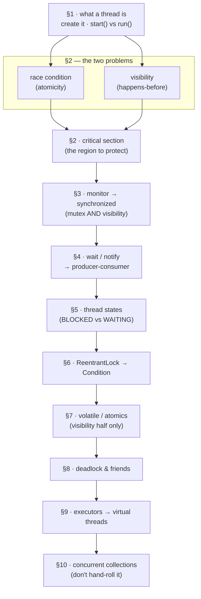
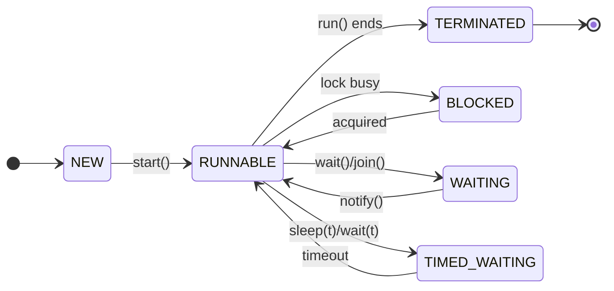

# Threads + JVM — the concurrency kit 🐧🧵

Threads · locks · the memory model · executors · JVM internals.
Rapid-fire, answers sized for speaking. Extracted from
[core-java.md](core-java.md) §5 and ordered so that no answer depends
on one below it.

- [The map — read in this order](#the-map--read-in-this-order)
- [§1 Ground floor — what a thread is, how you get one](#1-ground-floor--what-a-thread-is-how-you-get-one)
- [§2 The two problems](#2-the-two-problems)
- [§3 The monitor and `synchronized`](#3-the-monitor-and-synchronized)
- [§4 Waiting *inside* a lock](#4-waiting-inside-a-lock)
- [§5 Thread states](#5-thread-states)
- [§6 Upgrading the lock — ReentrantLock](#6-upgrading-the-lock--reentrantlock)
- [§7 Without a lock — volatile and atomics](#7-without-a-lock--volatile-and-atomics)
- [§8 Liveness failures](#8-liveness-failures)
- [§9 Running the work — executors and virtual threads](#9-running-the-work--executors-and-virtual-threads)
- [§10 Don't hand-roll it](#10-dont-hand-roll-it)
- [§11 JVM — memory, GC, loading](#11-jvm--memory-gc-loading)
- [Rep scorecard](#rep-scorecard)

**How to drill:** aloud, blind. Answers are sized for SPEAKING — say
the 1–3 lines, then stop talking. Never bluff; anchor to IMPS (⚓)
when pressed. Runnable companion: [s5-threads-lab.md](s5-threads-lab.md)
— eight predict→run→explain stations, linked inline as [→ S2].

---

## The map — read in this order

Every tool is defined against the one above it: `ReentrantLock`
against `synchronized`, `Condition` against the single wait-set,
`volatile` against the lock's visibility half. Read top to bottom
once; after that, jump anywhere.



---

## §1 Ground floor — what a thread is, how you get one

- **What is a thread?** *(the opener)* — a single sequential flow
  of execution within a process; a process is an independent
  running program with its own memory, a thread is a lighter unit
  inside it — threads in one process share heap + static memory,
  each gets its own stack + program counter.

- **Ways to create a thread?**

  - extend `Thread` — burns the one superclass slot

  - implement `Runnable` — preferred, frees inheritance

  - `Callable` + `Future` — returns a value, can throw checked

  - submit any of them to an `ExecutorService` pool (production) —
    a fixed crew of *reused* threads pulling tasks off a shared
    queue, so you stop paying for a new OS thread per task (full
    answer in [§9](#9-running-the-work--executors-and-virtual-threads))

  ```java
  // 1. Extend Thread (least flexible)
  class Worker extends Thread {
      @Override
      public void run() {
          System.out.println("running");
      }
  }
  new Worker().start();


  // 2. Implement Runnable (preferred over extending Thread)
  class Task implements Runnable {
      @Override
      public void run() {
          System.out.println("running");
      }
  }
  new Thread(new Task()).start();

  // Lambda (Runnable is a functional interface)
  new Thread(() -> System.out.println("running")).start();


  // 3. Callable + Future (returns a value and can throw checked exceptions)
  Callable<Integer> job = () -> 42;

  FutureTask<Integer> future = new FutureTask<>(job);
  new Thread(future).start();

  int result = future.get();      // waits for completion


  // 4. ExecutorService (recommended for real applications)
  ExecutorService pool = Executors.newFixedThreadPool(4);

  pool.execute(new Task());           // fire-and-forget Runnable

  Future<Integer> future = pool.submit(job); // Callable -> Future
  int result = future.get();

  pool.shutdown();
  ```

  | Approach                  | Creates Thread?        | Returns Value?      | Recommended?            |
  | ------------------------- | ---------------------- | ------------------- | ----------------------- |
  | Extend `Thread`           | Yes                    | No                  | Rarely                  |
  | Implement `Runnable`      | Yes (via `new Thread`) | No                  | Yes                     |
  | `Callable` + `FutureTask` | Yes (via `new Thread`) | Yes                 | Occasionally            |
  | `ExecutorService`         | No (uses thread pool)  | Optional (`Future`) | ✅ Yes (production code) |

- **run() vs start()?** *(trap)* — `start()` spawns a new thread
  that calls `run()`; calling `run()` directly is just a method
  call on the current thread.
  - the lab station that prints the thread name both ways:
    [→ S1](s5-threads-lab.md)

---

## §2 The two problems

Name the problem before you name the fix — every tool in this kit
exists for one of these two.

- **Race condition?** *(problem one of two)* — two threads touch
  the same shared state and the result depends on who wins the
  interleaving.

  ```java
  int count = 0;        // shared

  count++;              // looks like one step. it is three:
                        //   1. read count       (both read 5)
                        //   2. add 1            (both compute 6)
                        //   3. write it back    (both write 6)
  ```

  Two threads each running `count++` a thousand times almost never
  ends at 2000 — one update lands on top of the other. That is a
  **lost update**, and the cause is a lack of **atomicity**: the
  operation isn't indivisible, so a second thread slips between
  the steps.

  - the classic shapes: **read-modify-write** (`count++`) and
    **check-then-act** (`if (!seen.contains(id)) seen.add(id);`)
  - keep the two failures straight: *atomicity* = "saw it, then
    clobbered it" (this one); *visibility* = "never saw it at all"
    (the next answer)
  - ⚓ **I shipped one:** IMPS's Redis debit-limit check
    (`hget` → compare → `hset`) isn't atomic — two concurrent
    outward payments can both pass. Fix: Redis MULTI/WATCH or a Lua
    script. (Honest "what I'd fix" gold.)
  - the lab station that loses updates on cue:
    [→ S2](s5-threads-lab.md)

- **The visibility problem?** *(problem two of two — a race is
  about *order*, this is about whether the write is seen at all)*

  ```java
  int x = 0;                     // plain shared field

  // Thread A          // Thread B
  x = 42;              System.out.println(x);   // may print 0
  ```

  Nothing guarantees B ever sees 42 — not late, *ever*. Threads
  may work from their own cached copy of a variable, and the
  compiler/CPU may reorder around a plain field, so A's write can
  stay unpublished indefinitely.

  - the rule: a read is only guaranteed to see a write when the
    two are joined by a **happens-before** edge — and a plain
    field creates none
  - anything that creates one fixes it: `synchronized`, `Lock`,
    `volatile`, `Atomic*`, `Thread.start()`/`join()` — the rest of
    this kit is those tools
  - visibility ≠ atomicity — this is "never saw it"; a lost update
    (above) is "saw it, then clobbered it". `synchronized` fixes
    both; `volatile` fixes only this one.
  - the lab station that hangs on exactly this:
    [→ S3](s5-threads-lab.md)

- **Critical section?** — the specific lines that touch shared
  mutable state and so must not run in two threads at once.
  Naming it *is* the design step: you don't protect a class or a
  method, you protect a **region**.

  ```java
  var row = cache.get(k);        // read-only — leave it outside
  synchronized (lock) {
      if (!seen.contains(id)) {  // ─┐ the critical section:
          seen.add(id);          //  │ check-then-act on shared
      }                          // ─┘ state — must be indivisible
  }
  audit.log(id);                 // slow I/O — keep it OUTSIDE
  ```

  - **mutex** ("mutual exclusion") = the mechanism that admits one
    thread at a time. In Java that's the monitor behind
    `synchronized` (next), or a `Lock` ([§6](#6-upgrading-the-lock--reentrantlock)).
  - too wide and threads queue for nothing (throughput dies); too
    narrow and the race survives. Get it correct first, then narrow.
  - never do slow work — I/O, network calls, `sleep` — inside one:
    you are holding the door shut the whole time

---

## §3 The monitor and `synchronized`

- **monitor?** — every Java object carries one implicitly: a lock +
  a wait-set. The **lock** half is the mutex you already know —
  `synchronized` acquires it. The **wait-set** is a *second,
  separate* queue holding threads that already got in and then
  handed the lock back to wait for state they need
  (`wait`/`notify`/`notifyAll`, [§4](#4-waiting-inside-a-lock)) —
  blocked *outside* vs waiting *inside*, which is BLOCKED vs
  WAITING in [§5](#5-thread-states). All the "monitor" mentions
  below are this same one thing, not a dashboard/ops sense.

- **synchronized?** — mutual exclusion: only one thread at a time
  can hold a given monitor, so the guarded code can't interleave.
  - **instance method** `synchronized void m()` — locks `this`.
    Two threads calling `m()` on the *same* instance serialize; on
    different instances they don't (different monitors).
  - **block** `synchronized(obj) { ... }` — locks whatever `obj` you
    pick, not necessarily `this`. Narrows the critical section and
    lets you choose the lock object explicitly.
  - **static method** `synchronized static void m()` — locks the
    `Class` object (`Foo.class`), not any instance. So a static
    synchronized method and an instance synchronized method on the
    *same* object do **not** exclude each other — two different
    monitors *(MCQ trap)*.

  **The three forms, side by side** — the comment is the monitor:

  ```java
  class Counter {
      int n;                                  // the guarded state
      private final Object lock = new Object();

      synchronized void inc() {               // monitor = this
          n++;
      }

      void incBlock() {
          setup();                            // not guarded
          synchronized (lock) { n++; }        // monitor = lock
      }                                       // ↑ narrower section

      static int total;
      static synchronized void addTotal() {   // monitor = Counter.class
          total++;                            // ← NOT excluded by inc()
      }
  }
  ```

  Why a `private final Object lock` rather than `synchronized (this)`:
  `this` is visible to callers, so any outside code can lock your
  object and stall you. A private lock nobody else can reach can't
  be interfered with.

  - **which lock, which pairing?** — only two monitors exist per
    class: `Foo.class` (shared by every static synchronized method)
    and each individual instance (shared by its own instance
    synchronized methods). Exclusion only happens when two threads
    are fighting over the *same* one of those two.

    | Pairing | Same lock? | Mutually exclusive? |
    |---|---|---|
    | static sync + static sync (same class) | yes — `Foo.class` | ✅ yes |
    | instance sync + instance sync (same instance) | yes — `this` | ✅ yes |
    | instance sync + instance sync (different instances) | no | ❌ no |
    | static sync + instance sync (any instance) | no | ❌ no |
  - reentrant: a thread already holding the monitor can re-enter
    another synchronized method/block guarded by it without
    deadlocking itself.

  **A lock is two guarantees, not one.** This is the step most
  people miss: `synchronized` answers *who gets in* **and** *what
  they see*. It fixes both problems in [§2](#2-the-two-problems)
  at once.

  ```java
  // Thread A                     // Thread B, later
  synchronized (lock) {           synchronized (lock) {
      x = 42;                         print(x);   // sees 42
  }                               }               // guaranteed
  ```

  Not "probably 42" — **guaranteed**, provided both use the *same*
  lock. The lock is a hand-off point:

  ```text
  Thread A            Thread B
  --------            --------
  x = 42
  unlock  ────────▶   lock          releasing publishes A's writes;
                      print(x)      acquiring re-reads them
          happens-before            → B must see 42
  ```

  - **on unlock**, every write made inside the block is published
    to main memory before the unlock completes
  - **on lock**, the entering thread must refresh its view of
    shared memory before it reads anything
  - that ordering is the **happens-before** edge (the rule named
    in the visibility problem above)
  - why it must work this way: a lock with mutual exclusion but no
    visibility would still let B print `0` — one thread inside at a
    time, reading stale data. That lock would be nearly useless.
  - contrast to keep: `volatile` gives *only* the visibility half,
    no mutual exclusion — which is exactly why `count++` stays
    broken on a volatile field
    ([§7](#7-without-a-lock--volatile-and-atomics))

---

## §4 Waiting *inside* a lock

*Why a thread waits at all:* it's already inside the lock, but the
state it needs isn't there yet — buffer empty, queue full. It has
to hand the lock back, or nobody can get in to change that state
and it waits forever on itself. That forced hand-back is the whole
`wait` vs `sleep` difference.

- **wait vs sleep?** *(the famous one)*
  - `wait` — Object method; *releases* the monitor; must be inside
    synchronized (else IllegalMonitorStateException); woken by
    `notify`/`notifyAll`
  - `sleep` — Thread static method; *holds* any locks; wakes
    itself after the timeout
  - Memory hook: *wait lets go of the lock; sleep clutches it.*
  - the lab station that shows the difference under contention:
    [→ S4](s5-threads-lab.md)

- **notify vs notifyAll?** — `notify` wakes one arbitrary waiter
  (risky — one wait-set holds every waiting role, so the woken
  thread may be one that still can't proceed while the one that
  could stays asleep); `notifyAll` wakes all to recompete for the
  lock — the safe default. (Object-method table:
  [core-java.md §1](core-java.md#1-bedrock--java-identity--oop).)

- **Producer-consumer, the classic shape?** — one or more producer
  threads add work, one or more consumer threads take it, a shared
  buffer between them. This is what `wait`/`notify` is *for*.

  ```java
  private final Queue<String> q = new ArrayDeque<>();

  synchronized void put(String item) throws InterruptedException {
      while (q.size() == CAP) wait();   // releases the monitor
      q.add(item);
      notifyAll();      // wakes consumers AND the other producers
  }

  synchronized String take() throws InterruptedException {
      while (q.isEmpty()) wait();       // same single wait-set
      String item = q.poll();
      notifyAll();      // ...again, everybody
      return item;
  }
  ```

  - `while`, NOT `if` — a woken thread must re-check the guard: it
    still has to re-acquire the monitor first, and the state may
    have changed again by then
  - one wait-set means every wake is a broadcast to everybody —
    the limitation `Condition` removes in
    [§6](#6-upgrading-the-lock--reentrantlock)
  - real code: `BlockingQueue` (`put`/`take`) does this internally
    — nobody hand-rolls wait/notify in production
  - ⚓ this *is* IMPS's Kafka shape: producers (NPCI/CBS callers)
    append to a topic, consumer processors `poll()` at their own
    pace — the broker's partition log is the shared buffer.
  - [→ S7](s5-threads-lab.md) runs the `BlockingQueue` version

---

## §5 Thread states

*(MCQ staple — every row is vocabulary from §3–§4: BLOCKED is the
monitor's lock half, WAITING is its wait-set half.)*



| State | Entered by | Leaves via |
| --- | --- | --- |
| NEW | constructed | `start()` |
| RUNNABLE | `start()`, re-scheduled | runs / blocks / waits |
| BLOCKED | contended `synchronized` | monitor acquired |
| WAITING | `wait()`, `join()`, `park()` *(the low-level primitive `Lock`/`Condition` are built on)* | `notify()`, target ends, unpark |
| TIMED_WAITING | `sleep(t)`, `wait(t)`, `join(t)` | timeout **or** `notify()` |
| TERMINATED | `run()` returns | — *(one-way door)* |

- the confusable trio: BLOCKED = stuck *entering* synchronized
  (wants the monitor's lock); WAITING = parked *indefinitely* in
  the wait-set (`wait()`/`join()`); TIMED_WAITING = parked *with a
  deadline* (`sleep(t)`, `wait(t)`)
- `join()` = caller waits until that thread terminates
- one-way doors: NEW and TERMINATED are visited once — a
  terminated thread can't `start()` again *(MCQ trap)*

---

## §6 Upgrading the lock — ReentrantLock

- **synchronized vs Lock (ReentrantLock)?** *(X-vs-Y staple)*

  **Lead with what's the *same*:** same mutual exclusion, same
  reentrancy, same happens-before/visibility guarantee (the `Lock`
  contract requires it). So the difference isn't about memory —
  it's entirely about **the wait**. `synchronized` can only wait
  forever. `ReentrantLock` lets you not.

  **The mental picture:** one door, two doorknobs. `synchronized`
  has no handle on your side — you push, and the JVM opens and
  closes it for you. `ReentrantLock` is the same door with a
  keypad: more ways in, and you close it yourself.

  ```text
  synchronized (obj) {        lock.lock();
      critical();             try {
  }                               critical();
  // released here —          } finally {
  // normal exit OR               lock.unlock();  // you, always
  // exception                }
  ```

  That `finally` is the *entire* cost of the upgrade — miss it and
  an exception walks off still holding the lock, hanging every
  thread behind it.

  `lock` there is a **field**, not a local: one lock object per
  piece of guarded state, shared by every thread that touches it.

  ```java
  import java.util.concurrent.locks.*;   // ReentrantLock, Condition

  private final ReentrantLock lock = new ReentrantLock();
  ```

  **What you buy for it — four verbs:** *give up · be interrupted ·
  take turns · wake precisely.* If you can't name which one you
  need, you don't need the lock.

  *One term first — **interrupt is a cooperative cancel request,
  not a kill**:* `t.interrupt()` sets a flag on the target, and any
  method parked in a blocking call (`wait`, `sleep`, `await`,
  `lockInterruptibly`) throws `InterruptedException` and **clears**
  that flag. Re-calling `interrupt()` inside the catch restores it,
  so code above you still sees the cancel.

  | | `synchronized` | `ReentrantLock` |
  |---|---|---|
  | **give up** waiting | ❌ push and pray | `tryLock()`, `tryLock(t, unit)` |
  | be **interrupted** waiting | ❌ | `lockInterruptibly()` |
  | **take turns** (FIFO) | ❌ barging | `new ReentrantLock(true)` |
  | **wake precisely** | ❌ one wait-set | *n* × `lock.newCondition()` |
  | *(the price)* | JVM always unlocks | **you** unlock, in `finally` |

  **Verbs 1–2 — the ways to knock.** Both are escape routes out of
  a wait that `synchronized` simply doesn't have — which is why the
  next two snippets have no `synchronized` counterpart to compare
  against. That absence *is* the answer:

  ```text
                     ┌─ lock()               → wait forever
                     ├─ tryLock()            → false, walk away
  thread wants in ───┼─ tryLock(2, SECONDS)  → false after 2s
                     └─ lockInterruptibly()  → InterruptedException

  synchronized has only the top row — and no way back out of it.
  ```

  ```java
  if (lock.tryLock()) {              // ask once, don't queue up
      try {
          transfer(from, to);
      } finally {
          lock.unlock();             // only unlock if you GOT it
      }
  } else {
      skipped++;                     // ← the branch synchronized
  }                                  //   can't have: it must wait

  // same, but willing to wait 2s first — note the checked throw:
  if (lock.tryLock(2, TimeUnit.SECONDS)) { ... }  // InterruptedEx
  ```

  *(Beginner trap: calling `tryLock()` bare, outside an `if`, then
  unlocking in `finally` anyway — you'd release a lock you never
  acquired → `IllegalMonitorStateException`. The `if` **is** the
  API.)*

  ```java
  try {
      lock.lockInterruptibly();      // ← the wait is cancellable
      try {
          work();
      } finally {
          lock.unlock();
      }
  } catch (InterruptedException e) {
      Thread.currentThread().interrupt();   // restore flag, bail
  }
  ```

  Note the shape both share: the *acquire* sits **outside** the
  `try` that unlocks. Same reason as above — never unlock what you
  might not hold. (Plain `lock()` can't fail, so its acquire sits
  outside too, as in the first code block.)

  This is the `tryLock` escape hatch named in the deadlock answer
  ([§8](#8-liveness-failures)): a thread that can't get the *second*
  lock backs off and retries instead of hanging on it forever.

  **Verb 3 — take turns.** Default is *barging*: on release, any
  thread can grab the lock, including one that just arrived, so a
  long waiter can starve. `new ReentrantLock(true)` hands it to
  the longest waiter instead — fairer, measurably slower.

  ```java
  new ReentrantLock();       // default — barging, faster
  new ReentrantLock(true);   // fair — longest waiter wins
  ```

  *(MCQ trap: even on a fair lock, the untimed `tryLock()` barges
  anyway; the timed `tryLock(t, unit)` respects fairness.)*

  **Verb 4 — wake precisely.** The producer-consumer in
  [§4](#4-waiting-inside-a-lock) had one wait-set, so `notifyAll()`
  wakes producers *and* consumers and most go straight back to
  waiting. A lock gives each role its own queue:

  ```text
  synchronized                ReentrantLock
  ┌────────────────┐          ┌──────────────────┐
  │ one wait-set:  │          │ notFull   ← P P  │
  │   P C P C      │          │ notEmpty  ← C C  │
  └────────────────┘          └──────────────────┘
  notifyAll() wakes all 4,    signal() on notEmpty
  3 find nothing to do        wakes one consumer
  ```

  **The `Condition` way** — one queue per role, so you wake only
  the side that can actually move (same class as
  [§4](#4-waiting-inside-a-lock)'s, line for line):

  ```java
  private final ReentrantLock lock = new ReentrantLock();
  private final Condition notFull  = lock.newCondition();
  private final Condition notEmpty = lock.newCondition();
  private final Queue<String> q = new ArrayDeque<>();

  void put(String item) throws InterruptedException {
      lock.lock();
      try {
          while (q.size() == CAP) notFull.await();  // while, not if
          q.add(item);
          notEmpty.signal();      // wake ONE consumer, not the world
      } finally { lock.unlock(); }
  }

  String take() throws InterruptedException {
      lock.lock();
      try {
          while (q.isEmpty()) notEmpty.await();
          String item = q.poll();
          notFull.signal();       // a slot freed — wake ONE producer
          return item;
      } finally { lock.unlock(); }
  }
  ```

  - `await()` releases the lock while parked and re-acquires on
    wake — exactly like `wait()` does with a monitor
  - `while`, never `if`: a woken thread must re-check, because it
    still has to re-acquire the lock and the state may have
    changed again (and *spurious wakeups* are legal — `wait`/
    `await` may return with no signal at all)
  - (`await`/`signal`/`signalAll` are the Condition-side names for
    `wait`/`notify`/`notifyAll`)

  **You will rarely write that class.** `ArrayBlockingQueue` *is*
  that class, already written and tested — `put`/`take` block on
  exactly these two conditions. Reach for `java.util.concurrent`
  first; hand-roll `Condition`s only when nothing there fits.
  (Lab station S7 runs the `BlockingQueue` version:
  [→ S7](s5-threads-lab.md).)

  - rule of thumb: `synchronized` by default — shorter, and it
    can't leak. Upgrade only when you can name the verb.
  - Memory hook: *`synchronized` is a door that closes itself;
    `ReentrantLock` is a door with a keypad — more ways in, and
    yours to close.*

---

## §7 Without a lock — volatile and atomics

- **volatile?** — visibility + ordering guarantee, NOT atomicity:
  `i++` on a volatile is still a race. Flags: volatile; counters:
  AtomicInteger (CAS, lock-free).
  - what it does about the visibility problem: forces every
    read/write through main memory and bars reordering around it
    (the happens-before edge) — so the flag is always seen. It
    gives you the *visibility* half of a lock and nothing else:
    no mutual exclusion. So `i++` is still
    read-modify-write, three steps, so two threads can interleave
    and lose an update.
  - `AtomicInteger` closes exactly that gap: it performs the whole
    read-modify-write as a single CAS
    ([core-java.md §2](core-java.md#2-collections)), re-reading and
    retrying when another thread got there first — atomicity
    without a lock.
  - the lab station where a plain flag hangs and `volatile` doesn't:
    [→ S3](s5-threads-lab.md)

---

## §8 Liveness failures

- **Deadlock?** — two threads each holding a lock the other wants.
  Avoid: consistent lock ordering, or `tryLock` with timeout
  ([§6](#6-upgrading-the-lock--reentrantlock)).
  Starvation: a thread that never gets the lock (the barging
  problem, verb 3). Livelock: threads that keep responding to each
  other and never progress.
  - the lab station that deadlocks on cue *(hangs on purpose —
    guard with `timeout 6`)*: [→ S5](s5-threads-lab.md)

---

## §9 Running the work — executors and virtual threads

- **Runnable vs Callable?**
  - Runnable — `void run()`, no checked throws
  - Callable — returns a value, may throw checked; retrieved via
    `Future.get()` (blocks)
  - CompletableFuture (8) — chains async steps without blocking

- **ExecutorService — thread pools?** *(THE question)*
  - a fixed set of worker threads pulls tasks off a shared queue,
    instead of spawning a new OS thread per task
  - types: `newFixedThreadPool(n)` (bounded, steady load),
    `newCachedThreadPool()` (grows/shrinks, bursty short tasks),
    `newSingleThreadExecutor()` (serial, one worker),
    `newScheduledThreadPool(n)` (delayed/periodic tasks)
  - `shutdown()` — stop accepting new tasks, finish the queue, then
    exit; `shutdownNow()` — interrupt running tasks (the flag from
    [§6](#6-upgrading-the-lock--reentrantlock)), drop the queue,
    return what never ran

  **The mental picture:** a pool is a small crew of workers plus one
  shared in-tray (the task queue). Submitting a task drops it in the
  tray; whichever worker is free next picks it up. No worker means
  no task runs; too many workers means threads fighting over CPU
  and context-switch overhead.

  ```text
  submit(task) → [queue: t4 t5 t6] → worker1 (running t1)
                                      worker2 (running t2)
                                      worker3 (running t3)
  ```

  **`newFixedThreadPool(3)`, step by step, tasks t1..t6 submitted:**
  1. workers 1–3 pick up t1, t2, t3 immediately — pool is full
  2. t4, t5, t6 wait in the internal `BlockingQueue`
  3. worker1 finishes t1 → pulls t4 off the queue next
  4. this repeats until the queue drains
  5. call `shutdown()` — no new submits accepted, but t5/t6 still
     get to run to completion before the pool dies
  6. call `shutdownNow()` instead — workers get `interrupt()`,
     t5/t6 never start, returned as a list of un-run tasks

  **The logic behind pool sizing (design *why*):**
  - *why not one thread per task* — OS threads are expensive (MB-
    scale stack, kernel context-switch cost); thousands of
    short-lived threads thrash the scheduler more than they help
  - *why not one giant shared thread forever* — no concurrency at
    all, and one slow task blocks everything behind it
  - *CPU-bound rule of thumb* — pool size ≈ number of cores (more
    threads than cores just fights for the same CPU, adds
    switching overhead for no gain)
  - *I/O-bound rule of thumb* — pool size can exceed cores by a lot:
    threads spend most of their time *blocked* waiting on network/
    disk, not competing for CPU, so more workers = more overlap
  - *why bound the queue at all* — an unbounded queue under
    sustained overload just grows forever → OutOfMemoryError;
    bounded queue + rejection policy fails fast instead

  *One-liner:* a pool is workers + a shared task queue; fixed pool
  for steady CPU-bound load, cached for bursty short I/O work;
  `shutdown()` drains, `shutdownNow()` interrupts.
  - [→ S6](s5-threads-lab.md)

- **Virtual threads (Java 21)?** *(the modern follow-up)*
  - platform thread = thin wrapper over one OS thread — MB-scale
    stack, thousands at most
  - virtual thread = JVM-managed, KB-scale — millions are fine; it
    *mounts* a carrier (platform) thread to run, and when it blocks
    on I/O the JVM unmounts it and lends the carrier to another
  - what it changes: I/O-bound work no longer needs pool-sizing
    math — one virtual thread per task
    (`Executors.newVirtualThreadPerTaskExecutor()`); CPU-bound
    work gains nothing
  - honesty: IMPS is Spring Boot 2.7 — predates virtual threads;
    speak of them as "what I'd use today," not as shipped
  - [→ Java 21 deep dive](java-versions.md#java-21-2023--lts--virtual-threads)
    · [→ S8](s5-threads-lab.md)

---

## §10 Don't hand-roll it

- **Concurrent collections?** *(reach for these before you write a
  lock)* — `java.util.concurrent` already ships the thread-safe
  versions, written and tested.

  | Instead of | Use | Why |
  |---|---|---|
  | `HashMap` | `ConcurrentHashMap` | per-bin locking, no global lock |
  | `ArrayList` | `CopyOnWriteArrayList` | read-heavy, rare writes |
  | hand-rolled buffer | `ArrayBlockingQueue` | blocking `put`/`take` built in |
  | `int` counter | `AtomicInteger` | CAS, lock-free |

  - `Collections.synchronizedMap(m)` is the *old* fix: one lock
    around the whole map, so every thread serializes.
    `ConcurrentHashMap` locks per bin instead — that is the entire
    difference. ([core-java.md §2](core-java.md#2-collections) has
    the full comparison.)
  - ⚠️ thread-safe *per call* ≠ thread-safe *per sequence*. The
    check-then-act race walks straight back in if you write
    `if (!map.containsKey(k)) map.put(k, v)` — two threads can
    both pass the check. Use the atomic combinators instead:
    `putIfAbsent`, `computeIfAbsent`, `merge`.
  - the same rule as `count++`: one call is safe, two calls are a
    race

- **ThreadLocal?** — a per-thread copy of a variable; used for
  non-thread-safe things like the old SimpleDateFormat.

- **Daemon threads?** — background threads; JVM exits when only
  daemons remain (GC is one).

---

## §11 JVM — memory, GC, loading

- **JVM memory areas?** — heap (young: eden + survivors; old gen),
  one stack per thread, Metaspace (class metadata), code cache.
  Stack: references + frames; heap: objects.

  ```text
  Heap (shared)   │ young gen: eden → S0/S1 │ old gen │  ← objects
  Stacks (1/thread) frames: locals + references
  Metaspace         class metadata (native memory, Java 8+)
  Code cache        JIT-compiled hot methods
  ```

  *(§1's "share the heap, own the stack" — from the JVM side.)*

- **How does GC work?** — reclaims unreachable objects;
  generational: minor GC on young gen (frequent, cheap), major/full
  on old gen (stop-the-world pauses). G1 is default since Java 9.
  `System.gc()` is only a suggestion.
  - object journey: born in eden → survives a minor GC → bounces
    between survivor spaces → promoted to old gen after enough
    survivals — *why:* most objects die young, so collecting eden
    often and old gen rarely is cheap

- **Can Java leak memory?** — yes: lingering references
  - static maps/caches that only grow
  - unclosed resources
  - listeners never deregistered

- **StackOverflowError vs OutOfMemoryError?** — runaway
  recursion fills a thread stack vs heap exhausted.

- **JIT?** — JVM interprets bytecode, then compiles hot paths to
  native for speed.

- **Classloaders?** — bootstrap → platform → application; parent
  delegation (parents get first refusal — stops core classes being
  spoofed).

*One-liner for the whole kit:* threads share the heap but own
their stacks; `synchronized` for exclusion, `volatile` for
visibility, atomics for counters, pools instead of raw threads
(virtual threads since 21 for blocking I/O) — and the JVM cleans
up generationally, young and often.

---

## Rep scorecard

🟢 only after a **blind aloud** rep. Reading is not loading.

| Block | Rep 1 | Rep 2 | Rep 3 |
|---|---|---|---|
| §1 Ground floor | ☐ | ☐ | ☐ |
| §2 The two problems | ☐ | ☐ | ☐ |
| §3 monitor + synchronized | ☐ | ☐ | ☐ |
| §4 wait / notify | ☐ | ☐ | ☐ |
| §5 Thread states | ☐ | ☐ | ☐ |
| §6 ReentrantLock | ☐ | ☐ | ☐ |
| §7 volatile + atomics | ☐ | ☐ | ☐ |
| §8 Liveness | ☐ | ☐ | ☐ |
| §9 Executors + virtual threads | ☐ | ☐ | ☐ |
| §10 Don't hand-roll it | ☐ | ☐ | ☐ |
| §11 JVM | ☐ | ☐ | ☐ |
